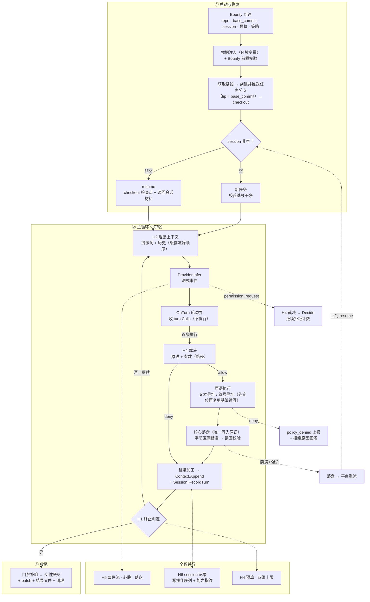

# Xhunter 架构设计

> **架构演进说明（2026-09-22）**：本文已按当前实现重写。Harness 收敛为**只做「模型调用循环」**的一层——`harness/` 只有 `engine.go` 与 `types.go`：固定循环 `Prepare → [infer → receive → OnTurn] → Finalize`，业务注入口只有**三组 handler**（`PrepareHandler` / `OnTurnHandler` / `FinalHandler`）。它**不定义任何业务模型**（任务、路径、选择器、门禁、检查点、git），也**不持有任何协作者**（上下文、会话材料、事件出口、工具执行全部外移）。业务下沉到 `hunt/`（值类型 + 原语 + 插件 + 默认执行器 `Session` + 协作者接口 + 两个扩展点），三项「能力抽象」拆到基础包 `workspace/` / `git/` / `ext/`，装配只发生在 `cmd/xhunter`。
>
> **本次演进只动「设计」，不动「产品」**：文件原语集合、业务模型（Bounty / Call / Gate / Policy / 交付 / 门禁）与产品目标（FR / NFR / AC）一律未变，本文更新的只是「分成哪几块、边界在哪、按什么时序跑」。对应的设计变化集中在三处：**① 循环骨架与业务实现分离**（§3、§7.1）；**②「流程组装」从运行期环节清单改为装配层组装**（§4，`Pipeline`/`Stage` 已从代码中移除，可组装的变成业务件：三组 handler + 原语清单 + 提示词插件 + 结果过滤器）；**③ 工具调用改由业务 handler 执行**（§6.3 L5、§7.3），并新增两段扩展面（原语装饰器、轮级结果加工）。

## 0. 文档定位

- 本文定义 **核心（Xhunter 进程内）** 的职责边界、分层结构、组件规格、控制流时序与接口抽象：`harness`（模型调用循环）、`hunt`（代码编辑 agent 业务域）、三项基础能力包（`workspace` / `git` / `ext`）与组装层（`cmd/xhunter`）各自的位置都在这里定。
- 产品边界与需求编号（FR/NFR/AC）见 `xhunter-product-design.md`；外部契约与使用方式见 `xhunter-usage.md`。本文是**实现层的结构约束**：产品文档说"要什么"，本文说"分成哪几块、边界在哪、按什么时序跑"。
- **控制流时序的规格权威是本文 §6**；循环骨架与三组 handler 契约以 `harness/engine.go`、`harness/types.go` 为准，业务侧（执行器、原语、协作者接口、扩展点）以 `hunt/` 为准，装配以 `cmd/xhunter/` 为准。
- 不含具体代码实现、不含部署步骤与使用指南。

---

## 1. 为什么 Harness 必须独立成层

一句话：**换马不换挽具。**

| 隐喻 | 对应 | 特征 |
|---|---|---|
| 马 | 模型 / LLM | 有力量，**没有方向** |
| **挽具与缰绳** | **Harness** | 把模型的力量导向目标 |
| 骑手 | Xhunter | 决定去哪、做什么 |

模型供应商会持续更替（新模型、新定价、新协议），而**编排逻辑（循环、工具、上下文、策略）不应该跟着变**。Harness 的存在就是为了把这两件事隔开：

- **模型变更**：只改 Provider 实现，核心侧零改动
- **编排演进**：只改核心侧（`hunt` ＋ 装配层），所有 Provider 同时受益

---

## 2. 职责边界

系统要做的七件事没变，变的是**它们各自落在哪一层**——这一栏就是本次重构的实质。

### 2.1 系统负责（以及各自落在哪一层）

| 职责 | 说明 | 落点 |
|---|---|---|
| 控制循环 | 状态机推进、终止判定、错误收敛 | `harness`（循环骨架：轮次上限、连续失败止损、终态收敛）＋ `hunt.Session`（轮边界守卫：取消、预算） |
| 上下文组装 | 首轮两段提示词、历史累积、压缩、工具输出截断 | `hunt.ContextBuilder`（接口）；首轮两段正文由 `prompt/<kind>/` 插件贡献，由 `Session.Prepare` 摆位置 |
| 工具调度 | 声明定格、执行、结果配对、错误结构化 | 装配层（`defaultTools` 定清单与顺序）＋ `hunt.Session.OnTurn`（执行流水线）＋ `hunt/basic`/`hunt/symbolic`/`hunt/gate`（实现） |
| 策略裁决 | 路径边界、破坏性拦截、预算、止损 | `hunt.Policy`（接口）＋ `internal/policy`（默认实现）；**机制性**上限（轮数硬顶、连续失败）由 harness 兜 |
| 事件与持久化 | 事件流与日志分流、心跳、会话材料落盘 | `hunt.EventSink` / `hunt.SessionRecorder`（接口）＋ 装配层实现（`sink.go` / `context.go`） |
| 会话材料与检查点恢复 | 材料随检查点提交；恢复 = checkout 分支 tip ＋ 读回材料（FR-12.1、FR-12.2） | `hunt.SessionRecorder` ＋ `git.GitWorktree` |
| 扩展接入 | MCP 客户端、能力描述符与降级、扩展生命周期（FR-13） | `ext.ExtHost`（接口）＋ 装配层注入实现（一期未接入） |

### 2.2 系统不负责

| 不负责 | 交给谁 |
|---|---|
| 模型推理本身 | Provider 实现（`provider/<protocol>`，马） |
| 代码编辑算法（符号解析、区间替换） | 原语实现（`hunt/basic`、`hunt/symbolic`） |
| **符号解析与语言语法** | **符号扩展（MCP，本地进程）**，经 `ext.ExtHost` 契约接入 |
| 任务排队、路由、重派 | 平台 |
| 交付物评审 | 平台侧 review |
| session 记录的存储与跨机传递 | 平台 |

**边界判据**：一件事如果"换模型后仍然一样"，就该在核心侧（Harness / hunt）；如果"换模型后就不同"，就该在 Provider Adapter。

---

## 3. 分层架构

```
┌───────────────────────────────────────────────────────────────────┐
│  平台                                                              │
│    Bounty（repo + session）│ 环境变量（凭据）│ git 远端仓库        │
└──────────────────────────────┬────────────────────────────────────┘
                               │  进程边界
                               ▼
┌───────────────────────────────────────────────────────────────────┐
│  Xhunter                                                          │
│                                                                   │
│  ┌──────────── Harness（模型调用循环，只依赖 llm）────────────────┐ │
│  │  固定循环：Prepare → [infer → receive → OnTurn] → Finalize     │ │
│  │  注入口只有三组 handler：PrepareHandler / OnTurnHandler /       │ │
│  │              FinalHandler（工具调用由 OnTurn 执行）             │ │
│  │  不持有协作者：上下文 / 会话 / 事件 / 执行全在业务侧与装配层     │ │
│  └──────────────────────────────┬───────────────────────────────┘ │
│                                 │  业务经三组 handler 注入          │
│  ┌──────────── hunt（代码编辑 agent 业务域）────────────────────┐ │
│  │  值类型：Bounty · Call · Selector · Gate · Result · WriteOp  │ │
│  │  默认执行器 Session（三组 handler，OnTurn 里执行工具）        │ │
│  │  扩展面：ResultFilter 结果加工 · 原语装饰器 调用拦截           │ │
│  │  协作者接口：ContextBuilder · SessionRecorder · EventSink     │ │
│  │  原语（按领域分组）：                                         │ │
│  │    hunt/basic     read · write · edit · find · glob           │ │
│  │    hunt/symbolic  symbol_read · symbol_edit · symbol_rename   │ │
│  │    hunt/gate      check（+ 自动检查点钩子）                    │ │
│  │  提示词插件：prompt/agentsmd · prompt/skills · prompt/task      │ │
│  └──────────────┬───────────────────────────┬────────────────────┘ │
│                 │ 能力抽象（基础包）          │                     │
│  ┌──────────────▼──────────┐  ┌─────────────▼──────────┐          │
│  │ workspace  文件读写      │  │ git  版本控制          │          │
│  │ ext  符号解析            │  │ （实现由 internal 注入）│          │
│  └──────────────────────────┘  └─────────────────────────┘          │
│                                                                   │
│  ┌──────────────────────────────────────────────────────────────┐ │
│  │  Provider Adapter   Anthropic │ OpenAI │ 本地 │ …            │ │
│  └──────────────────────────────────────────────────────────────┘ │
└───────────────────────────────────────────────────────────────────┘
                               │
                               ▼
                          模型（马）
```

**关键结构性约束**（随本次重构更新）：

- **Harness 不定义业务模型，也不持有协作者**：循环只做「推理 → 收流 → 交轮边界 → 判断继续」，业务经**三组 handler**（`PrepareHandler` / `OnTurnHandler` / `FinalHandler`）注入——工具怎么执行、上下文怎么组装、会话怎么记、事件怎么发，全是 handler 自己的事（`harness.New` 只收模型与这三组 handler）。因此 harness 只依赖 `llm`：不认识 workspace/git/ext/hunt，也不认识上下文/会话/事件。
- **工具调用由业务 handler 执行**：harness 只从流里收齐「模型要调什么」（`turn.Calls`）与本轮正文（`turn.Text`），执行、落盘、结果回灌、结果加工都在 `OnTurnHandler` 里完成；harness 读回 `turn.Results`/`turn.Failed` 只用于止损与「本轮无调用即完成」的判定。
- **符号化与降级是原语自身的性质**：`hunt/symbolic` 先定位到字节区间、再复用 `hunt/basic` 的读写；harness 与 basic 都不感知符号，也没有统一的 Dispatch 层。
- **能力抽象是独立基础包**：`workspace`/`git`/`ext` 各自定义一套抽象接口，原语与其他插件都是它们的消费者；「写盘唯一入口」（`Committer`）在 hunt 层，最终落在 workspace 的 `WriteRange` 上。
- **工作区是运行期产物**：装配层交的是工厂（`ToolFactory`、`PromptPluginFactory`），`Session.Prepare` 打开工作区后构造原语与插件、定格工具面——「构造顺序 = 依赖顺序」：后端 → 工作区（运行期）→ 原语/插件 → 执行体。

由此推出三点：

1. **符号化降级为实现细节**——符号解析随符号原语同包、跑在独立进程，还是别的形态，架构层不感知：`ExtHost` 接口不变则装配代码不变。
2. **驱动者无关性落到代码上**——平台驱动与本地驱动**共用同一套装配代码**，差别只在"谁投递 Bounty、谁消费事件流"（§5）。
3. **可复用的是循环与接口，不是业务组合**——这是 `harness/` 可被其他项目 import 的前提。

---

## 4. 流程组装与校验（FR-1.8）

**可组装的是「业务件」，不是「循环骨架」。** 循环骨架（`Prepare → [infer → receive → OnTurn] → Finalize`）由 harness 固定，业务不许改也不需改；可组装的部分全部落在**装配层**（`cmd/xhunter`），一共四张清单：

| 可组装件 | 交给谁 | 顺序的含义 |
|---|---|---|
| 原语清单 | `hunt.Config.Tools`（**工厂**，工作区就绪后调用） | 即模型可见工具面的顺序（缓存契约） |
| 提示词插件（system / user 两段） | `hunt.Config.SystemPlugins` / `UserPlugins` | 即正文拼接顺序 |
| 结果过滤器链 | `hunt.Config.Filters` | 即加工顺序（前一个的输出是后一个的输入） |
| 三组 handler | `harness.New(provider, prepare, onTurn, final)` | 即循环各阶段的业务实现；同组多 handler 按序执行、共享同一份 `Run`/`Turn` |

**校验从「配置合法性」变成「装配合法性」**——这是本节相对旧设计的关键变化：

| | 做法 | 后果 |
|---|---|---|
| 旧 | 运行期环节清单 ＋ `Validate()` | 不变量靠"配置的合法性规则"保证 |
| 新 | 构造期装配校验 ＋ 初始化期就绪校验 | 不变量靠"**装不起来就起不来**"保证 |

具体是两道闸，都在**进入首轮推理之前**：

1. **构造期**：`harness.New` 缺模型即返回错误；`hunt.NewSession` 的装配参数在该用它的地方显式失败，不猜默认值（如 `Prepare` 缺 git/opener、执行期缺工具表都当场报错）。
2. **初始化期**：`Prepare` 依次「取基线 → 打开工作区 → 定格工具面 → 构造两段提示词 → 组装首轮消息」，**任一步失败即终止**——循环根本不开始。因此不存在"跑到一半才发现工作区不可用"的中间态。

**不变量的落点（同上，换成装配口径）**：

| 不变量 | 装配上的落点 | 对应 |
|---|---|---|
| 基线先于任何写工作区的动作 | `Prepare` 的第一步就是 `PrepareBaseline`；原语清单在同一步之后才构造出来 | **INV-11** |
| 首轮必须有提示词 | `Prepare` 构造并定格两段正文；两段都空只记 warn（不判死），某个插件报错即终止 | **FR-7.8** |
| 取消与预算必须生效 | 取消在循环入口与 `OnTurn` 守卫各查一次，预算在 `OnTurn` 走 `Policy.Exhausted`——都在业务 handler 的固定位置上，不是可省的插件 | **INV-3**、**FR-9.2** |
| 写盘唯一入口 | 执行流水线的落盘段固定走 `Committer`（落在 `workspace.Storage.WriteRange`），原语自己拿不到写入口 | **FR-4.4**、**INV-10** |
| 接收段零写副作用 | harness 的接收只收流（`turn.Text` / `turn.Calls`），执行一律发生在轮边界的 `OnTurn` | §6.3 L4/L5 |
| 检查点提交「本轮已应用的改动」 | `OnTurn` 内的固定次序：执行 → 加工 → 记录 → **提交** | **FR-1.3c** |
| 交付提交与终态上报一定发生 | `Finalize` 无论成败都跑：交付提交 → 差异 → 材料落盘 → 清理 → `hunt_end` | **FR-6.1**、**FR-10.2** |

**生效配置快照**：装配结果（原语清单与顺序、两段插件、过滤器链、循环参数）进 `hunt_start` 事件与结果文件（FR-11.6）——评审者可直接看到"这次用了什么装配"。**（一期：快照字段待补，当前只上报任务与仓库事实）**

**边界（明确不做）**：不做运行期装卸（装配是构造期的事，`Config.Filters` 是构造参数而非运行期注册面）；不做多层 patch 叠加；不做字段级合并（改装配就重写装配代码，避免"半配置"造成的隐式行为）。

### 4.1 默认装配

| 装配点 | 默认内容 |
|---|---|
| `harness.New` | `provider` ＋ 三组 handler：`{session.Prepare}` / `{session.OnTurn}` / `{session.Finalize}` |
| `hunt.Config.Tools` | `defaultTools(ws, ex)`：按产品设计的工具集规格定序（`cmd/xhunter/primitives.go`），`checkpoint` 殿后 |
| `hunt.Config.SystemPlugins` | `prompt/agentsmd`（项目约定）· `prompt/skills`（技能清单）→ system 段 |
| `hunt.Config.UserPlugins` | `prompt/task`（任务陈述）→ user 段 |
| `hunt.Config.Filters` | 一期为空：结果加工链留空即原样透传 |
| `hunt.Config.Policy` | `internal/policy`：路径边界 ＋ 三重预算（token / 轮数 / 墙钟，0 = 不限） |
| `harness.Config` | 轮数硬上限、连续失败止损（缺省即可用）；与 `Policy` 的分工见 §7.4 |

各阶段的职责与落点见 §6.3（运行段 L1~L7）。

---

## 5. 外部驱动形态（FR-1.9）

装配全部落在组装层（§4）、协作方全是接口，两者合起来使**同一套核心可被不同形态驱动**。

| 形态 | 驱动者 | 核心是否需要改 | 适用 |
|---|---|---|---|
| **A. 配置驱动** | 外部生成 Bounty（任务正文 ＋ 部署事实）并投递 | **不需要** | 平台调度、本地驱动的产物 |
| **B. 观察驱动** | 外部消费事件流做展示（轨迹视图） | **不需要** | 本地调试、平台 UI 的进度展示 |
| **C. 单步驱动** | 外部在进程内逐阶段推进/暂停 | **需要**（把 handler 组做成可暂停的状态机） | 开发工具、教学/演示 |

#### A. 配置驱动——**装配代码必须共用，外部不得自建一套**

驱动方给的只有「任务正文 ＋ 部署事实」；装配（原语清单、两段插件、过滤器链、三组 handler）始终是**同一份装配代码**——本地驱动与平台驱动跑的是同一个 `cmd/xhunter`。

> **硬要求**：任何形态都不得绕过装配代码自建执行路径。基线先于任何写操作、写盘唯一入口、终态必上报这些不变量都落在装配与初始化顺序里，绕开它就等于绕开不变量。可复用的是**同一份装配**，不是一份可被外部重写的配置。

#### B. 观察驱动——**现在就可用，核心零改动**

`EventSink` 是接口，因此 CLI 形态实现为 NDJSON 写 stdout，UI 形态实现为推给 UI（轨迹视图），事件**语义**仍按使用手册 §5（SSOT）。

**由此澄清一条不变量的精确含义**：INV-6「stdout 仅有外部事件，日志走 stderr」约束的是 **"事件通道唯一且与日志分离"**，而不是"必须写 stdout"——stdout 是 **CLI 形态的承载**。同一份事件语义可以有不同承载，这正是把外部契约定为 SSOT 的价值。

#### C. 单步驱动——可行，但**不进一期**

技术前提是循环要能拆成"可暂停的状态机"（`Step` / `Resume`）；**三组 handler 各自是独立函数**已经是它的前提——阶段边界清楚，跨阶段状态只挂在 `Run`（任务级）与 `Turn`（轮级）上。此前必须先解决两个语义问题：**墙钟预算的计时语义**（等"下一步"的时间不能计入预算，需要"停表"概念）与**权限询问的归属**（UI 形态下 `Policy` 可接人工弹窗——决定仍经 `Policy`，只是实现把决定权交给了人，与 INV-4 不冲突；FR-7.2 禁止的是**模型向人提问**，两者不是一回事）。另需先补 `Provider` 侧的权限询问事件（一期未接入，见 §7.4）。单步驱动属于**本地开发工具**形态，不是交付引擎形态。

#### D. 驱动者无关性

"平台"未被写死为某个具体实现：**任何满足"能准备 Bounty + 能启动进程并消费 stdout 事件流"两个条件的实体都是合法驱动者**。最小条件与使用约束见 `xhunter-usage.md` §1.2；**换驱动者只换"谁投递、谁消费"，不换"什么被允许"**。

---

## 6. 任务生命周期（规格权威）

生命周期以**任务完整生命周期**为骨架：生成段 G → 运行段 R（L1~L7）→ 处置段 D。

### 6.1 全景与联合状态机

```
生成段 G            运行段 R                      处置段 D
───────    ┌───────────────────────────┐    ─────────────────
G1 生成 ──► G3 启动 ──► L1 初始化            ──► D1 验收（MR）
G2 排队            │   ┌─ L2 准备 ←────────┐    │   ├─ merged
（平台）           │   │  L3 发送 → L4 接收 │    │   └─ abandoned
                   │   │      L5 处理 → L6 收敛   D2 合并/放弃
                   │   └─────────┘        D3 归档清理
                   └── L7 终态收敛            D4 演化回灌 ──┐
                       （succeeded/failed/         │          │
                        cancelled）                ▼          │
                                             下一任务的 G1 ◄┘
```

**联合状态机**（◇= 平台侧职责，□= Xhunter 侧职责）：

```
◇ created ──► ◇ queued ──► □ running ──► □ terminal(succeeded|failed|cancelled)
                   ▲            │                │
                   │            │ 流静默超限      │ exit 0
                   └──── ◇ orphaned              ▼
                   （重派，session 保留）   ◇ delivered ──► ◇ merged | abandoned ──► ◇ archived
                                     exit 1/3：不重派，走平台处置
```

Xhunter 的契约边界：**进程内只认 running→terminal**；created/queued/orphaned/delivered/merged/archived 全归平台，Xhunter 不感知、不实现。

### 6.2 生成段 G（Bounty 从无到启动）

| 步骤 | 职责方 | 动作 | 依据 |
|---|---|---|---|
| **G1 生成/自举** | 平台 或 本地驱动 | 探测 remote / HEAD / 分支名候选 / 门禁候选 → 组装 Bounty（ID、Task、Repo{remote,branch,base_commit}、Session、Budget、Checkpoint；**流程不在 Bounty 里**，见 §4）；分配或继承 `trace_id` | FR-1.1、FR-1.10 |
| **G2 投递/排队** | ◇ 平台 | 投递准备：**任务正文（命令行）+ 部署事实（环境变量：仓库 / 分支 / 基线 / 模型接入）**；队列与调度；**崩溃重派次数上限也在此**（建议 ≤3，超限退化 failed） | FR-1.1、FR-1.4、AC-7 |
| **G3 启动契约** | ◇+□ | 进程启动：stdin 关闭、stdout=事件流、stderr=日志、环境变量注入凭据；Xhunter 输出 `hunt_start` 后进入 L1 | 使用手册 §2/§5、FR-8.4、INV-7 |

失败收敛：G1 生成不出合法 Bounty → 不启动（本地驱动报错退出；平台侧标记 failed）。**部署事实校验（仓库地址、基线提交、模型接入三项齐全）是 L1 之前的第一道闸**，在组装层里、任何动作之前完成（缺一项即退出码 2，并指出缺的是哪一项）。

### 6.3 运行段 R（L1~L7）

#### L1 初始化（任务一次，落在 `hunt.Session.Prepare`）

| 序 | 动作 | 落点 | 依据 | 说明 |
|---|---|---|---|---|
| 0 | 进程预检 | 组装层 | FR-9.5 | Provider 上限类能力校验；缺失→退出 2 |
| 1 | 取基线 → 建/推任务分支 → checkout | `Prepare` → `git.GitWorktree.PrepareBaseline` | FR-1.3、INV-11 | 先于一切可能写工作区的动作 |
| 2 | 打开工作区 | `Prepare` → `workspace.WorkspaceOpener.Open` | — | 根不存在 / 不是目录在此被拒；失败即终止，循环根本不开始 |
| 3 | 构造原语并定格工具面 | `Prepare` → `Config.Tools(ws)` → `run.Tools` | FR-4.11、FR-1.11④ | 工作区是运行期产物，所以是"打开之后再构造"；此后整任务读同一份声明 |
| 4 | 门禁清单来源裁决 | `Prepare`（**一期暂空**） | FR-5.2c | Bounty 下发 > 基线 `.xhunter/gates.yml` > 无 |
| 5 | 扩展能力描述符 | 组装层注入 `ext.ExtHost`（**一期未接入**） | FR-13.4 | 不可用 → 符号路径不可用，工具名字不变 |
| 6 | 构造两段提示词并定格 | `Prepare` → `buildPromptStage` ×2 → `Context.SetPrompt` | FR-2.6、FR-7.8、FR-15.2/15.3 | 按**装配顺序**调用两段插件，产出 **system / user 两段**；取一次、整任务内冻结 |
| 7 | 组装首轮消息 | `Prepare` → `Context.Assemble()` → `run.Messages` | FR-7.1 | 提示词 ＋ 历史（首轮历史为空） |
| 8 | 会话恢复（条件） | **一期未接入** | FR-12.1、FR-13.7 | 投递给出 `XHUNTER_SESSION_ID` 才执行：checkout 分支 tip ＋ 读回材料；指纹不一致拒绝（退出 2） |
| 9 | 生效配置快照 | **一期未接入** | FR-11.6 | 装配清单进结果文件（§4） |

事件：`hunt_start`、heartbeat(bootstrap)。失败：环境错误 → `Finalize`（退出 2）。

#### L2 轮前准备（每轮）

| 动作 | 落点 | 依据 | 说明 |
|---|---|---|---|
| 取消检查 | harness 循环入口 ＋ `OnTurn` 守卫 | FR-1.7、INV-8 | 取消 → `cancelled`（退出 3） |
| 事件通道健康 | **一期未接入**（sink 写失败目前直接上抛） | FR-10.4 | writeErr → 环境错误（退出 2，AC-19） |
| 预算判定 | `OnTurn` → `Policy.Exhausted(turn)` | FR-9.2 | 耗尽 → 失败（退出 1，含维度） |
| 消息组装 | `OnTurn` 末尾 `Context.Assemble()` → `run.Messages`（首轮由 `Prepare` 给） | FR-7.1/7.6 | 提示词取 `Prepare` 冻结的那一份，历史来自 `ContextBuilder` |
| 压缩 | `ContextBuilder` 内（**一期未接入**） | FR-14.1 | 三档水位 ＋ 冷却；硬上限 → 错误 |

#### L3 请求发送（每轮，harness）

| 动作 | 落点 | 依据 | 说明 |
|---|---|---|---|
| 发起推理 | harness：`Provider.Infer(ctx, Request{Turn, Messages: run.Messages, Tools: run.Tools})` | FR-4.11、FR-9.5 | 请求 = 消息 ＋ 工具声明（**9 个原语 + 1 个控制原语**）；工具声明读自 L1 定格的那一份，与提示词里的工具面说明同源（单一事实源） |

失败 `infer_failed` → 终态（退出 1）。事件：heartbeat(infer)。
（取消经 `llm.Session.Cancel()` 生效——控制面与数据面分离，取消不必等消费端读到某个特殊事件。）

#### L4 流式接收（每轮·流期间；harness 收流，零副作用）

| 事件 | 处理（落点） | 依据 |
|---|---|---|
| text | 累积到 `turn.Text`（harness）；需要外部可见时由业务经 `EventSink` 上报 `assistant_text` | FR-10 |
| tool_use | **收进 `turn.Calls`，不执行** | 接收段零副作用 |
| usage | 累加到 `run.Usage`（harness）；业务在 `OnTurn` 里把**增量**交给 `Policy.Charge` | FR-9、FR-11 |
| error | 不可重试 → 终态（环境错误）；可重试记日志后继续 | FR-11.2 |
| end | 进入轮边界（`OnTurn`） | — |
| permission_request | **一期未接入**（`llm.Event` 尚无此形态） | INV-4 |
| **流看门狗** | **一期未接入**（不活动超时 → `Cancel()` → 环境错误） | FR-1.11①、INV-3 |

约束：收流循环可被 ctx 打断（INV-8），打断时**必须调用 `sess.Cancel()` 并收敛为 cancelled**（退出 3）；取消时已收未执行的调用**不执行**；stdout 写失败记 writeErr，轮末收敛（FR-10.4）。

#### L5 响应处理（每轮·流结束后；**唯一写盘窗口**，全部落在 `hunt.Session.OnTurn`）

| 步 | 动作 | 依据 | 说明 |
|---|---|---|---|
| ① | 跳过已有结果的调用 | — | 排在 `Session.OnTurn` 之前的 handler 可以直接答复某次调用（缓存命中、一眼可见的非法规格），该调用不再执行 |
| ② | 执行工具流水线（按到达序，一期串行） | FR-4.12、FR-4.4、INV-10、FR-3.1 | `BindToolCall`（形状不成立 / 未知字段 → 结构化错误）→ 查表（名字不认识 → 报出可用名字）→ `Policy.Decide`（拒绝 → 原因回灌 ＋ 事件）→ `Primitive.Execute`（只读定位与计算）→ `Committer.Commit`（**唯一写盘点**：改前必读 ＋ 指纹校验） |
| ③ | 结果加工 | — | `Config.Filters` 按序跑（§7.3 扩展点）：改的是"即将发给模型的文本" |
| ④ | 事件上报 | FR-10、FR-5.2 | `tool_result` / `policy_denied` / `check_result`——**时点在流之后**（使用手册 §5） |
| ⑤ | 落记录 | FR-12.2 | `Context.Append` ＋ `Session.RecordTurn`：结果按 `CallID` 配对，成为下一轮的输入 |
| ⑥ | `every_write` 逐写提交 | FR-1.3c | **一期未接入**：唯一不在轮边界收敛的检查点 |

#### L6 轮收敛（每轮边界；落在 `OnTurn` 尾部 ＋ harness 判定）

| 动作 | 落点 | 依据 | 说明 |
|---|---|---|---|
| 检查点决策（**本轮单一提交点**） | `Session.checkpoint` → `git.Commit` | FR-1.3c | 优先级：模型显式请求 > 有改动兜底（门禁驱动、结构检查待接入）；**提交的是本轮已应用的改动**；单次失败不终止——下一轮累积重提 |
| 结构检查 | **一期未接入** | FR-1.3d | 只读定位判断"语法完整 / 区间封闭"，三态判定 |
| 止损 | harness（`Config.MaxFailStreak`）＋ `Policy` | FR-9.4 | 连续失败达阈值即收敛为失败（退出 1） |
| 事件通道复查 | **一期未接入** | FR-10.4 | → 环境错误（退出 2） |
| 提交连败复查 | **一期未接入** | FR-1.3b、FR-1.11② | 连续 3 次提交失败 → 本轮结束即收敛（退出 2），不跑完剩余轮次 |
| 终止判定 | harness | FR-6、使用手册 §7 | 本轮无工具调用 → 成功路径（进入 `Finalize` 过交付闸门：全程无写操作则判 `no_output` 失败）；否则回 L2 |

#### L7 终态收敛（任务一次，落在 `hunt.Session.Finalize`；G 后任何阶段的失败/取消全部汇入此处）

| 动作 | 依据 | 说明 |
|---|---|---|
| 中途收敛衔接 | INV-3 | harness 把任何终止（取消、推理失败、流错误、止损、轮数上限）都先收敛成显式终态，再照常进入 `Finalize`——这是结构保证，不依赖每个 return 处小心处理 |
| 交付闸门 | FR-6 | 成功终态但全程零写操作 → 覆盖为 `no_output` 失败（下游不该拿到一个空交付物） |
| `gates.required` 补跑 | FR-5.2f | **一期未接入**（门禁清单暂空）；时点在交付提交之前 |
| delivery.commit | FR-6.1 | 失败路径也尽力提交；提交失败只降级为"仅产出补丁"，不判死 |
| deliverable.diff | FR-6.1 | 排除会话材料路径 `.xhunter/<session_id>/**`（MaterialDir）；**同目录下的其他路径（如 `.xhunter/skills.draft/**`）不排除**——它们属于交付内容，要进 diff 供人 review（FR-15.3、AC-25） |
| session.snapshot | FR-12.3b | 尽力而为，不阻断；收尾这一次排在交付提交之后（那时才有交付提交哈希） |
| workspace.cleanup / ext.close | FR-12.4、FR-13.5 | 清理失败不阻断 |
| `hunt_end`（必须是最后动作） | FR-10.2 | 终态 ＋ 原因（退出码见使用手册 §7） |

### 6.4 处置段 D（终态之后；平台为主，Xhunter 契约到文件为止）

| 步骤 | 职责方 | 动作 | 依据 |
|---|---|---|---|
| **D1 验收** | ◇ 平台 | 退出码→处置（使用手册 §7 映射表）：0→取 patch 进 MR；1/3→按失败/取消流程；2→重派（回到 G2）。MR 评审证据 = 任务分支提交链 + patch + 结果文件（gates 证据 + `effective_config` 快照） | FR-6、FR-11.6、AC-20 |
| **D2 合并/放弃** | ◇ 人 | merge 形态（ff/squash/rebase）= 宿主仓库政策，**不在 Xhunter 契约内**；Xhunter 保证的只是：分支 tip 可 fast-forward、patch 可应用（AC-1）、绝不 force push | FR-8.3 |
| **D3 归档清理** | ◇ 平台 | 事件流脱敏+滚动清理；会话材料 `.xhunter/<id>/` 随分支保留；分支删除属仓库所有者（Xhunter 永不删分支，FR-8.3） | FR-12.3 |
| **D4 演化回灌** | ◇ 人 + 下一任务 | MR 合并的 AGENTS.md 修改与 `skills.draft/` 成为**下一任务的新基线**——下一任务 `Prepare` 里的插件读到的就是它们。单任务是线，跨任务是环 | FR-2.6、FR-15.3 |

### 6.5 异常与恢复矩阵

| 中断点 | 检测方 | 恢复动作 | 幂等/一致性保证 |
|---|---|---|---|
| G3 前崩溃 / L1 基线就绪前 | ◇ 流静默 | 重派 | `PrepareBaseline` 幂等：分支不存在则建；已存在且 tip=基线或其后代即成功 |
| L1 完成后、首个检查点前 | ◇ 流静默 | 重派（session 指向空材料=等价新任务） | 临时工作区丢弃无损；材料为空则从基线重跑 |
| L2~L6 中途（已有检查点） | ◇ 流静默 | 重派→resume：checkout 分支 tip + 读回材料，**未重做已完成轮次**；在途一轮由模型重做（代价有界） | AC-7；检查点自愈（累积重提） |
| L7 中途（交付提交后、hunt_end 前） | ◇ 流静默 | 重派→resume：tip 已含交付提交，材料完整；模型复查后无新调用→再收敛（`ErrNoChanges` 不重复提交） | 交付幂等：diff 可再生、提交幂等 |
| L4 流内挂起（Provider 断流） | □ 流看门狗（一期未接入） | Cancel→收敛退出 2→◇ 可重派 | 流内无副作用（工具在 `OnTurn` 才执行），无半写状态 |
| 用户取消（SIGTERM） | □ 取消检查（`ctx`） | 优雅退出：材料落盘→cleanup→exit 3；检查点保留 | AC-6；◇ 决定重开新任务或废弃 |
| 退出 1（预算/止损/无产出） | ◇ | **不重派**（重派同样耗尽） | 结果文件含耗尽维度与 unverified |
| 退出 2（环境） | ◇ | 重派（≤N 次，建议 3，超限退化 failed） | 环境修复后可续（resume）或重来（无材料时） |

### 6.6 不变量落点

| INV | 落点 |
|---|---|
| INV-1 无供应商名 | 全程（`llm` 契约与 `harness` 都不出现供应商名字） |
| INV-2 工具执行不委托 Provider | L5：执行在业务 handler 里；`llm.Provider` 只有 `Infer` / `Capabilities`，**没有执行方法** |
| INV-3 显式终态 | harness 的单一收敛出口（`Finalize` 无论成败必跑）＋ L2 取消检查 ＋ L6 止损 ＋ §6.5 恢复矩阵 |
| INV-4 权限经 Policy | L5 `Policy.Decide`（权限询问应答一期未接入） |
| INV-5/6 事件契约 | 各阶段只经 `EventSink` 产出；L5 的时点变化见使用手册 §5 |
| INV-7 凭据不入上下文 | G3 环境注入；L5 门禁子进程环境最小集（FR-5.2i） |
| INV-8 可取消 | L2 取消检查 ＋ L4 打断必调 `sess.Cancel()` |
| INV-9 已退役 | L1-8 恢复 ＝ checkout 分支 tip ＋ 读回材料 |
| INV-10 写盘唯一入口 | L5 的 ②：原语只产出编辑计划，落盘只走 `Committer` → `workspace.Storage.WriteRange` |
| INV-11 分支/交付不经模型 | L1-1 / L6 / L7——全不在模型可达面；D3 注：Xhunter 永不删分支 |

---

## 7. 组件规格

### 7.1 H1 Loop —— 控制循环（`harness.Engine`）

**循环骨架（固定，业务不许改也不需改）**：

```
Prepare ──► ┌──  infer ──► receive ──► OnTurn  ──┐ ──► Finalize
            └──────────── 继续下一轮 ◄───────────┘
```

三组 handler 各自能做什么，由**签名**决定，不靠约定：

| handler | 时机 | 拿到什么 | 影响后续的唯一通道 |
|---|---|---|---|
| `PrepareHandler(ctx, *Run)` | 循环前一次 | 空 `Run`（只有 `Meta`） | 写 `run.Messages` / `run.Tools`；返回错误即终止 |
| `OnTurnHandler(ctx, *Run, *Turn) (bool, error)` | 每个轮边界 | 本轮发送的（`turn.Messages`）＋ 本轮产生的（`turn.Text` / `turn.Calls`） | 执行工具填 `turn.Results`、组装下一轮 `run.Messages`、置 `run.Terminal`、返回 `false` 即停止 |
| `FinalHandler(ctx, *Run)` | 循环后一次（无论成败） | 任务级 `Run`（含 `Terminal` / `Usage`） | 交付、清理、终态上报（此时已无「继续」一说） |

**harness 自己只做机制判定**——业务判断都在 handler 里：

| 条件 | 终态 | 说明 |
|---|---|---|
| 本轮无 tool_call | 成功（过交付闸门） | 唯一"正常完成"路径；全程无写操作时由 `Finalize` 判 `no_output` 失败 |
| 轮数达 `Config.MaxTurns` | 失败 | 机制性硬顶，兜住编排缺陷导致的死循环 |
| 连续失败轮数达 `Config.MaxFailStreak` | 失败 | 机制性止损：不管原因，只在同一堵墙前反复撞时抽身 |
| `OnTurn` 返回错误 | 失败 | `failed`（退出 1） |
| `Prepare` 返回错误 / 推理失败 / 流错误 | 失败 | 环境错误（退出 2） |
| 取消（`ctx` 结束） | 取消 | 退出 3 |
| panic | 环境错误 | 收敛为终态，不让进程带着半截状态崩掉 |
| 预算耗尽（业务口径） | 失败 | 维度名由 `Policy.Exhausted` 给出（tokens / turns / wall_clock） |
| 连续同类失败**达阈值** | 继续（**切换策略**） | FR-9.4 第一段：换策略而不终止（一期：`Policy.ObserveFailure` 待接入） |
| 策略连续拒绝累积 | 失败 | 模型在撞不该撞的墙（一期：`DeniedCount` 待接入） |
| 外部信号 | 取消 | SIGTERM / SIGINT |

> 止损是**两段式**（FR-9.4）：达到阈值先换策略，超过上限才失败——若把它压成一行"达阈值即失败"，就丢掉了模型自我纠错的机会。**机制止损**（harness：连续失败轮数）与**业务止损**（`Policy`：连续同类失败、连续拒绝）分工不同：前者不认识原因，后者认得。

**不变量**：任何异常（工具 panic、Provider 返回畸形数据）都必须收敛到终态并带原因，**不允许静默挂起**。

### 7.2 H2 Context —— 上下文组装（`hunt.ContextBuilder`）

首轮固定 **system 与 user 两条消息**，与协议首轮消息一一对应：稳定内容全在 system（前缀缓存靠它命中），每个任务都不同的内容全在 user（FR-7.6）。

**两段正文都由插件贡献**（FR-7.8）：多个插件按装配顺序拼接，**执行体只负责把结果放到固定位置上**（`Session.Prepare` 里的 `firstPrompt(system, user)`）。于是"约定文件在哪、skill 清单从哪来、正文写什么"属于插件；执行体保留的是两段的位置与顺序、取一次冻结，以及"正文改不了工具面与权限边界"。

**契约（`hunt/runtime.go`）**：`SetPrompt(msgs)`（`Prepare` 调一次，此后不变）／`Assemble()`（给出「提示词 ＋ 历史」）／`Append(rec harness.Turn)`（累积本轮产生的消息）。**历史只住在这里**——轮级状态只装「本轮那段」，handler 物理上碰不到历史。

```
system ─┬─ 插件正文       约定与 skill 清单 · 角色与风格        ← 稳定，可长期复用
        ├─ 工具面说明层   由定格的工具声明生成，不手写（FR-7.7）
        └─ 内核条款       工具纪律 · 安全边界 · 无人类条款 · 止损规则   ← 末尾追加，不可覆盖
user  ─┬─ 内核注入        环境事实（cwd / git / shell）· 门禁清单
        └─ 插件正文       任务陈述                              ← 每次不同
```

> **一期现状**：两段**只由插件正文构成**（`prompt/agentsmd` + `prompt/skills` → system，`prompt/task` → user）。图中的**工具面说明层、内核条款、内核注入（环境事实与门禁清单）三项尚未实现**；`firstPrompt` 只负责"摆位置与顺序"，这三项之外的部分已落地。

**约定与 skill 的默认口径**（实现见 `prompt/agentsmd/` 与 `prompt/skills/`；插件可替换，内核不规定发现方式）：

- **AGENTS.md**（FR-2.6）：根级全文注入 system 段；monorepo 嵌套采用"**命中附注**"——工具结果携带该文件路径向上链上最近且未注入过的嵌套 AGENTS.md（追加到 user 段，因为它是按操作位置动态出现的）。构造一次即冻结，运行中不重读。
- **skill 发现清单**（FR-15.2）：从 `.xhunter/skills/`（基线 commit 读取，冻结语义）扫描 frontmatter，向 system 段注入 name+description 清单（总量封顶）；SKILL.md 与 references/ 的**全文按需加载**由模型经 `read` 原语完成——渐进披露天然落在已有原语上，核心零新机制、零新工具名；scripts/ 不可执行（FR-15.4）。

**压缩**（FR-14）——**一期未接入**（`ContextBuilder` 目前只有「组装」没有「下压」；下面几节是目标规格）：

**水位的定义**：`可用输入预算 = MaxContextTokens（预置配置，FR-9.5） − 固定开销（system 段 + 工具 schema） − 输出预留`。三档水位：预警 70% 触发、目标 50% 压后水位、硬上限 90% 不可继续。

```
预警 70% ──► 触发压缩 ──► 压到目标 50% ──► 冷却 N 轮 ──► 再次逼近才压
                                        （不是超限才动手：那时已无余量跑完压缩后的那一轮）
```

**为什么是"批量压深"而不是"持续微调"**：两段消息里的前置稳定内容正是为了吃 prompt cache 的红利，而**任何对已缓存前缀的改写都会让其后全部 token 的缓存失效**。低频、一次压到位，两次压缩之间才能持续命中缓存。

**分层压缩（按序下压，够用即停）**：

| 层 | 手段 | 损失 | 成本 |
|---|---|---|---|
| L0 | 工具输出截断（H3 已有：标注截断位置与总量） | 极低 | 0 |
| L1 | 丢弃可重建信息（推理过程整段丢弃） | 低 | 0 |
| L2 | 工具输出**整体替换为可寻址摘要**（"读了 X 的 1–200 行，含 N 个符号"） | 中，模型可重新读 | 0 |
| L3 | 旧轮折叠为**结构化工作日志** | 高（丢过程、留结论） | 0 |
| L4 | 模型摘要（可选，非默认） | — | 一次模型调用，计入预算 |

**保丢优先级（FR-14.3）**：

| 等级 | 内容 |
|---|---|
| **永不丢** | Bounty 正文与验收标准、工作区约定、当前轮 messages、**写操作记录** |
| 优先保留 | 最近 N 轮的完整 tool_call / result 对 |
| 可替换 | 早期工具输出 → L2 可寻址摘要 |
| 可丢弃 | 推理过程、重复失败的重试细节（留结论）、已被后续覆盖的中间态 |

**"写操作记录永不丢"是硬要求**：它是"只碰必要字节"与交付物可解释性的基础，也是失败路径下生成 assumptions / unverified 的来源。

**结构化工作日志是投影，不是总结**：字段固定为「任务与验收标准 / 已完成改动 / 已确认事实 / 失败尝试与原因 / 未决问题与假设」，由 H6 的 session 记录**投影**得出——零模型调用、内容与顺序可复现、可脱离模型单测（NFR-8）。L4 若启用，摘要文本同样"生成一次即落盘、恢复时读回"。

**交付物不依赖上下文（FR-14.6）**：patch、`files_changed`、assumptions、unverified 全部由执行体从 session 记录生成。模型压缩后"忘记"改过什么，不影响交付物完整性。

**截断策略必须区分"头尾保留"与"整体替换"**：小超限用头尾保留 + 省略标记；已明显是原始流 dump 时整体替换为提示，不得让不可信内容进入上下文。

### 7.3 H3 Tools —— 工具调度

| 职责 | 要求 |
|---|---|
| 注册 | **工具面恒定（9 + 1）**：基础 5（`read`/`write`/`edit`/`find`/`glob`）＋ 符号 3（`symbol_read`/`symbol_edit`/`symbol_rename`）＋ `check` ＋ 控制原语 `checkpoint`（殿后）。**两个轴都不改变工具名与参数 schema**：**交付分期**不裁剪工具面（一期未实现的符号原语与 `check` 照常注册，调用返回 `not_implemented`）；**环境能力**不决定注册（扩展不可用、语言未注册时符号原语仍注册，调用返回结构化错误）。能力差异只改"调用时会发生什么"（FR-4.11、AC-26） |
| **工具集由装配层提供** | `harness` 与 `hunt` 都不认识具体原语：有哪些、叫什么、什么顺序，全由装配层以**工厂**形式交给 `hunt.Session`（`Config.Tools = func(Workspace) []Primitive`）。原语的实现需要工作区，而工作区是基线就绪后的运行期产物，所以交的是工厂：`Session.Prepare` 打开工作区后调用它，把工作区**显式传给每个原语**再定格工具面（`run.Tools`）。因此换一套工具集不需要动框架；而"这套工具集恰好是这些、顺序固定"这类**业务约束留在装配层**（`cmd/xhunter/primitives.go`），由那里的测试审查（FR-4.11） |
| 实现扩展点 | **三段，全在业务侧**：① **原语实现可替换**——工厂返回同一个已知名字但换一份实现的 `Primitive`（差量替换），或返回整张清单（整体接管）；只能替换已知名字、不能新增工具名——模型可见面恒定，扩展改变的是名字背后的行为与路径，不是模型的工具清单。② **调用级装饰器**：包一层 `Primitive`，可拦截（不转交 inner 直接给结果）、改语义（改 `Call` 再转交）、美化结果（改 `Result.Summary`），但写盘仍只走 `Committer`（"未读即写"与指纹校验不被绕开）。③ **轮级结果加工**：`Config.Filters` 里的有序 `ResultFilter` 链，跑在工具执行之后、落历史之前——位置即保证，加工后的文本一定会进下一轮上下文；排在其后的任何加工只会改到副本。加工失败即上抛：脱敏、截断一类过滤器静默放行，等于把自己要防的内容原样送进上下文。**框架侧只校验结构自洽**（名字非空、实现齐备、声明名一致、不重复），不校验业务名字（那是业务知识） |
| 执行位置 | 一轮的调用由 `hunt.Session.OnTurn` 按到达序执行（一期串行）；harness 只从流里收 `turn.Calls`，**不执行** |
| 寻址与分发 | **没有统一 Dispatch 层**：每个原语自己解释寻址——`hunt/symbolic` 先定位字节区间、再复用 `hunt/basic` 的读写；`BindToolCall` 只做具名槽位的纯搬运，不做业务分支。路径不同**不得放宽匹配语义**（FR-4.12、FR-4.13） |
| 并行 | 同一轮内无依赖的调用并行执行；有依赖的串行（一期默认串行，结构留门） |
| 配对 | 结果按 `tool_call_id` 严格配对，**禁止按顺序猜测** |
| 错误 | 失败必须返回结构化错误（类型 + 上下文 + 可重试性），供模型自愈 |
| 截断 | 输出超限时标注截断位置与总量，三态表达"完整/已截断/未知" |
| 语言能力 | **符号原语**由语言注册表决定可用性：已注册语言给符号级能力；未注册语言 / 语法不可解析 / 扩展不可用时返回**结构化错误**并在结果与事件流里显式说明（**不静默改用文本替换**，也不拒绝文件——基础原语在任何语言上都可用）（FR-4.9、FR-4.10）。不可用与降级必须对模型与事件流同时可见 |

### 7.4 H4 Policy —— 策略与预算（`hunt.Policy`）

**这是无人类场景下唯一顶替人类的位置**，因此它是最不可省的一块。默认实现 `internal/policy`：**默认拒绝**——放行需要一条明确的理由，而不是反过来。

| 裁决点 | 输入 | 输出 | 一期状态 |
|---|---|---|---|
| 路径边界 | 原语 ＋ 参数（路径） | allow / deny | 已实现：绝对路径 / `..` 逃逸 / `.xhunter/**`（`skills.draft/**` 除外）一律拒绝；**未知原语默认拒绝** |
| 破坏性操作 | 原语 ＋ 参数 | allow / deny | 由"原语名 ＋ 路径"表达（如符号重命名的写判定） |
| **影响面** | 原语 ＋ 寻址方式 ＋ 改动规模 | allow / deny | **待接入**：需要符号原语的只读定位先行（随扩展 M2） |
| **权限询问应答** | Provider 的 PermissionRequest | allow / deny / rewrite | **待接入**：`llm.Event` 尚无该形态 |
| 预算 | 累计用量（增量由执行体转交） | continue / terminate | 已实现：三档独立判定（token / 轮数 / 墙钟），0 = 不限 |
| 止损 | 失败序列 | continue / switch / terminate | **待接入**：`ObserveFailure` / `DeniedCount` |

**接口形状**（`hunt/policy.go`）：`Decide(ctx, Call) (Decision, error)` / `Charge(llm.Usage)` / `Exhausted(TurnNo) (bool, string)`。`Decision` **必须携带原因**——拒绝时原因会回灌给模型，让它换个做法，而不是对着同一堵墙反复尝试。

**用量为什么由执行体转交、而不是引擎直给**：`run.Usage` 是累计值，而策略要的是增量；执行体在轮边界自己记水位（`Session.charged`），把差值交给 `Charge`。否则累计值会被反复当作增量上报，预算被自己的重报耗尽。

**权限应答是整个设计里最容易被忽略、却最关键的一环**（见 §10.3）：无头环境下没有人类可以回答，必须由策略顶替，且**禁止无条件放行**（INV-4）。

### 7.5 H5 Stream —— 事件与持久化（`hunt.EventSink`）

**契约**（`hunt/runtime.go`）：`Emit(ExternalEvent) error` / `Log(level, msg, kv ...any)` / `Heartbeat(Phase) error`；装配层实现见 `cmd/xhunter/sink.go`（事件写 stdout、日志写 stderr）。

- **事件行是外部契约**：`{"type": "<事件名>", ...payload}`——载荷**摊平到顶层**、键名小写，与使用手册 §5 一一对应。**事件类型只增不改**（INV-5）。
- **内部事件 → 外部协议映射**（见 §9）：内部可细、外部须稳。
- **落盘**：周期性写入当前状态与 session 增量，应对不可捕获的强杀信号（FR-12.3b）——**一期未接入**（`SessionRecorder` 目前只记内存）。
- **心跳**：任务级，与 runtime 心跳解耦（FR-10.1）；`Heartbeat(phase)` 已能发事件，但**调用点一期未接入**。
- **通道隔离**：事件流走 stdout，人类日志走 stderr，绝不混用（FR-11.4）。
- **通道断裂即终止**（FR-10.4）：写 stdout 失败（EPIPE / 磁盘满）意味着消费者已不在或无法接收，此时**记录原因并终止**（环境错误，退出码 2）。

### 7.6 H6 Session —— 会话材料与检查点恢复（`hunt.SessionRecorder`）

**契约**（`hunt/runtime.go`）：`RecordTurn(rec harness.Turn)` / `Snapshot() error`。设计上还要 `RecordOp` / `Ops` / `Delta` / `Fingerprint`——**一期未接入**（记录项与恢复流程见下，当前只记内存、恢复未实现）。

**记录**（全程）：

| 记录项 | 要求 |
|---|---|
| 写操作序列 | 工具名 + 完整参数 + 结果摘要 + turn 序号，自含**续跑**所需的全部信息（FR-12.2） |
| 上下文素材 | H2 实际拼装的 messages 增量（含截断标记）——恢复的是"模型当时看到的东西"，而非原始全量输出 |
| 记录边界 | 只记写操作与上下文；**读操作与 check 不复放执行**，其结果直接回灌 |

**恢复**（session 非空时，在首轮推理之前执行——落在 `Prepare` 里；**不重放写操作**）：

1. 获取基线（按 SHA 浅克隆，不可得则完整克隆）→ **在基线 commit 上创建并推送任务分支**（已存在且 tip 为基线或其后代即幂等）→ **checkout 分支 tip（最后一个检查点）**——该状态即上次工作区，**无需重新执行任何写操作**
2. 读回**会话材料**（`.xhunter/<session_id>/`，随检查点提交进分支，git 保证完整性）→ 台账出已完成轮次与写操作序列
3. **零工具执行**：恢复过程不调用任何原语；材料损坏或 `schema_version` 不兼容 → 退出码 2，平台 fallback 重跑（FR-12.6）
4. 回灌上下文（过 `ContextBuilder` 的压缩）→ 设为 `run.Messages`，从**下一轮**继续——不重做已完成轮次

**代价（明确接受）**：检查点之间的改动（最多在途一轮）不在工作区里，由模型在续跑轮重做。用"最多一轮的 token"换掉"重放器 + 忠实性证明"。

**唯一状态源**：会话材料是本次 Hunt 的**唯一状态记录**；上下文（messages）由它**派生**（压缩管线是纯投影，FR-14.4），而不是并行维护的第二份状态——避免"日志与快照对齐"这类一致性问题。

**关键不变量**：恢复全程**零模型调用、零写操作执行**；工作区与上下文同源于一份材料，不引入第二份快照。

### 7.7 H7 Ext —— 扩展接入（`ext.ExtHost`，MCP）

符号级能力不在核心里，由本地 MCP 扩展提供。`ext.ExtHost` 是核心侧的客户端与治理契约（实现由装配层注入，一期未接入）。

| 职责 | 要求 |
|---|---|
| 不新增工具名 | 扩展**不带来新的模型可见工具名**：它的能力通向已注册的符号原语（FR-4.11、FR-13.2）；结果结构与错误语义与内置完全一致 |
| 能力声明 | 扩展上报**能力描述符**（能力集 + 精度等级 `syntactic` / `semantic`）；核心据此决定符号路径可用性与结果标注，**不感知后端种类**（FR-13.8、FR-4.13） |
| 落盘归位 | 符号原语的写操作（`symbol_edit` / `symbol_rename`）只接受扩展返回的**定位结果**（文件 + 字节区间 + 新内容），由 `Committer` 执行区间替换（FR-13.3、FR-4.4） |
| 生命周期 | 懒启动（首次调用符号工具时拉起）、随 Hunt 退出回收（FR-12.4）；**崩溃隔离**——扩展死掉不得使主循环静默挂起（INV-3）；**注册即副作用、卸载即撤销**：扩展注册的工具 schema / 符号能力 / 能力描述符随其卸载全部撤销 |
| 降级 | 扩展缺失/启动失败/超时 → **符号原语**不可用（**工具不撤回**，FR-4.11）：调用返回结构化错误并显式提示"改用文本原语"，基础原语不受影响，任务继续（FR-13.4、AC-12、AC-26） |
| 不可信边界 | 仅本地进程；不继承凭据环境变量（FR-8.4）；不得绕过路径校验（FR-3.5、FR-8.2）——扩展没有写权限，写盘只在 `Committer`（落在 `workspace.Storage.WriteRange`） |
| **协议托管 MCP 不采用** | OpenAI Responses 的内置 `type:"mcp"` 工具与 Anthropic Messages 的 `mcp_servers` 连接器把工具执行搬到**供应商侧**——调用不经策略裁决、不经唯一写盘入口（INV-2、INV-10），仅收公网 HTTPS 服务端且凭据须交上游（FR-13.6 禁止）。本项目 MCP 仅限本地 stdio（FR-13.1）；线格式包不发送也不消费这些字段，上游返回此类输出项按未知事件容错处理 |
| 能力指纹 | 记录扩展标识 + 版本 + 语言清单，写入 session 记录；指纹不一致只记录、不阻断（FR-13.7） |

**与 Provider `Caps` 同构**："能力声明 + 缺失降级"在本设计中第二次出现（第一次是模型能力，见 §8）。这是 Harness 面对任何**不可控外部组件**时的通用模式：**声明能力 → 按能力降级 → 如实上报**。

**为什么值得独立成层**：解析器是整套设计里唯一"轻则误改用户代码、重则进程崩溃"的重组件。把它放到进程外，换来三件事——核心保持零 CGO 与语言无关；解析器选型降级为扩展侧决策，可替换、可多实现；解析器崩溃与内存失控被进程边界隔离。

**内部后端抽象（能力声明驱动）**：抽象层**位于扩展内部**，对核心只暴露能力描述符。自包含语法后端为**默认**（唯一满足 NFR-1，也是所有语言的兜底）；LSP 语义后端**可选启用**（`symbol_rename` 与引用点查询优先用它），缺失时降级到自包含后端并**上报精度变化**。三条不变量：后端替换**不改变工具契约**；**精度如实上报**（FR-4.13）；外部后端**不得成为必需依赖**（AC-14）。

### 7.8 质量门禁（`check` 原语的具名条目）

> **一期状态**：门禁清单暂空（`Prepare` 里 `s.gates = nil`），`check` 原语**声明但不实现**，收尾补跑与检查点联动均未接入——本节是目标规格。

门禁**不是新工具**，而是 `check` 原语的具名条目——原语面是 9 个（5 基础 ＋ 3 符号 ＋ 1 门禁，另有控制原语 `checkpoint`），门禁不占新的工具名。

**清单来源（按优先级，FR-5.2b）**：① **Bounty 下发**（平台显式配置，可覆盖或禁用仓库声明）② **仓库声明** `.xhunter/gates.yml` ③ 无 → 不设门禁。

**仓库声明必须从基线 commit 读取**（`git show <base_commit>:.xhunter/gates.yml`），**不从工作区读取**（FR-5.2g）——要防的是**模型在任务中途削弱自己的门禁**：工作区可被 `edit`，而基线 commit 被任务分支钉住、不可改。**读取基线 = 冻结配置语义**。策略层另拒绝模型写该路径（纵深防御，FR-8.7）。门禁名随上下文注入模型。

**格式**：

```json
"gates": [
  {"name": "fmt",   "argv": ["gofmt", "-l", "."],   "timeout": "30s",  "required": true,  "expect": "empty_output"},
  {"name": "build", "argv": ["go", "build", "./..."],"timeout": "300s", "required": true,  "expect": "exit_zero"},
  {"name": "test",  "argv": ["go", "test", "./..."], "timeout": "600s", "required": false, "expect": "exit_zero"}
]
```

| 字段 | 语义 |
|---|---|
| `name` | 门禁名（进提交信息、事件与结果文件；模型按名字调用） |
| `argv` | **数组直启，不经 shell**——`;`、`&&`、`$()` 不被解释 |
| `timeout` | 单门禁超时，独立于墙钟预算 |
| `required` | 是否"必须通过才算交付成功"（见下） |
| `expect` | **通过判据**：`exit_zero` / `empty_output`（如 `gofmt -l` 无输出即通过）/ `regex` / `max_warnings` |

**`expect` 不是装饰**：`gofmt -l` 的通过判据是"输出为空"而非"退出码 0"；lint 是"警告数 ≤ N"。若一律按退出码判定，格式门禁会永远"通过"，等于没有。

**两类失败必须分开**（这是本节最关键的一条）：

| 情形 | 含义 | 处理 |
|---|---|---|
| **执行失败**：命令不存在、无法创建进程、超时 | 环境或配置问题——**不是质量结论** | **环境错误（退出码 2）**，平台修好可重派 |
| **判定不通过**：退出码非 0、输出越阈值 | 质量确实不达标 | 终态失败（若 `required`），并**抑制自动检查点**（FR-5.2c） |

把两者混同的后果很具体：门禁命令名写错会被当成"代码质量差"，任务反复失败却永远修不好。

**结果缓存**：按**待提交改动的内容指纹**缓存上一次结果，同一状态重复调用直接返回缓存（标注 `cached: true`）。模型常会反复调同一门禁，而测试动辄数十秒到数分钟——缓存既省时间，也避免"重复门禁调用产生重复检查点"。

**技术栈：不需要 shell**。`argv` 数组直启（fork+exec），Xhunter **不依赖 bash 存在**，也不调用 `timeout`/`head`/`sed` 等外部工具：

| 需求 | 实现 |
|---|---|
| 超时 | `context.WithTimeout` + `exec.CommandContext`（超时即杀进程组） |
| 输出截断 | 限长读取（保留头尾），不靠 `head`/`tail` |
| 非交互 | `Stdin = nil` + `CI=1` / `NO_COLOR=1` / `GIT_TERMINAL_PROMPT=0` |
| 工作目录 | 工作区根，或清单声明的 `dir`（monorepo） |
| 环境 | **最小集 + 清单显式声明的 `env`**；**Xhunter 自身的 git 凭据绝不传入**（FR-5.2i） |

**一个必须说清的边界**：门禁**命令自己**可能内部用到 shell（`npm run lint` 会经 `sh -c` 执行 `package.json` 里的 scripts）。这不在 Xhunter 的控制范围内，也不该由我们堵——那已经是"执行仓库配置的构建脚本"的性质。**我们堵的是显式把 shell 请回来**：`argv[0]` 为 `sh`/`bash`/`zsh`/`dash` 一律拒绝（元门禁，FR-5.2h）。**不要把"数组直启"理解为"门禁内部不会用到 shell"。**

**执行约束**：非交互环境 + 关闭子进程 stdin（FR-8.6）；输出截断（保留头尾）；工作目录为工作区根；**一期不强制网络隔离**，靠约定（`GOFLAGS=-mod=vendor`、离线安装）+ 超时兜底。

**与交付状态的关系**（FR-6.5 的具体化）：**任一 `required` 门禁未通过，或从未运行 → 终态为失败（退出码 1），但改动照常交付**。"从未运行"也计入不通过——否则模型只要不跑门禁就能拿到成功状态。

**上报**：事件 `check_result` 的字段以**使用手册 §5**（外部事件契约 SSOT）为准，本文不另行定义；结果文件除 `gates` 汇总外，还须**列出未运行的门禁**（`passed: null`）。

**任务本身就是改门禁时（FR-5.2h）**：默认"从基线读取"意味着新清单本次不生效，下次成为新基线后才生效（与 CI 惯例一致）。需要新清单本次生效时，**只能由 Bounty 显式授予**（`gates_source: "working_tree"`），并受三条护栏约束：**元门禁**（schema 合法 + 每个 `argv` 可启动）、**强度不得降低**（同名 `required` 门禁的 `argv`/`expect` 不得改动，只允许新增）、**显式上报**（`gate_config_changed` 事件 + 结果文件标注清单来源）。**模型拿不到豁免**：`gates_source` 只存在于 Bounty。

**执行主体：模型主调用 + 收尾自动补跑**（两级）：

| 层 | 谁执行 | 时机 | 理由 |
|---|---|---|---|
| **主路径** | **模型**经 `check` 工具 | 模型判断"改完一批相关文件、值得验证"时 | 门禁（尤其测试）昂贵，模型的语义判断能避免在每次编辑后跑测试；这也让它与"检查点落在语义边界"一致 |
| **兜底** | **执行体自动**（`Finalize`） | **收尾前**，对尚未通过的 `required` 门禁各跑一次 | ① "required 未运行"本身即判交付失败——模型若从未调用，整段工作白跑；② 此时工作区就是**最终交付物**，结论才有针对性 |

**不做"每轮自动跑门禁"**：中间状态多为半成品，门禁必然失败 → 反而抑制检查点、增加丢失窗口，且墙钟成本可能翻倍。**自动化的价值在"交付前的那一道"，不在过程中的每一次。**

**自动补跑不破坏"写操作只由模型发起"**：门禁是**验证**性质、必须**只读**——不得修改被跟踪文件（如 `jest --updateSnapshot`、`gofmt -w` 这类写形态的命令不属门禁）；其产物（构建缓存、临时目录）不应进入交付 diff。

**默认门禁集由平台配置，Xhunter 不内置**：门禁命令与仓库布局强相关（monorepo 的 test 命令各不相同），内置默认极易误判。

---

## 8. Provider 抽象（挽具接口）

Provider 是**唯一允许知道"具体是哪家模型"的地方**。

```go
// Provider 只做一件事：给定上下文与工具声明，产出一轮流式事件。
type Provider interface {
    Infer(ctx context.Context, req InferenceRequest) (Session, error)
    Capabilities() Caps
}

type Session interface {
    Events() <-chan Event        // 流式：text / thinking / tool_use / permission_request / usage / end
    Decide(reqID string, d Decision) error   // 应答权限询问（双向通道）
    Cancel() error
}
```

**接口设计要点**：

| 要点 | 原因 |
|---|---|
| `Events()` 与 `Decide()` 分离 | 权限询问需要**双向**通道，不是单向流 |
| `Caps` 能力声明 | 不同 Provider 支持并行工具调用、结构化输出、思考块的能力不同，编排需据此降级 |
| 不使用具体供应商类型 | 结构上保证 Harness 不依赖任何一家 |
| 流式而非一次性 | 中断、预算、心跳都依赖增量进度 |

**能力声明的最小集合**：

```go
type Caps struct {
    ParallelToolCalls   bool
    StructuredOutput    bool
    ThinkingBlocks      bool
    PermissionCallback  bool   // 是否支持运行时权限询问
    UsageReporting      bool   // 是否回报 token 用量
    MaxContextTokens    int    // 来自预置配置，不探测、不估算（FR-9.5）
}
```

**能力类字段分两类，降级规则不同**：

| 类别 | 字段 | 缺失时 |
|---|---|---|
| **上限类** | `MaxContextTokens` | **不得估算**：必须来自预置配置（内置模型目录 → 用户配置覆盖），都没有则启动期显式失败（FR-9.5） |
| 行为类 | `ParallelToolCalls`、`StructuredOutput`、`ThinkingBlocks`、`PermissionCallback` | 降级（不支持并行则串行、不支持权限回调则走预裁决） |
| 用量类 | `UsageReporting` | 本地估算，误差自校正 |

**不允许"缺了就静默不工作"**；也确实不允许"缺了就静默猜一个"。上限猜错的两个方向都有代价：偏高在任务中途硬失败，偏低静默拉低所有同类任务的效率。

**上限精确、用量近似**：窗口上限是配置出来的确定值，而"当前用了多少"只能估算（需要在下发请求前就知道大小，无法依赖供应商回报）。因此硬上限取配置窗口的 90%，**这 10% 之差正是用于吸收 token 估算误差的安全边际**（FR-9.6）。

### 8.1 Provider 配置（供应商是部署期决策，不是编译期决策）

Provider Adapter 是唯一知道供应商的地方（INV-1），但它**不把供应商写进代码**。连接参数与能力上限来自配置（公开包 `providerconfig/`，形态见 `xhunter-usage.md` §4）：

```
用户配置（覆盖片段） ─┐
                     ├─► Merge ─► 生效配置 ─► Resolve(provider, model) ─► Caps
内置模型目录 ────────┘
```

推论：

1. `limit.context` → `Caps.MaxContextTokens`，`limit.output` → 压缩公式的输出预留，**直接落实 FR-9.5 与 FR-9.6**；
2. 新增供应商或模型 = 改配置，不改核心——与"扩展把符号能力外挂"是**同一手法**：把编译期决策降级为部署期选择；
3. 凭据是配置里的 `{env:VAR}` **引用**，值仍在环境变量中（FR-1.2、FR-8.4）；配置结构里没有任何字段承载凭据明文；
4. 未命中目录且未配置 → 启动期 `EnvError`（退出码 2），与既有的 `MaxContextTokens <= 0` 检查合流。

**分层与落点**（协议实现只管协议，装配归组装层）：

```
配置（SDK + baseURL + 凭据引用 + 模型上限）
   │  组装层：按 SDK 取针对性工厂（厂商特有的连线方式在这里落地）
   ▼
providerconfig.Resolved ──► provider/<protocol> 的构造函数 ──► 协议客户端
                                                              │
                             核心侧只看到：llm.Request / llm.Session / llm.Event
```

| 包 | 职责 |
|---|---|
| `provider/adapter/` | **共用件**：流式分帧、中立调用词汇、调用按位置拼装、协议侧错误形状、上限契约。不含任何具体协议，也不含装配概念 |
| `provider/openaichat/` | **一个协议**：OpenAI 兼容对话补全（按角色平铺消息 + 分片流式） |
| `provider/openairesponses/` | **一个协议**：OpenAI Responses（类型化条目 + 语义事件流，以 `response.completed` 收尾） |
| `provider/anthropicmessages/` | **一个协议**：Anthropic Messages（顶层系统提示 + 内容块，以 `message_stop` 收尾） |
| `providerconfig/` | **配置模型与解析**：连接事实（`Resolved`）出自这里，由组装层消费，因此它是公开契约而非内部实现 |
| 组装层（`cmd/xhunter`） | **厂商表**：SDK 值 → 针对性工厂。唯一知道"有哪些协议、哪个值对应哪一个、针对已知厂商怎么连线（默认端点、凭据头的名称与前缀、必填的协议头）"的地方 |

协议实现都以普通构造函数对外，参数是已经解析好的连接事实；线格式类型一律不导出。

**自持传输层，不引厂商 SDK**：每个协议包自己写请求体、自己解流式分帧（`provider/adapter` 只提供最小 SSE 分帧与调用拼装）。理由不是偏好，而是维护面：**协议实现只应当随协议变，不应当随某家 SDK 的版本变**。代价是这批"各家刚好相同的样板代码"要自己维护，收益是核心二进制保持零第三方运行时依赖（NFR-1）。

**协议版本基线写在包注释里**：每个协议包的包注释都有一段「协议版本基线」，写清**端点**、**版本标识**（如 `anthropic-version: 2023-06-01`；对话补全与 Responses 无版本头，记形状本身）、**形状基线**（具体的字段与事件序列）、**结束语义**（谁容忍缺失、谁严格要求）、**什么情况下才需要动这个包**。改动协议前先读那一段，就不必重新翻协议文档。

**端点不预设、鉴权可配置**：实现里不含任何厂商地址（`baseURL` 一律来自配置）；鉴权形状由配置的请求头决定（值支持 `{env:VAR}` 引用，可带前缀），`apiKey` 只是"补一个标准 Bearer"的便捷形式。因此接一家厂商是写配置，接一种**协议**才是写代码。

| 在边界内（协议实现独占） | 在边界外（中立类型） |
|---|---|
| 请求形状与端点路径、流式分帧、增量拼装（工具调用按位置配对）、错误分类与可重试性判定 | `Message`（角色词汇 + 正文 + 调用 + 结果）、`ToolDecl`（名字 + 说明 + 参数形状）、`Event`（文本 / 调用 / 用量 / 错误 / 结束）、`Caps` |

四条结构约束：

1. **上游线格式类型不导出**——请求与分片的结构体只在协议包内可见，于是"顺手引用某个上游字段"这件事在类型层面就不成立，挽具不会随时间被磨掉；
2. **协议实现不含装配知识**——它不知道配置里的哪个 SDK 值会选中自己，不做注册、也不提供工厂；构造参数是已经解析好的连接事实（端点、模型、鉴权头值、上限）。因此协议包不依赖配置模型，可以脱离本项目的配置体系被独立复用；
3. **装配归组装层**——"SDK 值 → 协议实现 + 厂商特有的连线方式"集中在组装层的厂商表：通用形态（OpenAI 兼容）与已知厂商（鉴权头的名称与前缀、端点约定、需要补的请求头）各占一个针对性工厂。接一家新厂商 = 加一条，协议实现与 Harness 都不动；空值与 `builtin` 落到通用形态。**协议之间不互相引用**，共享件下沉到 `provider/adapter`——互相引用会构成导入循环，编译期即失败；
4. **启动期失败**——缺模型上限、缺端点、凭据引用解析为空、SDK 在厂商表里没有对应工厂，都在构造期返回环境错误（退出码 2），不留到运行中途：无人值守时中途失败意味着已消耗的轮次与预算全部作废。最后一类的错误信息要指出答案在组装层（协议实现不做注册），并列出已装配的项——"配置里写错协议名"与"组装层没加这一条"是两种故障，应当能直接区分。

**事件序列即协议状态**：流的结束以通道关闭表达，而"正常结束"与"中断"的区别由最后一条事件表达（`EvError` 带结构化错误与可重试性）。适配器因此不需要另给返回码，调用方也不会漏查——半截响应被静默当成完整回答，是比直接失败危险得多的错误。同理，**形状不成立的调用照常上报**（参数不是合法 JSON、工具名不认识、字段未知），由绑定层作为失败结果回灌：丢掉它，模型永远不知道自己发错了什么。

**目录快照的来源与边界**：来源①是本地快照 `~/.xhunter/models.json`，**安装时**从 LiteLLM 价格与上下文窗口目录拉取并转换，`xhunter models update` 手动刷新。**运行期只读本地快照、不联网**。快照同时携带每 token 单价，供 H4 的费用预算维度使用（FR-9.1）。

**校验的层次**：配置文件既可以是完整定义，也可以是覆盖片段，因此**结构校验在解析时、生效校验在合并之后**——覆盖片段允许只给一半字段，但生效配置必须齐备。

---

## 9. 事件模型：两级事件

内部事件粒度细，用于日志与调试；外部事件是稳定契约，一旦发布不可随意变更。

> **外部事件契约的权威在 `xhunter-usage.md` §5**（含信封字段与全部事件载荷），本节只保留"内部事件 → 外部事件"的映射关系，不重复定义字段。

### 9.1 内部事件（实现侧 → 日志 / 落盘）

内部事件是**实现侧的自由度**：`EventSink.Log` 与调试信息都属于这一层，命名与粒度不受外部契约约束（`turn_start`、`policy.evaluated`、`budget.ticked` 之类可以随实现演进）。

**外部事件不由「内部事件映射」派生**：业务直接产出**已经是外部形状**的事件（`ExternalEvent{Type, Payload}`），组装层的 sink 只做序列化——它不解释业务、不改字段。少一层翻译，就少一处"内部改了、外部悄悄变了"的漂移点。

### 9.2 外部事件（stdout NDJSON，契约）

| 外部事件 | 产生位置（实现侧，非契约） | 说明 |
|---|---|---|
| `hunt_start` | `Prepare` / 组装层 | |
| `assistant_text` | 收流（如需外部可见） | 流式增量合并后输出 |
| `tool_call` | `OnTurn` 执行前 | |
| `tool_result` | `OnTurn` 执行后（`emitToolResult`） | 载荷含 `tool` / `ok` / `summary`（失败再加 `error` / `message`） |
| `policy_denied` | `Policy.Decide` 拒绝分支 | 必须上报，不得静默 |
| `assumption` | 业务（暂未产出） | 替代追问的假设外化 |
| `check_result` | `check` 原语（一期未接入） | 具名门禁结果 |
| `usage` | `OnTurn` / 收尾 | 用量 |
| `heartbeat` | `EventSink.Heartbeat`（调用点一期未接入） | 阶段 ＋ 已用时 |
| `context_compacted` | `ContextBuilder`（一期未接入） | 命中层级 + 释放 token 量（FR-14.7） |
| `degraded` | 提示词插件 / 符号降级 | 非致命降级：跳过了什么、为什么 |
| `deliverable` | `Finalize` | 交付文件清单 |
| `error` | 各阶段 | 结构化，含可重试性 |
| `hunt_end` | `Finalize`（必须是最后一条） | 终态 + 原因 |

**稳定性靠两件事，而不是一张映射表**：**类型只增不改**（INV-5），以及 **sink 只做序列化、不做业务解释**（`cmd/xhunter/sink.go`）。跳过这层纪律、让 sink 参与解释业务，才会让每次内部重构都变成破坏性变更。

---

## 10. 关键数据流

### 10.1 完整工作流（全景）



**读图三要点**：

1. **启动阶段只有一个分歧点**——`session` 是否为空。跨机器 failover（崩溃 → 平台重派）走的也是 `resume` 这条路，因此它不是异常分支，而是设计内的正常路径。
2. **主循环里箭头顺序即约束**：`轮边界收调用 → 裁决 → 执行（含只读定位） → 落盘`。裁决先于落盘（INV-10），因此策略能在写入之前拦下调用；符号原语的只读定位属于执行的一部分，其算出的**影响面**目前只有原语自己看得到——按影响面裁决待 M2。
3. **收尾不是"成功专属"**——校验未通过时同样走到 C1，patch 照常交付、状态标失败（FR-6.5）；崩溃路径则回到 `resume`，与启动阶段共用同一条恢复管线。

### 10.2 主循环一轮

```
装配层 ──► harness.New(provider, {session.Prepare}, {session.OnTurn}, {session.Finalize})

Prepare（业务，循环前一次）
  ├─ Git.PrepareBaseline → Opener.Open（失败即终止，循环根本不开始）
  ├─ Tools(ws) 构造原语 → run.Tools（工具面定格）
  ├─ 两段插件 → Context.SetPrompt(两段)
  └─ Context.Assemble() → run.Messages
                          │
循环（每轮）               ▼
  ├─ infer    harness → Provider.Infer(run.Messages, run.Tools)
  ├─ receive  harness 收流：text → turn.Text ／ tool_use → turn.Calls（**不执行**）／ usage → run.Usage
  └─ OnTurn   hunt.Session：
        ① 跳过已有结果的调用
        ② 逐条执行：Bind → 查表 → Policy.Decide → Primitive.Execute → Committer.Commit
        ③ Filters 加工结果（**落历史之前**）
        ④ 事件上报：tool_result / policy_denied
        ⑤ Context.Append ＋ Session.RecordTurn
        ⑥ checkpoint → Git.Commit（本轮已应用的改动）
        ⑦ charge(增量) → Context.Assemble() → run.Messages（下一轮）
        ⑧ 守卫：取消 / 预算 → 置终态并返回 false
     └─ 返回「是否继续」；本轮无 tool_call → harness 收敛为成功

Finalize（业务，循环后一次，成败都跑）
  ├─ 交付闸门（全程零写操作 → no_output 失败）
  ├─ Git.Commit（交付提交）→ Git.Diff（deliverable）
  ├─ SessionRecorder.Snapshot → Git.Clean
  └─ Sink.Emit(hunt_end) → 终态 ＋ 退出码
```

### 10.3 权限询问应答（无人类场景的关键路径）

> **一期状态**：`Provider` 侧还没有权限询问事件（`llm.Event` 无该形态），这条路径**尚未接入**；下面是它的形状与职责划分。

模型在运行中可能发起权限询问（是否允许执行某操作）。**无头环境下没有人类可以回答，必须由 Policy 顶替。**

```
Provider ──permission_request{tool, input}──► Policy（业务侧）
                                                    │
                                          ┌─────────┴─────────┐
                                          ▼                   ▼
                                     allow                deny
                                          │                   │
                                          │                   └─► 上报 policy_denied
                                          │                       ＋ 回灌拒绝原因给模型
                                          ▼
                              把决定回填给 Provider（流内必答）
                                          │
                                          ▼
                                  Provider 继续本轮推理
```

**设计要点**：

1. **应答必须是裁决结果，不能是无条件放行。** 无条件 allow 会让策略层形同虚设——模型的每一次越界都变成既成事实。
2. **拒绝要回灌原因**，让模型能换策略，而不是反复撞同一堵墙。
3. **连续拒绝计数**进入终止条件（阈值触发即失败退出）。

### 10.4 会话恢复（session 非空）

```
Bounty(session) ──► H6.Session
                        │
         ①获取基线 + 创建并推送任务分支（tip = base_commit；工作区须干净）
                        │
         ②读回会话材料（checkout 分支 tip 即上次工作区；不重放写操作）
                        │
         ③回灌上下文（H2 压缩后）────► messages
                        │
                        ▼
                  H1.Loop 进入 assemble，从断点续跑
```

恢复失败（任一步骤）：退出码 2，平台侧 fallback 到全新任务重跑（FR-12.6）。

### 10.5 原语的寻址与裁决

```
模型 tool_call（原语 + 具名槽位）
        │
        ▼
  BindToolCall ── 纯搬运：JSON 字段 → Call 槽位；形状不成立 / 未知字段 → 结构化错误
        │
        ▼
  查表 ── 名字不认识 → 报出可用名字（不猜、不静默）
        │
        ▼
  Policy.Decide（输入 = 原语 + 路径）── deny ──► policy_denied 上报 ＋ 拒绝原因回灌
        │ allow
        ▼
  Primitive.Execute ── 自己解释寻址：文本原语直接定位内容；符号原语先经 ext 只读定位，
        │              再复用 basic 的读写（**没有统一 Dispatch 层**）
        ▼
  Committer.Commit（唯一写盘点：改前必读 ＋ 指纹校验 → 字节区间替换）
        │
        ▼
  结果 →（Filters 加工）→ 回灌模型 ＋ tool_result 事件
```

**顺序要点**：裁决先于落盘（INV-10），且**寻址由原语自己解释**——不被"分发层"这个中间概念约束：符号能力缺失时是否降级、降级到什么路径，由原语决定并如实上报（FR-4.12、FR-4.13）。影响面裁决（需要只读定位先行）待 M2 接入。

---

## 11. 不变量

以下任一条被破坏，架构即失效：

| 编号 | 不变量 |
|---|---|
| INV-1 | Harness 代码中不出现任何模型供应商的名字 |
| INV-2 | 工具执行永远在核心侧（业务 handler），**不委托 Provider** |
| INV-3 | 任何路径都能收敛到显式终态，无静默挂起 |
| INV-4 | 权限询问必须经 Policy 裁决，禁止无条件放行 |
| INV-5 | 外部事件协议只能追加，不可修改或删除已发布字段 |
| INV-6 | stdout 仅有外部事件，日志一律走 stderr |
| INV-7 | 凭据不进入上下文、事件流与 patch |
| INV-8 | 循环内任何阻塞调用都必须可被取消信号打断 |
| ~~INV-9~~ | **已退役**（重放）：恢复改为"checkout 检查点 + 读回会话材料"，不再重放写操作。原 INV-9 保护的是"重放的忠实性"，该风险随重放一起消失 |
| INV-10 | 扩展不可信：**写盘与路径校验永远在核心侧**（`Committer` → `workspace.Storage.WriteRange`），扩展不得直接写工作区；扩展不可用时核心能力不受影响 |
| INV-11 | **分支与交付的生命周期不由模型驱动**：任务分支的创建与推送只发生在初始化阶段；阶段性检查点与交付提交的**执行**只由执行体在轮边界（`OnTurn`）与收尾（`Finalize`）完成。工具面**不含任何能改变分支、推送目标或已推送历史的操作**——模型既看不见也改不了它们。模型可经 `checkpoint(summary)` **提议**检查点时机，但那只是语义意图：提交信息由执行体合成，分支与推送目标从未进入模型的可见面 |

---

## 12. 接口验收标准

### 12.0 通用约定

- **错误分类决定退出码**（使用手册 §7）：普通失败 → `1`；环境或资源问题 → `2`（可重试，平台可重派）；取消 → `3`；成功 → `0`。实现侧约定：以 `EnvError(err)` 标记环境问题。
- **终态总是显式**（INV-3）：`Engine.Run` 正常返回时 `Outcome` 一定有效；`error` 只用于无法形成终态的编程错误。任何协作方返回错误都必须被转换为终态，不允许静默挂起。
- **事件契约只追加**（INV-5）：外部事件类型与字段一旦发布不可修改；新增字段不算破坏性变更。
- **判定主体是代码与测试**：接口即契约，测试即判定；所有用例不依赖模型（NFR-8）。
- 验收项用 `IA-x`（Interface Acceptance）编号，映射到产品文档的 FR/NFR/AC（见 §13）。
- **判定方式里的用例名以当前测试套件为准**：写「**待补**」的验收项没有对应用例（实现未落地或测试未随包搬过来都算），一并记在 §14。

### 12.1 H1 — `harness.Engine`

**契约**：`New(provider llm.Provider, prepare []PrepareHandler, onTurn []OnTurnHandler, final []FinalHandler) (*Engine, error)` / `WithConfig(Config) *Engine` / `Run(ctx, Input) (Outcome, error)`。缺 provider 即构造错误；`Outcome` 一定有效（`error` 只留给"无法形成终态"的编程错误）。

| 编号 | 验收项 | 判定方式 |
|---|---|---|
| IA-1.1 | `Prepare` 失败即终止，**不进入任何一轮推理** | `TestEngine_PrepareFailureStopsBeforeInference`（断言零次推理） |
| IA-1.2 | `OnTurn` 返回 `false` 即停止；handler 已置的终态不被覆盖 | `TestEngine_HandlerTerminalWinsOverStop` |
| IA-1.3 | 取消优先级最高：`ctx` 取消即以 `cancelled/3` 收敛，且不再发起推理；**推理在途中被取消也按取消归因**（不得判成推理失败/环境错误） | `TestEngine_CancelledBeforeFirstTurn`、`TestEngine_CancelDuringInferIsCancelled` |
| IA-1.4 | 轮数达 `Config.MaxTurns` → `failed/1`（`turn_limit_exceeded`） | `TestEngine_TurnLimitIsMechanicalCap`（断言推理次数恰等于上限） |
| IA-1.5 | 连续失败轮数达 `Config.MaxFailStreak` → `failed/1`（止损） | `TestEngine_FailStreakStopsLoss` |
| IA-1.6 | 本轮无工具调用 → 成功路径（`no_tool_call`）；handler 拿到整轮内容与用量 | `TestEngine_NoToolCallSucceedsAndCollectsTurn` |
| IA-1.7 | panic 收敛为环境错误终态，不让进程带着半截状态崩掉 | `TestEngine_PanicBecomesEnvFailureAndFinalStillRuns` |
| IA-1.8 | **工具调用不由引擎执行**：引擎只收 `turn.Text` / `turn.Calls`，只读 `turn.Results` / `turn.Failed` | 代码检查：`harness` 里没有任何执行或写盘调用 |
| IA-1.9 | **收尾在每条退出路径上都跑**（含 panic、初始化失败、轮数上限） | `TestEngine_PanicBecomesEnvFailureAndFinalStillRuns`、`TestEngine_PrepareFailureStopsBeforeInference` |
| IA-1.10 | 缺 provider → 构造期错误，不是运行期失败 | `TestNew_RequiresProvider` |
| IA-1.11 | 推理失败 / 流内错误 → 环境错误（退出 2），且流错误不进入轮边界 | `TestEngine_InferFailureIsEnvError`、`TestEngine_StreamErrorIsEnvError` |
| IA-1.12 | `OnTurn` 报错 → `failed/1`，原因标明阶段与原因 | `TestEngine_OnTurnErrorIsFailed` |

### 12.2 H2 — `hunt.ContextBuilder`

**契约**（`hunt/runtime.go`）：`SetPrompt(msgs []llm.Message)` / `Assemble() []llm.Message` / `Append(rec harness.Turn)`。压缩与恢复所需的 `Compact` / `Restore` / `TokenCount` **待接入**。

| 编号 | 验收项 | 判定方式 |
|---|---|---|
| IA-2.1 | 首轮两段顺序稳定且空段不占位：system 段在前、user 段在后（一期只由插件正文构成，工具面说明层与内核条款待接入），缓存友好；**任务正文必须进 user 段**（否则模型看不到任务） | `TestFirstPrompt_KeepsOrderAndSkipsEmpty`（hunt）、`TestDefaultPromptPlugins_OrderIsThePromptOrder`、`TestPrepare_FirstPromptCarriesTaskAndConventions`（cmd） |
| IA-2.2 | 历史按轮追加、每轮各成消息（模型说了什么 ＋ 调用结果），下一轮即可见 | `TestContextBuilder_AssemblesPromptThenHistory`（cmd） |
| IA-2.3 | 结果加工的改动**必须先于落历史**——否则历史里是旧副本，模型看不到 | `TestOnTurn_FiltersRunBeforeRecording`（hunt） |
| IA-2.4 | 落历史与会话材料是**值拷贝**：此后对 `Turn` 的改动不影响已记内容 | 同上（同一条用例的断言之一） |
| IA-2.5 | 当前轮 messages 与 Bounty 正文**永不裁剪** | **待补**（压缩未接入，AC-17） |
| IA-2.6 | 水位线触发压缩：低于预警不压、达预警才压、压后冷却期内不重复压 | **待补**（FR-14.1） |
| IA-2.7 | 分层下压按 L0→L4，够用即停；默认实现零模型调用 | **待补**（FR-14.2、FR-14.4） |
| IA-2.8 | 同一份 session 记录两次投影出的工作日志内容一致 | **待补**（AC-18） |
| IA-2.9 | 可用输入预算与水位的算法口径：上限来自配置而非估算 | `TestInputBudget`、`TestWatermarks`（providerconfig） |
| IA-2.10 | **AGENTS.md 注入**（FR-2.6 / AC-23）：根级全文进 system 段；文件名精确匹配（大小写反例不注入）；空白视同不存在；超限在行边界收刀并留下降级记录；构造一次冻结 | `TestBuild_InjectsRootConventions`、`TestBuild_CaseVariantIsNotRecognized`、`TestBuild_BlankContentIsTreatedAsAbsent`、`TestBuild_OversizeTruncatesWithNotice`、`TestBuild_WithoutBaseCommitFallsBackToWorktree` |
| IA-2.11 | **skill 发现清单**（FR-15.2/15.5/15.6 / AC-24）：只注入 name+description 与入口路径（正文绝不进清单，总量封顶、溢出上报）；非法 frontmatter / 名字与目录名不符者跳过且事件流可见；SKILL.md 全文由模型经 `read` 按需获取 | `TestBuild_ListsNameDescriptionAndPath`、`TestBuild_InvalidEntryIsSkippedWithNotice`、`TestBuild_NameMustMatchDirectory`、`TestBuild_IgnoresSkillFilesOutsideDirectory`、`TestBuild_TruncatesBeyondLimit`、`TestBuild_NoSkillsYieldsEmptyPart`、`TestParseFrontmatter`、`TestParseFrontmatter_LengthLimitsComeFromSpec` |
| IA-2.12 | **书写/生效分离**（FR-15.3 / AC-25）：`.xhunter/skills/**` 禁写、`.xhunter/skills.draft/**` 放行 | `TestDecide_WriteToControlDirDenied`、`TestDecide_WriteToSkillsDraftAllowed`（策略侧）；**diff 排除规则待补** |
| IA-2.13 | **两段正文由插件贡献**（FR-7.8/7.9 / AC-29）：同段多插件按装配顺序拼接、空正文整段跳过、不重复；两段都不接只记 warn、不判死 | `TestDefaultPromptPlugins_OrderIsThePromptOrder`、`TestDefaultPromptPlugins_NoDuplicate`（cmd）、`TestFirstPrompt_KeepsOrderAndSkipsEmpty`（hunt）；**插件失败按环境错误收敛的用例待补** |

### 12.3 H3 — 原语与执行流水线（`hunt.Primitive` ＋ `hunt.Session.OnTurn`）

**契约**：`Primitive{Name / Decl() llm.ToolDecl / Execute(ctx, Call, Facts) (Result, []workspace.FileEdit, error)}`。**写盘不在原语里**：原语只产出编辑计划，唯一落盘点在 `Committer.Commit`（→ `workspace.Storage.WriteRange`）。执行顺序见 §6.3 L5。

| 编号 | 验收项 | 判定方式 |
|---|---|---|
| IA-3.1 | 工具面由装配层定格：`Config.Tools(ws)` 的顺序 ＝ 模型可见顺序，`checkpoint` 殿后 | `TestDefaultTools_FaceIsFixed` |
| IA-3.2 | 每个原语的声明是「已知形状」：名字、说明、合法 JSON Schema、`additionalProperties: false` | `TestDefaultTools_ShapeIsDeclared` ＋ 每个原语的 `*_DeclShape`（参数面与必填逐条断言） |
| IA-3.3 | 未读即写被拒：改已存在的文件必须先读过，且读后未被外部改动（指纹校验） | **待补**（属于 `Committer` 的职责，需执行器级用例） |
| IA-3.4 | 内容寻址不放宽匹配语义：未找到 → `not_found`（可重试）；多处匹配 → `ambiguous` ＋ 数量 | `TestEdit_NoMatchReportsNotFound`、`TestEdit_AmbiguousReportsCount` |
| IA-3.5 | 符号寻址只接受 `Prepared` 的定位结果，落盘仍走 `Committer` | **待接入**（符号原语声明不实现） |
| IA-3.6 | 落盘只改写目标字节区间，其余字节原样保留 | **待补**（需 `Committer` 级用例） |
| IA-3.7 | 路径解析与工作区根校验：`../` 与符号链接逃逸一律拒绝；**新建文件（叶子尚不存在）与深层路径同样要拦**，且指向工作区内部的软链不误伤 | `TestResolve_RejectsPathsOutsideWorkspace`、`TestResolve_RejectsSymlinkEscape`、`TestResolve_RejectsSymlinkEscapeForNewFile`、`TestResolve_AllowsSymlinkInsideWorkspace`（osfs） |
| IA-3.8 | 枚举跳过噪音但保留控制目录（`.xhunter`）；同状态枚举顺序稳定 | `TestList_SkipsNoiseButKeepsControlDir`、`TestList_OrderIsStable`（osfs） |
| IA-3.9 | 绑定层拒绝形状不成立的调用（未知字段 / 未知工具名），并回灌结构化错误 | **待补**（需绑定层用例） |
| IA-3.10 | 结果按 `CallID` 严格配对，**禁止按顺序猜测** | 代码检查（`produced()` 里 tool 消息携带 `Results[].CallID`） |
| IA-3.11 | 已答复的调用不重复执行（前置 handler 的短路通道真实可用） | `TestOnTurn_AnsweredCallIsNotReExecuted`（hunt） |
| IA-3.12 | 输出超限时标注截断位置与总量，并给出可直接照抄的续读起点 | `TestRead_OversizeTruncatesWithContinuationHint` |
| IA-3.13 | **原语不自己判路径、不自己落盘**：越界路径 / 非法模式由工作区拒绝，原语只产出编辑计划 | `TestWrite_InvalidPathPropagates`、`TestGlob_InvalidPatternPropagates`、`TestRead_MissingFileIsError` |
| IA-3.14 | 新建只建新文件：目标已存在 → `file_exists`（可重试 ＋ 指向 `edit`），且不产出编辑 | `TestWrite_ExistingFileIsRejectedWithGuidance` |
| IA-3.15 | 未实现的原语给出**可解释结果**而非执行失败：`not_implemented` ＋ 不可重试 ＋ 零编辑 | `TestFind_ReportsNotImplemented`、`TestSymbolics_ReportNotImplemented`、`TestCheck_ReportsNotImplemented` |
| IA-3.16 | **门禁不是任意命令执行**：`check` 的参数面精确等于 `{name}`，`required` 只有 `name` | `TestCheck_DeclSurfaceIsExactlyTheGateName` |
| IA-3.17 | 符号原语只走符号寻址：参数面里没有内容寻址槽位（无降级形态） | `TestSymbolics_SurfaceHasNoContentAddressingSlot`、`TestSymbolics_DeclShapes` |

### 12.4 H4 — `hunt.Policy`

**契约**：`Decide(ctx, Call) (Decision, error)` / `Charge(llm.Usage)` / `Exhausted(TurnNo) (bool, string)`（`Answer` / `ObserveFailure` / `DeniedCount` 待接入）。无人类场景下它是唯一顶替人的位置，默认拒绝。

| 编号 | 验收项 | 判定方式 |
|---|---|---|
| IA-4.1 | 裁决输入是「原语 ＋ 参数（路径）」；影响面维度待接入（FR-8.7、AC-16） | 代码检查 |
| IA-4.2 | 拒绝必须携带原因，且原因随结果回灌给模型 | **待补**（需 Session 级用例） |
| IA-4.3 | 被拒操作**零落盘** | **待补** |
| IA-4.4 | 权限询问禁止无条件放行（INV-4） | **待接入**（Provider 侧尚无该事件） |
| IA-4.5 | 读与门禁放行、写按路径裁决、**未知原语默认拒绝** | `TestDecide_ReadAndGateAllowed`、`TestDecide_WriteAllowed`、`TestDecide_UnknownPrimitiveDenied` |
| IA-4.6 | 路径边界：绝对路径 / `..` 逃逸 / `.xhunter/**` 拒绝，`skills.draft/**` 放行 | `TestDecide_PathEscapeDenied`、`TestDecide_WriteToControlDirDenied`、`TestDecide_WriteToSkillsDraftAllowed` |
| IA-4.7 | 三重预算独立判定，耗尽给出维度名；0 = 不限 | `TestChargeAndExhausted_Tokens`、`TestExhausted_Turns`、`TestExhausted_WallClock`、`TestExhausted_ZeroMeansUnlimited` |
| IA-4.8 | 连续拒绝达阈值 → 终止（防止模型反复撞墙） | **待接入**（`DeniedCount`） |
| IA-4.9 | 止损三态：continue / switch / terminate，阈值与上限分离 | **待接入**（FR-9.4） |
| IA-4.10 | 用量按**增量**转交：累计值不得被反复当作增量上报（执行体自记水位） | **待补**（`Session.charge` 的增量语义） |

### 12.5 H5 — `hunt.EventSink`

**契约**：`Emit(ExternalEvent) error` / `Log(level, msg string, kv ...any)` / `Heartbeat(Phase) error`。

| 编号 | 验收项 | 判定方式 |
|---|---|---|
| IA-5.1 | 事件行形状：一行一条 JSON、`type` 在顶层、载荷**摊平**（与使用手册 §5 一一对应） | `TestEventSink_EmitsFlatJSONLine` |
| IA-5.2 | stdout 只有外部事件行，合法 NDJSON；日志一律 stderr | **待补**（端到端断言，AC-9） |
| IA-5.3 | **事件写入失败 → 上抛**，不得静默继续（FR-10.4、AC-19） | **待补**（注入写失败的 sink） |
| IA-5.4 | 心跳按任务输出（非 runtime），携带阶段与已用时 | **待接入**（`Heartbeat` 已实现，调用点未接入） |
| IA-5.5 | 工具结果事件携带 `ok` / `summary`（失败再加 `error` / `message`） | 代码检查（`emitToolResult`） |
| IA-5.6 | 失败信息自含足以远程定位的上下文 | 代码检查（FR-11.5） |
| IA-5.7 | 每个事件携带信封四字段：`type` / `bounty_id` / `trace_id` / `ts`（契约权威在使用手册 §5） | **待补**（当前只保证 `type` ＋ 载荷） |

### 12.6 H6 — `hunt.SessionRecorder`

**契约**：`RecordTurn(rec harness.Turn)` / `Snapshot() error`（`RecordOp` / `Ops` / `Delta` / `Fingerprint` 待接入）。**一期只记内存**，恢复未实现——下列验收项是目标。

| 编号 | 验收项 | 判定方式 |
|---|---|---|
| IA-6.1 | 会话材料自含续跑所需全部信息：对话历史 + 工具名 + 完整参数 + 结果摘要 + turn 序号 + 用量 + 能力指纹 | **待接入**（FR-12.2） |
| IA-6.1b | **按任务隔离**：材料路径为 `.xhunter/<session_id>/session.jsonl`；两任务并行同一仓库时互不覆盖 | **待接入**（FR-12.2b） |
| IA-6.1c | **提交强制加入**（`add -f`）：仓库 `.gitignore` 忽略 `.xhunter/` 时材料仍随检查点提交 | **待接入** |
| IA-6.2 | **恢复过程零工具执行**：不重放写操作 | **待接入**（恢复未实现） |
| IA-6.3 | 恢复从**下一轮**继续，不重做已完成轮次 | **待接入**（FR-12.1） |
| IA-6.4 | 材料带 `schema_version`；不兼容 → 环境错误（退出码 2），不自动迁移 | **待接入**（FR-12.6） |
| IA-6.5 | 材料含扩展能力指纹；不一致**只记录、不阻断** | **待接入**（FR-13.7） |
| IA-6.5b | **材料不可被模型篡改**：写 `.xhunter/**` 被策略拒绝；模型无 git 操作能力 | `TestDecide_WriteToControlDirDenied`（策略侧）；git 侧靠工具面不含 git 原语 |
| IA-6.6 | `Snapshot` 不阻断主流程；失败只记录 | 代码检查（`Session.snapshot` 只记 warn，FR-12.3b） |
| IA-6.7 | 写操作记录是交付物存在性判定的唯一依据（交付闸门） | 代码检查（`Finalize` 以 `len(s.ops)` 判定） |
| IA-6.8 | 凭据不得进入材料（与事件流同规则） | **待补**（断言扫描，FR-8.4、AC-8） |

### 12.7 H7 — `ext.ExtHost`

**契约**：`Caps` / `Locate` / `Fingerprint` / `Close`。**接口不含任何写方法**——这是 INV-10 的类型级保证。

| 编号 | 验收项 | 判定方式 |
|---|---|---|
| IA-7.1 | 扩展**不新增工具名**：它的能力通向已注册的符号原语 | **待补**（需"工具面恒定"的对照用例：环境能力与分期都不改变工具名与 schema） |
| IA-7.2 | 扩展不可用 → 全量降级文本路径，**任务不失败** | **待接入**（符号原语声明不实现） |
| IA-7.3 | 上报能力描述符（能力集 + 精度等级）；核心不感知后端种类 | **待接入** |
| IA-7.4 | 精度如实上报，不得把语法级当语义级 | **待接入**（`Prepared.Precision`） |
| IA-7.5 | `CanResolve == false` 时重命名**仍然注册**（工具名与参数 schema 不变），调用返回结构化错误且**不降级为文本路径** | **待接入** |
| IA-7.6 | 扩展崩溃不使主循环静默挂起；`Close` 随 Hunt 回收 | **待接入**（需真实子进程的扩展宿主测试） |
| IA-7.7 | 外部后端（LSP）缺失不得使任务失败 | **待接入**（FR-13.9、AC-14） |

### 12.8 `Provider`

| 编号 | 验收项 | 判定方式 |
|---|---|---|
| IA-8.1 | `MaxContextTokens` 缺失 → 启动期环境错误，**不得估算继续** | `TestProviderFor_PropagatesMissingContextWindow`、`TestNew_FailsAtStartupWhenFactsAreMissing` |
| IA-8.2 | `Events()` 与 `Decide()` 分离（双向通道） | 接口形状 |
| IA-8.3 | 工具执行不委托 Provider（INV-2） | 代码检查：`llm.Provider` 的方法集只有 `Infer` / `Capabilities`（**待补**：把方法集断言写成用例） |
| IA-8.4 | 核心代码不出现供应商名字（INV-1） | **待补**（源码静态扫描，原先在 `harness` 侧，重构后需重建） |
| IA-8.5 | 协议实现不含供应商硬编码：端点、鉴权头、上限全部来自构造参数 | `TestNew_BuildsEndpointAndDeclaresWindow`、`TestNew_BuildsEndpointAndPassesHeadersThrough`、`TestNew_AppliesProtocolHeadersAndLetsConfigOverride` |
| IA-8.6 | **协议形状不外泄**：请求组装、流式分帧、增量拼装、错误分类都在协议包内，Harness 侧没有对应类型 | 代码检查：上游线格式类型不导出（IA-8.4 同一次扫描） |
| IA-8.7 | **流中断不得静默**（→ `EvError` 带可重试性）；**协议层不解释参数**，形状不成立的调用由绑定层拒绝并回灌 | `TestInfer_TruncatedStreamIsExplicit`、`TestInfer_DoesNotInterpretArguments`、`TestBindToolCall_RejectsShapesThatWouldExecuteTheWrongThing` |
| IA-8.8 | 工具调用按位置配对拼装：参数分片跨块到达、同一响应多个调用都不串台 | `TestInfer_AssemblesRawToolCallsAcrossChunks`、`TestInfer_AssemblesRawFunctionCallFromDeltas`、`TestInfer_AssemblesRawToolUseFromJSONDeltas` |
| IA-8.9 | 工具有声明才下发参数形状；无声明时不下发空壳（协议要求必填的除外） | `TestInfer_SendsProtocolRequest`、`TestToWireTools_PassesSchemaThrough` |
| IA-8.10 | **协议实现不含装配知识**：不知道配置里的哪个 SDK 值会选中自己，不做注册、不提供工厂，构造签名不依赖配置模型 | 代码检查：`provider/<protocol>` 不 import `providerconfig` |
| IA-8.11 | **装配集中在组装层**：SDK 值 → 针对性工厂的映射只出现在 `cmd/xhunter`；未装配的 SDK 在启动期失败，错误指向组装层并列出已装配项 | `TestProviderFor_UnknownSDKTellsWhereToAddAFactory`、`TestProviderFor_BuildsEveryKnownProtocol` |
| IA-8.12 | **端点与鉴权都由配置决定**：缺 `baseURL` 启动期失败；`headers` 支持 `{env:VAR}` 引用（含带前缀写法），`apiKey` 只是便捷形式 | `TestProviderFor_RequiresEndpointFromConfig`、`TestProviderFor_ResolvesEnvRefInHeaders`、`TestProviderFor_ResolvesAPIKeyIntoBearerHeader`、`TestProviderFor_VendorSpecificFactoryIsJustAnotherEntry` |
| IA-8.13 | **一个协议一个包**：协议包与共用件包之间互不包含对方的具体协议 | 结构自证：互相引用会构成导入循环，编译即失败 |
| IA-8.14 | 组装不持有全局状态：厂商表每次新建，可用项不随调用顺序漂移 | 代码检查：`vendorFactories()` 返回新表 |
| IA-8.15 | **协议版本基线写在包注释里**（端点 / 版本标识 / 形状基线 / 结束语义 / 何时需要动本包） | 代码检查（三个协议包的包注释） |
| IA-8.16 | **自持传输层**：不使用厂商 SDK，核心二进制保持零第三方运行时依赖（NFR-1） | 代码检查：`go.mod` 无 `require`；协议实现自解分帧 |
| IA-8.17 | 未知角色显式报错，不得原样透传（拼错的角色名会变成对端的静默行为差异） | `TestInfer_RejectsUnknownRole`、`TestToWireMessages_UnknownRoleIsRejected` |
| IA-8.15 | **Messages 协议的形状**：系统提示提到顶层字段、工具调用与工具结果都是内容块（结果挂在用户消息下）、请求体带生成上限、工具用 `input_schema` | `TestInfer_SendsProtocolRequest`、`TestProviderFor_AnthropicWiring`（`provider/anthropicmessages`） |
| IA-8.16 | **Responses 协议的形状**：对话是类型化条目数组（消息 / 函数调用 / 结果各占一条）、工具声明不带"函数"外层包装、用量取自收尾事件 | `TestInfer_SendsProtocolRequest`、`TestInfer_AssemblesFunctionCallFromDeltas`（`provider/openairesponses`） |
| IA-8.17 | **收尾语义按协议各自定义**：Anthropic 无 `message_stop`、Responses 无 `response.completed` → 显式截断；`response.incomplete`（输出被截断）算正常结束 | `TestInfer_TruncatedWithoutMessageStopIsExplicit`、`TestInfer_TruncatedWithoutCompletedIsExplicit`、`TestInfer_IncompleteIsNormalEnd` |
| IA-8.18 | 上游错误按协议分类可重试性（限流/过载可重试，请求不合法/鉴权失败不可重试） | `TestInfer_ErrorEventIsClassified`（两个协议各一） |

### 12.9 `providerconfig`

| 编号 | 验收项 | 判定方式 |
|---|---|---|
| IA-9.1 | 凭据只能是 `{env:VAR}` 引用，字面量被拒（FR-1.2、FR-8.4） | `TestValidateShape_RejectsLiteralAPIKey` |
| IA-9.2 | 覆盖片段合法：只给 `context` 不给 `output` 时解析放行 | `TestParse_AcceptsPartialOverlay` |
| IA-9.3 | 生效校验在合并之后：上限缺失即报错，目录补齐后通过 | `TestValidateResolved_RejectsMissingLimits` |
| IA-9.4 | 未知字段被拒——拼错的字段名不得静默忽略 | `TestParse_RejectsUnknownField` |
| IA-9.5 | OpenAI 兼容适配器必须提供 `baseURL` | `TestParse_RequiresBaseURLForOpenAICompatible` |
| IA-9.6 | 用户配置覆盖目录、目录兜底，**字段级合并**（覆盖片段只给连接参数也可解析；`Resolve` 与 `Merge` 同一套合并逻辑） | `TestResolve_UserConfigWinsOverCatalog`、`TestResolve_OverlayFragmentInheritsCatalogLimits`、`TestResolve_MergesFieldByField`、`TestMerge_FieldLevelOverride` |
| IA-9.7 | 未命中目录**不采用保守默认**，返回 `ErrNotConfigured` | `TestResolve_NotConfiguredIsExplicit` |
| IA-9.8 | 可用输入预算 = `context − 固定开销 − output`；非正即显式失败 | `TestInputBudget` |
| IA-9.9 | 水位线以**可用输入预算**为基数，四舍五入 | `TestWatermarks` |
| IA-9.10 | 一次报出全部结构问题，而非逐个发现 | `TestValidateShape_ReportsAllIssues` |

### 12.10 `modelcatalog`

| 编号 | 验收项 | 判定方式 |
|---|---|---|
| IA-10.1 | 上游说明性条目（`sample_spec`）被跳过，且其**字符串型数值字段不会导致整份目录解析失败** | `TestConvert_FiltersAndNormalizes` |
| IA-10.2 | 无关模式（embedding / image_generation / …）被跳过并计数 | 同上 |
| IA-10.3 | 缺上限的条目被跳过（无法满足 FR-9.5） | 同上 |
| IA-10.4 | 带 provider 前缀的键名去前缀（`gemini/gemini-2.0-flash` → `gemini-2.0-flash`） | 同上 |
| IA-10.5 | 同名冲突按"信息更全者胜"取舍，且结果确定 | 同上 |
| IA-10.6 | 只给"总窗口"的条目：上下文取事实值，输出预留取策略默认值并**逐条打标** | 同上 |
| IA-10.7 | 价格按 美元/token → **纳美元/token** 换算 | `TestConvert_CostUnits` |
| IA-10.8 | 转换产物必须能通过生效校验（否则它就是不可用的目录） | `TestConvert_OutputPassesResolvedValidation` |
| IA-10.9 | 转换结果为空即显式报错（格式变更不得静默产出空目录） | `TestConvert_EmptyResultIsExplicitError` |
| IA-10.10 | 快照原子写入（临时文件 + 改名），不留残file | `TestSave_LeavesNoTempFiles` |
| IA-10.11 | 更新失败（HTTP 错误 / 坏 JSON / 空目录）**不得破坏已有快照** | `TestUpdate_FailureModes` |
| IA-10.12 | 快照缺省时给出可操作提示（`ErrNoSnapshot`：请执行 `xhunter models update`） | `TestUpdate_FetchesConvertsAndSaves` |
| IA-10.13 | 元数据完整：来源地址、抓取时间、字节数、sha256、转换统计 | 同上 |
| IA-10.14 | 目录与用户覆盖片段合并后可直接解析出模型事实（来源①+②） | `TestSnapshot_MergesWithUserConfig` |
| IA-10.15 | **默认目录口径一致**：`Load` / `Save` 的空目录参数解析为 `~/.xhunter`（与 `Update` 一致），运行期不得去读工作目录下的同名文件；显式目录按原样使用 | `TestLoadAndSave_EmptyDirMeansDefaultDirNotWorkingDir`、`TestLoad_ExplicitDirIsUsedAsGiven` |

### 12.11 `GitWorktree`

| 编号 | 验收项 | 判定方式 |
|---|---|---|
| IA-11.1 | `PrepareBaseline`：获取基线（按 SHA 浅取，不可得则完整 fetch）→ **创建并推送任务分支** → checkout + 干净校验 | `TestPrepareBaseline_FreshTaskCreatesAndPushesBranch`（cli）、`TestEndToEnd_LocalRunProducesDeliveryCommit`（cmd） |
| IA-11.2 | **幂等（续跑）**：分支已存在且 tip 为基线或其后代 → 成功（checkout 到分支 tip）；分叉即环境错误（退出码 2） | `TestPrepareBaseline_ResumeChecksOutBranchTip`、`TestPrepareBaseline_DivergedBranchIsEnvError`（cli） |
| IA-11.3 | 基线不可达 / 远端不可达 / 缺部署事实 → 环境错误（退出码 2），且失败路径不留临时工作树 | `TestPrepareBaseline_FailsAtStartupOnUnusableFacts`（cli） |
| IA-11.4 | `Commit`：提交累积自上一个检查点的全部改动并推送；**无改动不产生空提交**（FR-1.3c） | `TestCommit_PushesFastForwardAndSkipsEmptyCommit`、`TestEndToEnd_LocalRunProducesDeliveryCommit`（cmd） |
| IA-11.5 | 远端 tip 不是本地父提交 → 拒绝推送并返回环境错误，**绝不 force push**（FR-8.3、AC-20） | `TestCommit_RejectsNonFastForward`（断言远端 tip 未被改写） |
| IA-11.6 | `Diff` 相对基线产出改动文件清单（FR-6.1、AC-1）；失败不阻断收尾（`Finalize` 只记 warn）。**排除会话材料目录 `.xhunter/<session_id>/**` 待接入**（会话材料尚未落盘） | `TestDiff_ListsFilesChangedSinceBaseline`、`TestEndToEnd_LocalRunProducesDeliveryCommit`（deliverable 事件） |
| IA-11.7 | `Clean` 回收临时工作树，可重复调用；回收后提交显式失败；失败只记录 | `TestClean_RemovesWorktreeAndIsIdempotent`（cli） |
| IA-11.8 | **调用时机与不可见性（INV-11）**：`PrepareBaseline` 是 `Prepare` 的第一个动作，先于任何工具执行；`Commit` 只在轮边界与收尾被调用；两者**都不作为原语暴露**给模型 | **待补**（断言调用顺序 ＋ 工具面不含 git 原语） |
| IA-11.9 | **检查点自愈与止损（AC-22）**：单次提交失败不中止（下一轮累积重提）；连续失败达上限 → 环境错误 | 自愈部分：代码检查（`checkpoint` 失败只记 warn）；**连败上限待接入** |
| IA-11.10 | **时间语义**：检查点提交的是**本轮已应用的改动**（执行在 `OnTurn` 内、提交紧随其后），不含下一轮内容；末轮改动由收尾交付 | **待补** |
| IA-11.11 | **密度可配（FR-1.3c、AC-22）**：`interval` / `final_only` / `every_write` 各档行为 | **待接入**（当前只有"有改动即提交"这一档） |
| IA-11.12 | **门禁驱动的检查点**：门禁通过后立即提交（提交信息含原因）；门禁未通过则抑制自动检查点 | **待接入**（依赖 `check`） |
| IA-11.13 | **模型请求的检查点（控制原语的消费端）**：模型经 `checkpoint` 表达意图 → 本轮提交，提交信息标明"模型请求"并带上理由；**理由只作素材**——只取首行、剥控制与格式字符、按上限截断，前缀与分隔符由执行体固定；**一次请求只兑现一次**；**无改动则不产生空提交**，但意图照样被消费 | 净化：`TestSanitizeIntent`（hunt）；**提交信息合成、一次兑现、空提交抑制的用例待补** |

### 12.12 装配层（`cmd/xhunter`，对应 FR-1.8 / FR-1.9）

| 编号 | 验收项 | 判定方式 |
|---|---|---|
| IA-12.1 | 三组 handler 的签名与循环契约一致；三个协作方实现满足业务接口（**编译期**守住） | `TestWiring_SatisfiesContracts` |
| IA-12.2 | 工具面由装配层定格：名字与顺序固定、声明合法（名字非空、说明非空、schema 是合法 JSON） | `TestDefaultTools_FaceIsFixed`、`TestDefaultTools_ShapeIsDeclared` |
| IA-12.3 | 两段插件清单的顺序**即**正文拼接顺序，且不重复 | `TestDefaultPromptPlugins_OrderIsThePromptOrder`、`TestDefaultPromptPlugins_NoDuplicate` |
| IA-12.4 | 后端实现可构造且满足契约；坏根在打开期被拒（不等到第一次读写） | `TestBackends_SatisfyContracts`、`TestBackends_RejectBadRoot` |
| IA-12.5 | 部署事实缺失 → 启动期退出码 2，并指出缺哪一项 | `TestBountyFromEnv_RequiresRepoFacts`、`TestSelectionFromEnv_Validate`、`TestProviderFor_UnknownSDKTellsWhereToAddAFactory` |
| IA-12.6 | **端到端**：本地驱动跑通一次（基线 → 至少一轮 → 工具落盘 → 轮边界检查点 → 交付 = 分支 tip → `hunt_end`），退出码与事件序列符合契约；事件只走 stdout、收尾清理工作树 | `TestEndToEnd_LocalRunProducesDeliveryCommit`（真 git 夹具 + 本地假上游） |
| IA-12.7 | 装配结果无运行期注册面：改装配只改装配代码，框架侧无注册 API | 代码检查（`harness` 只有 `New(provider, ...)`；`hunt.Config` 是构造参数） |
| IA-12.8 | **信号接线**：SIGINT / SIGTERM 取消运行段的 `ctx`（循环停止发起新的推理与工具调用、`Finalize` 照常收敛、退出码 3）；启动期仍走默认处置 | `TestSignalContext_CancelsOnSignal`、`TestSignalContext_StopCancelsContext`；进程级 AC-6 断言**待补** |

---

## 13. 覆盖矩阵（接口 → 需求）

| 接口 | 覆盖的 FR/NFR/AC |
|---|---|
| `harness.Engine`（H1 Loop） | FR-1.4、FR-1.7、FR-6、FR-9.2、FR-12.4/12.5、INV-3 |
| `hunt.ContextBuilder`（H2 Context） | FR-7 全部（含 7.8/7.9 组装扩展点）、FR-9.6、FR-14 全部、FR-15.2/15.5/15.6、FR-2.6、AC-17、AC-18、AC-23、AC-24、AC-25 |
| `hunt.Primitive` ＋ `Session.OnTurn`（H3 Tools） | FR-2、FR-3、FR-4、FR-5、产品设计 §6 工具集规格、AC-1、AC-13、AC-15 |
| `hunt.Policy`（H4 Policy） | FR-8 全部、FR-9、FR-15.3/15.4（`.xhunter/skills/**` 禁写、`skills.draft/**` 放行）、AC-5、AC-16、INV-4 |
| `hunt.EventSink`（H5 Stream） | FR-10、FR-11、FR-14.7、AC-9、INV-6 |
| `hunt.SessionRecorder`（H6 Session） | FR-12.1~12.3b、FR-12.6、FR-13.7、AC-7、INV-11 |
| `ext.ExtHost`（H7 Ext） | FR-13 全部、FR-4.9~4.13、AC-11、AC-12、AC-14、INV-10 |
| `Provider` | NFR-1、NFR-6、FR-9.5、FR-16 全部、AC-27、AC-28、INV-1、INV-2 |
| `GitWorktree` | FR-1.3、FR-6.1、FR-12.4、AC-1 |
| `PromptPlugin` | FR-7.1/7.5/7.8/7.9、FR-2.6、FR-15.2/15.3、AC-23、AC-29 |
| 装配层（`cmd/xhunter`） | FR-1.8、FR-1.9、FR-11.6、INV-11（装配顺序即不变量落点） |
| 全部组件 | NFR-8（须可脱离模型独立测试） |

---

## 14. 尚未覆盖的验收（待补）

### 14.1 实现未落地（设计已在，代码待补）

| 缺口 | 说明 |
|---|---|
| 会话材料与恢复（§7.6、IA-6.x） | 目前只记内存：材料落盘、`schema_version`、按任务隔离、恢复 = checkout 分支 tip ＋ 读回材料 |
| 压缩（§7.2、IA-2.5~2.8） | `ContextBuilder` 只有「组装」没有「下压」：水位、分层下压、结构化工作日志投影 |
| 门禁（§7.8、IA-11.12） | 清单来源裁决、`check` 实现、收尾补跑、检查点联动、结果缓存 |
| 符号能力（§7.7） | `ext.ExtHost` 无实现；`hunt/symbolic` 声明不实现 |
| git 剩余语义（IA-11.8~11.13） | 四个动作已落地；检查点密度分档、连败上限、门禁驱动检查点与调用顺序断言待补 |
| 流看门狗与权限询问（§6.3 L4、§10.3） | `llm.Event` 尚无权限询问形态；不活动超时未接入 |
| 检查点密度与结构检查（IA-11.11、§6.3 L6） | 只有"有改动即提交"一档；`every_write` / `interval` / `final_only` 与结构判定待接入 |
| 生效配置快照（§4、IA-12.x） | 装配清单未进结果文件 |
| 事件信封四字段（IA-5.7） | 当前只保证 `type` ＋ 载荷（`bounty_id` / `trace_id` / `ts` 待补） |

### 14.2 判定方式缺用例

| 缺口 | 说明 |
|---|---|
| **写盘与执行器级用例（IA-3.3、IA-3.6）** | `Committer` 的"未读即写被拒 / 读后被改动被拒 / 只改目标区间"目前没有用例——它就在 `hunt` 包里，补起来最便宜 |
| 绑定层用例（IA-3.9） | `BindToolCall` 拒绝未知字段 / 未知工具名、且**不判断名字存不存在** |
| 进程级信号（其余信号形态） | SIGTERM 的进程级断言已落地（`TestEndToEnd_SigtermConvergesToCancelled`，AC-6）；SIGKILL / 中断时机的更多组合仍可补 |
| 扩展崩溃隔离（IA-7.6） | 需要真实子进程的扩展宿主测试（M2 引入扩展后补） |
| 凭据静态扫描（IA-6.8、IA-8.4） | 需要 CI 级扫描规则，非单测能覆盖（AC-8） |
| stdout 纯净性与通道断裂（IA-5.2、IA-5.3） | 纯净性已有进程级断言（`TestHuntCmd_EventsGoToStdoutAndLogsGoToStderr`、端到端用例）；**写入失败（EPIPE/磁盘满 → 退出 2）仍待补** |
| 恢复正确性（AC-7） | 需要断言：恢复后工作区 == 最后检查点、**未重做已完成轮次**、恢复过程**零写操作执行** |
| ~~装配层端到端（IA-12.6）~~ | **已落地**：`TestEndToEnd_LocalRunProducesDeliveryCommit`（真 git 夹具 + 本地假上游，不联网） |
| 嵌套约定附注（IA-2.10） | 算出"路径链上最近且未注入过的那份约定"需要一份**约定清单（路径 ＋ 正文）**，而当前插件契约只交正文（`PromptPart.Body`）。补法是给 system 段的结果带上它；等真有消费方时再加，眼下先不摆无人读的契约 |
