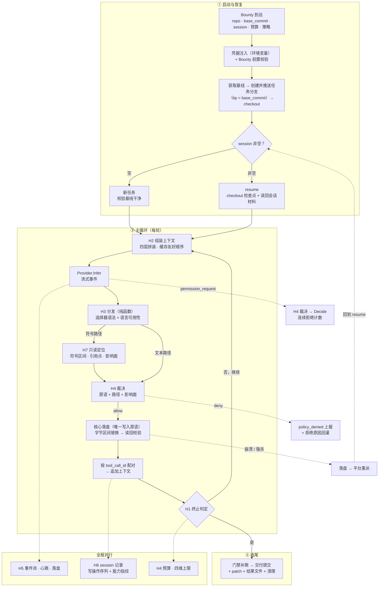

# Xhunter 架构设计

## 0. 文档定位

- 本文定义 **Harness（控制循环层）** 的职责边界、分层结构、组件规格、控制流时序与接口抽象。
- 产品边界与需求编号（FR/NFR/AC）见 `xhunter-product-design.md`；外部契约与使用方式见 `xhunter-usage.md`。本文是**实现层的结构约束**：产品文档说"要什么"，本文说"分成哪几块、边界在哪、按什么时序跑"。
- **控制流时序的规格权威是本文 §6**；接口签名以 `harness/types.go` 为准，环节清单与校验在 `harness/pipeline.go`，链驱动与轮边界收敛在 `harness/engine.go`。
- 不含具体代码实现、不含部署步骤与使用指南。

---

## 1. 为什么 Harness 必须独立成层

一句话：**换马不换挽具。**

| 隐喻 | 对应 | 特征 |
|---|---|---|
| 马 | 模型 / LLM | 有力量，**没有方向** |
| **挽具与缰绳** | **Harness** | 把模型的力量导向目标 |
| 骑手 | Xhunter | 决定去哪、做什么 |

模型供应商会持续更替（新模型、新定价、新协议），而**编排逻辑（循环、工具、上下文、策略）不应该跟着变**。Harness 的存在就是为了把这两件事隔开：

- **模型变更**：只改 Provider Adapter，Harness 零改动
- **编排演进**：只改 Harness，所有 Provider 同时受益

---

## 2. 职责边界

### 2.1 Harness 负责

| 职责 | 说明 |
|---|---|
| 控制循环 | 状态机推进、终止判定、错误收敛 |
| 上下文组装 | 系统提示词分层、历史管理、压缩、工具输出截断 |
| 工具调度 | 注册、并行、结果配对、错误结构化 |
| 策略裁决 | 路径边界、破坏性拦截、**权限询问应答**、四重预算、止损 |
| 事件与持久化 | 内部事件 → 外部协议映射、状态落盘、心跳 |
| 会话材料与检查点恢复 | 会话材料（对话 + 写操作 + 用量）随检查点提交；恢复 = checkout 分支 tip + 读回材料 + 上下文回灌（FR-12.1、FR-12.2） |
| 扩展接入 | MCP 客户端、工具来源管理与契约同构、扩展生命周期与降级（FR-13） |

### 2.2 Harness 不负责

| 不负责 | 交给谁 |
|---|---|
| 模型推理本身 | Provider Adapter（马） |
| 代码编辑算法（符号解析、区间替换） | Tools 的具体实现 |
| **符号解析与语言语法** | **符号扩展（MCP，本地进程）** |
| 任务排队、路由、重派 | 平台 |
| 交付物评审 | 平台侧 review |
| session 记录的存储与跨机传递 | 平台 |

**边界判据**：一件事如果"换模型后仍然一样"，就该在 Harness；如果"换模型后就不同"，就该在 Provider Adapter。

---

## 3. 分层架构

```
┌───────────────────────────────────────────────────────────────────┐
│  平台                                                              │
│    Bounty（repo + session）│ 环境变量（凭据）│ git 远端仓库        │
└──────────────────────────────┬────────────────────────────────────┘
                               │  进程边界（FR-1）
                               ▼
┌───────────────────────────────────────────────────────────────────┐
│  Xhunter                                                          │
│                                                                   │
│  ┌─────────────────────── Harness ──────────────────────────────┐ │
│  │                                                              │ │
│  │   H1  Loop      控制循环 · 状态机 · 终止判定 · 错误收敛        │ │
│  │        │                                                     │ │
│  │        ├─ H2  Context    提示词分层 · 历史 · 压缩 · 截断       │ │
│  │        ├─ H3  Tools      注册 · 并行调度 · 结果配对            │ │
│  │        ├─ H4  Policy     边界 · 拦截 · 权限应答 · 预算 · 止损  │ │
│  │        ├─ H5  Stream     事件映射 · 落盘 · 心跳                │ │
│  │        ├─ H6  Session    会话材料 · 检查点恢复 · 上下文回灌    │ │
│  │        └─ H7  Ext        MCP 客户端 · 契约同构 · 生命周期      │ │
│  │                                                              │ │
│  └──────────────────────────────┬───────────────────────────────┘ │
│                                 │  Provider 接口（挽具）           │
│  ┌──────────────────────────────▼───────────────────────────────┐ │
│  │  Provider Adapter   Anthropic │ OpenAI │ 本地 │ …            │ │
│  └──────────────────────────────┬───────────────────────────────┘ │
│                                 │                                 │
│  ┌──────────────────────────────▼───────────────────────────────┐ │
│  │  Tools  read · edit · write · find · glob · check（内置）     │ │
│  └──────────────────────────────┬───────────────────────────────┘ │
│                                 │ MCP（stdio · 本地进程）          │
│  ┌──────────────────────────────▼───────────────────────────────┐ │
│  │  符号扩展  符号视图 · 符号定位 · 区间计算 · 引用解析          │ │
│  │          （解析器 + 语言语法；对模型不可见）                  │ │
│  └──────────────────────────────────────────────────────────────┘ │
└───────────────────────────────────────────────────────────────────┘
                               │
                               ▼
                          模型（马）
```

**关键结构性约束**：Tools 由 Harness 直接调度，**不经过 Provider**。Provider 只负责"说出要调什么工具"，执行永远在 Harness 侧——否则工具执行时机就变成了供应商行为，换马就会换掉语义。

**扩展不改变这条约束**：符号扩展（MCP）只是工具的**远端实现**，调度、裁决与落盘仍在 Harness——写类符号工具由扩展返回定位结果（文件 + 区间 + 新内容），实际写盘由 Harness 执行（FR-13.3）。因此"单一写入原语"不因扩展而分裂。

**组装原则：所有模块以标准化接口暴露，由 `main` 包在装配期组装。** 图中每个方框（Provider / Tools / Policy / Sink / Session / Context / Ext / Git）都是接口，实现在装配期注入，**组装点唯一**。由此推出三点：

1. **分发形态降级为实现细节**——符号扩展随核心同包、独立包，还是跑在独立进程，架构层不感知：接口不变则装配代码不变。
2. **驱动者无关性落到代码上**——平台驱动与本地驱动**共用同一套装配代码**，差别只在"谁投递 Bounty、谁消费事件流"（§5）。
3. **可复用的是接口与控制流，不是实现组合**——这是 `harness/` 可被其他项目 import 的前提。

---

## 4. 流程组装与校验（FR-1.8）

控制流程**不写死在控制流里**，而是由一份环节清单组装而成：

```
Pipeline
├── Pre   []StageID          初始化，顺序执行一次
├── Turn  { Guards, Steps }  每轮：先守卫，再步骤
└── Post  []StageID          收尾，顺序执行一次
```

**可组装与不变量的接缝**——这是本节的核心设计：

| | 做法 | 后果 |
|---|---|---|
| 旧 | 把顺序硬编码在控制流代码里 | 不变量靠"没人改这段代码"保证 |
| 新 | `Validate()` 在**启动期**校验组装结果 | 不变量靠"**非法配置无法启动**"保证（退出码 2） |

即：**不变量从"代码里的固定顺序"升级为"配置的合法性规则"**。因此流程可以重排、可以增减可选环节，但**只要违反不变量就无法启动**。

**校验规则**（每条都对应需求或不变量，实现见 `harness/pipeline.go`）：

| 规则 | 对应 |
|---|---|
| 环节必须已定义，且只能出现在其所属区段；区段内不得重复 | 组装正确性 |
| `git.prepare_baseline` 必须存在且是 `pre` 的第一个环节；`ext.caps` 先于 `session.restore` | **INV-11**（基线先于任何写工作区的动作） |
| `guard.cancel` 与 `guard.budget` 必须存在 | **INV-3**（无静默挂起）、**FR-9.2**（预算必生效） |
| `tools.execute` 必须存在且唯一 | **FR-4.4 / INV-10**（唯一写盘入口） |
| `stream.receive` 必须在 `tools.execute` **之前** | 接收段不得产生写副作用（§6.3） |
| `checkpoint.commit` 若存在，必须在 `tools.execute` **之后** | **FR-1.3c 时间语义**（提交本轮已应用的改动） |
| `provider.infer` 必须存在 | 否则不可能产生工具调用 |
| `delivery.commit` 必须存在；`deliverable.diff` 在其之后 | **FR-6.1**（交付 = 分支 tip） |
| `gates.required` 若存在，必须在 `delivery.commit` 之前 | **FR-5.2f**（门禁结论要进入终态） |
| `event.hunt_end` 必须存在且是 `post` 的最后一个环节 | **FR-10.2**（终态上报） |

**注意最后几条的形态**：它们不是"必须有这个环节"，而是"**若你有，它必须在那个位置**"——这才是可组装的表达方式：**约束位置而非约束存在**，把选择权留给配置，把安全边界留给校验。

**边界（明确不做）**：不做运行时插件装卸（环节集合编译期固定，配置只能选择与排序，不能引入新环节）；不做多层 patch 叠加；不做字段级合并（给出 `pipeline` 即整体替换，避免"半配置"造成的隐式行为）。

**生效配置快照**：实际编排进 `hunt_start` 事件与结果文件（FR-11.6），格式见 `Pipeline.String()`——评审者可直接看到"这次用了什么流程"。

### 4.1 默认编排

| 区段 | 环节（按序） |
|---|---|
| `pre`（L1 初始化） | `git.prepare_baseline` → `workspace.scan` → `gates.load` → `ext.caps` → `session.restore`（条件） → `config.snapshot` |
| `turn.guards`（L2 轮前守卫） | `guard.cancel` → `guard.channel` → `guard.budget` → `context.compact` |
| `turn.steps` | `context.assemble` → `provider.infer` → `stream.receive` → `tools.execute` → `checkpoint.commit` |
| `post`（L7 终态收敛） | `session.snapshot` → `gates.required`（补跑） → `delivery.commit` → `deliverable.diff` → `workspace.cleanup` → `ext.close` → `event.hunt_end` |

环节职责与依据见 §6.3（运行段 L1~L7）。

---

## 5. 外部驱动形态（FR-1.9）

流程组装（§4）与"协作方全是接口"合起来，使**同一套核心可被不同形态驱动**。

| 形态 | 驱动者 | 核心是否需要改 | 适用 |
|---|---|---|---|
| **A. 配置驱动** | 外部生成 Bounty（含 `pipeline`）并投递 | **不需要** | 平台调度、可视化编排产物 |
| **B. 观察驱动** | 外部消费事件流做展示（轨迹视图） | **不需要** | 本地调试、平台 UI 的进度展示 |
| **C. 单步驱动** | 外部在进程内逐环节推进/暂停 | **需要**（`Step` 接口） | 开发工具、教学/演示 |

#### A. 配置驱动——**校验必须共用，外部编排不得成为绕过不变量的后门**

`Pipeline` 是**纯数据 + 纯函数**（`Validate()`），因此外部工具可以直接复用它做**编排合法性即时反馈**：拖动环节时当场提示"这样排违反 INV-11（基线必须在最前）"。

> **硬要求**：任何形态**必须调用同一份 `Validate()`**。若外部工具自己实现一套校验，它就会成为绕过不变量的入口——这是把校验做成纯函数（而非藏在控制流里）的主要理由之一。

#### B. 观察驱动——**现在就可用，核心零改动**

`EventSink` 是接口，因此 CLI 形态实现为 NDJSON 写 stdout，UI 形态实现为推给 UI（轨迹视图），事件**语义**仍按使用手册 §5（SSOT）。

**由此澄清一条不变量的精确含义**：INV-6「stdout 仅有外部事件，日志走 stderr」约束的是 **"事件通道唯一且与日志分离"**，而不是"必须写 stdout"——stdout 是 **CLI 形态的承载**。同一份事件语义可以有不同承载，这正是把外部契约定为 SSOT 的价值。

#### C. 单步驱动——可行，但**不进一期**

技术前提是 `Run(ctx, bounty)` 要能拆成"可暂停的状态机"（`Step` / `Resume`）；**环节函数可独立调用**（§6 的环节执行器）即是它的前提。此前必须先解决两个语义问题：**墙钟预算的计时语义**（等"下一步"的时间不能计入预算，需要"停表"概念）与**权限询问的归属**（UI 形态下 `Policy.Answer` 可接人工弹窗——决定仍经 `Policy`，只是 `Policy` 的实现把决定权交给了人，与 INV-4 不冲突；FR-7.2 禁止的是**模型向人提问**，两者不是一回事）。单步驱动属于**本地开发工具**形态，不是交付引擎形态。

#### D. 驱动者无关性

"平台"未被写死为某个具体实现：**任何满足"能准备 Bounty + 能启动进程并消费 stdout 事件流"两个条件的实体都是合法驱动者**。最小条件与使用约束见 `xhunter-usage.md` §1.2；**换驱动者只换"谁投递、谁消费"，不换"什么被允许"**。

---

## 6. 任务生命周期（规格权威）

生命周期以**任务完整生命周期**为骨架：生成段 G → 运行段 R（L1~L7）→ 处置段 D。

### 6.1 全景与联合状态机

```
生成段 G            运行段 R                      处置段 D
───────    ┌───────────────────────────┐    ─────────────────
G1 生成 ──► G3 启动 ──► L1 初始化            ──► D1 验收（MR）
G2 排队            │   ┌─ L2 准备 ←────────┐    │   ├─ merged
（平台）           │   │  L3 发送 → L4 接收 │    │   └─ abandoned
                   │   │      L5 处理 → L6 收敛   D2 合并/放弃
                   │   └─────────┘        D3 归档清理
                   └── L7 终态收敛            D4 演化回灌 ──┐
                       （succeeded/failed/         │          │
                        cancelled）                ▼          │
                                             下一任务的 G1 ◄┘
```

**联合状态机**（◇= 平台侧职责，□= Xhunter 侧职责）：

```
◇ created ──► ◇ queued ──► □ running ──► □ terminal(succeeded|failed|cancelled)
                   ▲            │                │
                   │            │ 流静默超限      │ exit 0
                   └──── ◇ orphaned              ▼
                   （重派，session 保留）   ◇ delivered ──► ◇ merged | abandoned ──► ◇ archived
                                     exit 1/3：不重派，走平台处置
```

Xhunter 的契约边界：**进程内只认 running→terminal**；created/queued/orphaned/delivered/merged/archived 全归平台，Xhunter 不感知、不实现。

### 6.2 生成段 G（Bounty 从无到启动）

| 环节 | 职责方 | 动作 | 依据 |
|---|---|---|---|
| **G1 生成/自举** | 平台 或 本地驱动（`xhunter run --repo --task`） | 探测 remote / HEAD / 分支名候选 / 门禁候选 → 组装 Bounty（ID、Task、Repo{remote,branch,base_commit}、Session、Budget、Policy、Checkpoint、Pipeline）；分配或继承 `trace_id` | FR-1.1、FR-1.10 |
| **G2 投递/排队** | ◇ 平台 | Bounty 文件 + 命令行准备；队列与调度；**崩溃重派次数上限也在此**（建议 ≤3，超限退化 failed） | FR-1.4、AC-7 |
| **G3 启动契约** | ◇+□ | 进程启动：stdin 关闭、stdout=事件流、stderr=日志、环境变量注入凭据；Xhunter 输出 `hunt_start` 后进入 L1 | 使用手册 §2/§5、FR-8.4、INV-7 |

失败收敛：G1 生成不出合法 Bounty → 不启动（本地驱动报错退出；平台侧标记 failed）。Bounty 校验（含 `Pipeline.Validate()`）是 L1 之前的第一道闸。

### 6.3 运行段 R（L1~L7）

#### L1 初始化（任务一次）

| 序 | 切入点 | 依据 | 说明 |
|---|---|---|---|
| 0 | 进程预检（代码级，非环节） | FR-9.5 | Provider 上限类能力校验；缺失→退出 2 |
| 1 | `git.prepare_baseline` | FR-1.3、INV-11 | 基线→任务分支→checkout；先于一切可能写工作区的动作 |
| 2 | `workspace.scan` | FR-2.6、FR-15.2/15.3 | AGENTS.md 根级发现 + skill frontmatter 扫描；**从基线读取、启动冻结**；产出工作区素材快照供 L2 拼装 |
| 3 | `gates.load` | FR-5.2c | 门禁清单来源裁决（Bounty 下发 > 基线 `.xhunter/gates.yml` > 无） |
| 4 | `ext.caps` | FR-13.4、FR-1.11④ | 能力描述符；不可用→全量文本降级。**模型可见工具面在此定格**（原语名字集合由交付分期决定 + 符号路径可用性由扩展能力决定，两者合并后存为任务状态） |
| 5 | `session.restore`（条件环节） | FR-12.1、FR-13.7 | session 非空才执行；checkout 分支 tip + 读回材料；指纹不一致拒绝（退出 2） |
| 6 | `config.snapshot` | FR-11.6 | 生效配置快照生成时点显式化（进结果文件） |

事件：`hunt_start`、heartbeat(bootstrap/restore)。失败：环境错误→L7（退出 2）。

#### L2 轮前准备（每轮）

| 切入点 | 依据 | 说明 |
|---|---|---|
| `guard.cancel` | FR-1.7 | 取消→L7（cancelled，退出 3） |
| `guard.channel` | FR-10.4 | writeErr→L7（退出 2，AC-19） |
| `guard.budget` | FR-9.2 | 耗尽→L7（退出 1，含维度） |
| `context.compact` | FR-14.1 | 三档水位+冷却；硬上限→错误 |
| `context.assemble` | FR-7.1/7.6、FR-2.6、FR-15.2 | 四层拼装；素材=L1 素材快照 + 动态层 |

#### L3 请求发送（每轮）

| 切入点 | 依据 | 说明 |
|---|---|---|
| `provider.infer` | FR-4.11、FR-9.5 | 请求 = messages + 可见原语（**7 个文件原语 + 1 个控制原语**）；可见原语**读自 L1 `ext.caps` 已定格的工具面**，与 L2 工具说明层同源（单一事实源）；`checkpoint` 控制原语在此注册 |

失败 `infer_failed`→L7（退出 1）。事件：heartbeat(infer)。

#### L4 流式接收（每轮·流期间）

| 事件 | 处理 | 依据 |
|---|---|---|
| text | → `assistant_text` 事件 | FR-10 |
| permission_request | → **Policy.Answer（运行时权限层）** → `sess.Decide` | INV-4；**流内必答**（Provider 等待决策） |
| tool_use | → **入队，不执行**（记录 CallID 与到达序） | 接收段零副作用 |
| usage | → Policy.Charge + `usage` 事件 | FR-9、FR-11 |
| error | 可重试记日志 / 不可重试→L7 | FR-11.2 |
| end | → 进入 L5 | — |
| **流看门狗** | 不活动超时（无任何事件）→ `sess.Cancel()` → L7 环境错误 | FR-1.11①、INV-3 |

约束：消费循环可被 ctx 打断（INV-8），打断时**必须调用 `sess.Cancel()` 并汇入 L7**（cancelled，退出 3）；取消时已入队未执行的 calls **不执行**，TurnRecord 按"已执行部分"配对落盘，缺失对标记 `cancelled`（FR-1.11③）；stdout 写失败记 writeErr，轮末收敛（FR-10.4）。

#### L5 响应处理（每轮·流结束后；**唯一写盘窗口**）

| 切入点 | 依据 | 说明 |
|---|---|---|
| 工具流水线（按到达序，默认串行） | FR-4.12、FR-8.7、FR-4.4、INV-10、FR-3.1 | Inspect→Dispatch→rename 能力判定（无引用解析→结构化错误，**不降级为文本路径**）→Prepare（只读定位）→**Policy.Decide（调用裁决层）**→Execute→Commit |
| WriteOp→RecordOp | FR-12.2 | 重放素材与交付物依据 |
| `every_write` 逐写提交 | FR-1.3c | 唯一不在 L6 的检查点 |
| check 门禁结果处理 | FR-1.3c、FR-5.2c | 通过→本轮 gatePassed；失败→gateFailed |
| 事件 `tool_result`/`policy_denied`/`check_result` | FR-10、FR-5.2 | **时点移到流后**（使用手册 §5） |
| TurnRecord→Context.Append + Session.RecordTurn | FR-12.2 | 结果按 CallID 严格配对后入上下文 |

#### L6 轮收敛（每轮边界）

| 切入点 | 依据 | 说明 |
|---|---|---|
| 检查点决策（**本轮单一提交点**） | FR-1.3c/1.3d | 优先级：门禁通过 > 模型显式 > 结构检查/轮兜底（`every_write` 为 L5 内例外）；**提交本轮已应用改动** |
| structureGate | FR-1.3d | 用 H3.Inspect（只读）；三态判定 |
| 止损 + 连续拒绝 | FR-9.4、§7.3 | 触发→L7（退出 1） |
| writeErr 复查 | FR-10.4 | →L7（退出 2） |
| **commitErr 复查** | FR-1.3b 自愈上限 | 连续 3 次提交失败→**本轮结束时收敛**到 L7（退出 2），不跑完剩余轮次（FR-1.11②） |
| 终止判定 | FR-6、使用手册 §7 | 无 tool_call→L7 交付闸门（Ops 空→`no_output` 失败）；否则回 L2 |

#### L7 终态收敛（任务一次；G 后任何阶段的失败/取消全部汇入此处）

| 切入点 | 依据 | 说明 |
|---|---|---|
| **中途收敛衔接** | INV-3 | L2~L6 每段入口复查"上段是否已判死"；取消/错误下材料落盘仍尽力而为 |
| session.snapshot | FR-12.3b | 尽力而为，不阻断 |
| gates.required 补跑 | FR-5.2f | 在交付提交之前 |
| delivery.commit | FR-6.1 | 失败路径也尽力提交；成功终态+提交连败→覆盖为失败/退出 2 |
| deliverable.diff | FR-6.1 | 排除 `.xhunter/**` |
| workspace.cleanup / ext.close | FR-12.4、FR-13.5 | 清理失败不阻断 |
| hunt_end（必须是最后动作） | FR-10.2 | 终态 + 退出码（使用手册 §7） |

### 6.4 处置段 D（终态之后；平台为主，Xhunter 契约到文件为止）

| 环节 | 职责方 | 动作 | 依据 |
|---|---|---|---|
| **D1 验收** | ◇ 平台 | 退出码→处置（使用手册 §7 映射表）：0→取 patch 进 MR；1/3→按失败/取消流程；2→重派（回到 G2）。MR 评审证据 = 任务分支提交链 + patch + 结果文件（gates 证据 + `effective_config` 快照） | FR-6、FR-11.6、AC-20 |
| **D2 合并/放弃** | ◇ 人 | merge 形态（ff/squash/rebase）= 宿主仓库政策，**不在 Xhunter 契约内**；Xhunter 保证的只是：分支 tip 可 fast-forward、patch 可应用（AC-1）、绝不 force push | FR-8.3 |
| **D3 归档清理** | ◇ 平台 | 事件流脱敏+滚动清理；会话材料 `.xhunter/<id>/` 随分支保留；分支删除属仓库所有者（Xhunter 永不删分支，FR-8.3） | FR-12.3 |
| **D4 演化回灌** | ◇ 人 + 下一任务 | MR 合并的 AGENTS.md 修改与 `skills.draft/` 成为**下一任务的新基线**——下一任务的 L1 `workspace.scan` 读到的就是它们。单任务是线，跨任务是环 | FR-2.6、FR-15.3 |

### 6.5 异常与恢复矩阵

| 中断点 | 检测方 | 恢复动作 | 幂等/一致性保证 |
|---|---|---|---|
| G3 前崩溃 / L1 基线就绪前 | ◇ 流静默 | 重派 | `PrepareBaseline` 幂等：分支不存在则建；已存在且 tip=基线或其后代即成功 |
| L1 完成后、首个检查点前 | ◇ 流静默 | 重派（session 指向空材料=等价新任务） | 临时工作区丢弃无损；材料为空则从基线重跑 |
| L2~L6 中途（已有检查点） | ◇ 流静默 | 重派→resume：checkout 分支 tip + 读回材料，**未重做已完成轮次**；在途一轮由模型重做（代价有界） | AC-7；检查点自愈（累积重提） |
| L7 中途（交付提交后、hunt_end 前） | ◇ 流静默 | 重派→resume：tip 已含交付提交，材料完整；模型复查后无新调用→再收敛（`ErrNoChanges` 不重复提交） | 交付幂等：diff 可再生、提交幂等 |
| L4 流内挂起（Provider 断流） | □ 流看门狗 | Cancel→L7 退出 2→◇ 可重派 | 流内无副作用（工具在 L5 执行），无半写状态 |
| 用户取消（SIGTERM） | □ guard.cancel | 优雅退出：材料落盘→cleanup→exit 3；检查点保留 | AC-6；◇ 决定重开新任务或废弃 |
| 退出 1（预算/止损/无产出） | ◇ | **不重派**（重派同样耗尽） | 结果文件含耗尽维度与 unverified |
| 退出 2（环境） | ◇ | 重派（≤N 次，建议 3，超限退化 failed） | 环境修复后可续（resume）或重来（无材料时） |

### 6.6 不变量落点

| INV | 落点 |
|---|---|
| INV-1 无供应商名 | 全程（架构级） |
| INV-2 工具执行在 Harness | L5 |
| INV-3 显式终态 | L7 唯一出口 + L2 守卫每轮 + L4 看门狗 + L6 commitErr 复查 + §6.5 恢复矩阵全覆盖 |
| INV-4 权限经 Policy | L4 Answer / L5 Decide |
| INV-5/6 事件契约 | 各段事件产出；L5 顺序变化见使用手册 §5 |
| INV-7 凭据不入上下文 | G3 环境注入；L5 门禁子进程环境最小集（FR-5.2i） |
| INV-8 可取消 | L2 守卫 + L4 打断必调 `sess.Cancel()`→L7 |
| INV-9 已退役 | L1-5 恢复 = checkout + 读回材料 |
| INV-10 写盘在核心 | L5 唯一写盘窗口 |
| INV-11 分支/交付不经模型 | L1-1 / L6 / L7——全不在模型可达面；D3 注：Xhunter 永不删分支 |

---

## 7. 组件规格

### 7.1 H1 Loop —— 控制循环

**状态机**（显式，不可省略）：

```
                ┌── restore（仅 session 非空：checkout 分支 tip → 读回会话材料 → 回灌上下文）
                ▼
assemble ──► infer ──► dispatch ──► observe ──┬──► assemble   （继续）
   ▲                                          │
   └──────────────────────────────────────────┴──► finalize   （终止）
```

**终止条件**（全部必须显式判定，任一命中即收敛到终态并携带原因）：

| 条件 | 终态 | 说明 |
|---|---|---|
| 本轮无 tool_call | 成功（过交付闸门） | 唯一"正常完成"路径；无任何写操作时判 `no_output` 失败 |
| 轮数达上限 | 失败 | 预算耗尽维度 = turns |
| token / 费用超限 | 失败 | 维度 = tokens / cost |
| 墙钟超时 | 失败 | 维度 = wall_clock |
| 连续同类失败**达阈值** | 继续（**切换策略**，不终止） | FR-9.4 第一段；H4 的止损输出 `switch` |
| 连续同类失败**超过上限** | 失败 | FR-9.4 第二段；止损上限 |
| 策略连续拒绝累积 | 失败 | 模型在撞不该撞的墙 |
| 外部信号 | 取消 | SIGTERM / SIGINT |

> 止损是**两段式**（FR-9.4）：达到阈值先换策略，超过上限才失败——若把它压成一行"达阈值即失败"，就丢掉了模型自我纠错的机会。

**不变量**：任何异常（工具 panic、Provider 返回畸形数据、进程被杀）都必须收敛到终态并带原因，**不允许静默挂起**。

### 7.2 H2 Context —— 上下文组装

四层拼装，顺序即缓存友好顺序（FR-7.6）：

> 与 FR-7.1 的"提示词三层"是同一件事的两种切法：FR-7.1 按**职责**分（内置层 / 工作区层 / 任务层），本节按**拼装顺序**分。映射关系：FR-7.1 的"内置层"= 本节 [1]；FR-7.1 的"任务层"= 本节 [2]（工具说明，由 schema 生成）+ [4]（动态层：环境事实 → Bounty 正文）。

```
[1] 内置层      角色 · 工具纪律 · 无人类条款 · 止损规则     ← 最稳定
[2] 工具说明    由工具 schema 自动生成，不手写
[3] 工作区层    项目约定文件（AGENTS.md）+ skill 发现清单（FR-15.2）
[4] 动态层      环境事实（cwd / git / shell）→ Bounty 正文  ← 每次不同
```

**工作区层素材细则**：

- **AGENTS.md**（FR-2.6）：根级全文注入 [3]；monorepo 嵌套采用"**命中附注**"——工具结果携带该文件路径向上链上最近且未注入过的嵌套 AGENTS.md（追加到 [4]，因为它是按操作位置动态出现的）。启动读取一次即固定，运行中不重读。
- **skill 发现清单**（FR-15.2）：从 `.xhunter/skills/`（基线 commit 读取，冻结语义）扫描 frontmatter，注入 name+description 清单（总量封顶）；SKILL.md 与 references/ 的**全文按需加载**由模型经 `read` 原语完成——渐进披露天然落在 7 原语上，核心零新机制；scripts/ 不可执行（FR-15.4）。

**压缩**（FR-14）：

**水位的定义**：`可用输入预算 = MaxContextTokens（预置配置，FR-9.5） − 固定开销（内置层 + 工具 schema） − 输出预留`。三档水位：预警 70% 触发、目标 50% 压后水位、硬上限 90% 不可继续。

```
预警 70% ──► 触发压缩 ──► 压到目标 50% ──► 冷却 N 轮 ──► 再次逼近才压
                                        （不是超限才动手：那时已无余量跑完压缩后的那一轮）
```

**为什么是"批量压深"而不是"持续微调"**：四层拼装的前置稳定内容正是为了吃 prompt cache 的红利，而**任何对已缓存前缀的改写都会让其后全部 token 的缓存失效**。低频、一次压到位，两次压缩之间才能持续命中缓存。

**分层压缩（按序下压，够用即停）**：

| 层 | 手段 | 损失 | 成本 |
|---|---|---|---|
| L0 | 工具输出截断（H3 已有：标注截断位置与总量） | 极低 | 0 |
| L1 | 丢弃可重建信息（推理过程整段丢弃） | 低 | 0 |
| L2 | 工具输出**整体替换为可寻址摘要**（"读了 X 的 1–200 行，含 N 个符号"） | 中，模型可重新读 | 0 |
| L3 | 旧轮折叠为**结构化工作日志** | 高（丢过程、留结论） | 0 |
| L4 | 模型摘要（可选，非默认） | — | 一次模型调用，计入预算 |

**保丢优先级（FR-14.3）**：

| 等级 | 内容 |
|---|---|
| **永不丢** | Bounty 正文与验收标准、工作区约定、当前轮 messages、**写操作记录** |
| 优先保留 | 最近 N 轮的完整 tool_call / result 对 |
| 可替换 | 早期工具输出 → L2 可寻址摘要 |
| 可丢弃 | 推理过程、重复失败的重试细节（留结论）、已被后续覆盖的中间态 |

**"写操作记录永不丢"是硬要求**：它是"只碰必要字节"与交付物可解释性的基础，也是失败路径下生成 assumptions / unverified 的来源。

**结构化工作日志是投影，不是总结**：字段固定为「任务与验收标准 / 已完成改动 / 已确认事实 / 失败尝试与原因 / 未决问题与假设」，由 H6 的 session 记录**投影**得出——零模型调用、内容与顺序可复现、可脱离模型单测（NFR-8）。L4 若启用，摘要文本同样"生成一次即落盘、恢复时读回"。

**交付物不依赖上下文（FR-14.6）**：patch、`files_changed`、assumptions、unverified 全部由 Harness 从 session 记录生成。模型压缩后"忘记"改过什么，不影响交付物完整性。

**截断策略必须区分"头尾保留"与"整体替换"**：小超限用头尾保留 + 省略标记；已明显是原始流 dump 时整体替换为提示，不得让不可信内容进入上下文。

### 7.3 H3 Tools —— 工具调度

| 职责 | 要求 |
|---|---|
| 注册 | **两个轴分开**：**交付分期**决定是否注册（M1/M2/M3，未实现的工具不注册而非返回空）；**环境能力不决定注册**——扩展不可用、语言未注册、扩展不具备引用解析能力时，工具**仍注册**，调用退回文本路径或返回结构化错误。**模型侧恒定 7 个文件原语 + 1 个控制原语**（`checkpoint`），能力差异不体现为工具名与参数 schema（FR-4.11、AC-26） |
| 分发 | 统一原语按**选择器语法 + 语言可用性**选择内部路径；`resolved_mode` 随结果上报；路径不同**不得放宽匹配语义**（FR-4.12、FR-4.13） |
| 并行 | 同一轮内无依赖的调用并行执行；有依赖的串行（一期默认串行，结构留门） |
| 配对 | 结果按 `tool_call_id` 严格配对，**禁止按顺序猜测** |
| 错误 | 失败必须返回结构化错误（类型 + 上下文 + 可重试性），供模型自愈 |
| 截断 | 输出超限时标注截断位置与总量，三态表达"完整/已截断/未知" |
| 语言能力 | 符号类工具由**语言注册表**决定精度：已注册语言给符号级能力，未注册语言降级文本模式并**显式提示降级**，不拒绝文件（FR-4.9、FR-4.10）。降级必须对模型与事件流同时可见 |

### 7.4 H4 Policy —— 策略与预算

**这是无人类场景下唯一顶替人类的位置**，因此它是 Harness 里最不可省的一块。

| 裁决点 | 输入 | 输出 |
|---|---|---|
| 路径边界 | 工具 + 参数 | allow / deny |
| **分发路径** | 原语 + 内部路径（文本 / 符号）+ 影响面 | allow / deny |
| 破坏性操作 | 工具 + 参数 | allow / deny |
| **权限询问应答** | Provider 的 PermissionRequest | allow / deny / rewrite |
| 预算 | 累计用量 | continue / terminate |
| 止损 | 失败序列 | continue / switch / terminate |

**权限应答是整个 Harness 最容易被忽略、却最关键的一环**（见 §10.3）。

**为什么需要「分发路径」这一裁决点**：统一原语（FR-4.11）把文本路径与符号路径的差异藏进了内部，等于削弱了"工具即权限边界"的显式性。这一行把它补回来——策略可以表达"允许文本路径、拒绝跨文件重命名"这类规则（FR-8.7），而 `rename` 的影响面（由扩展只读解析先行得出）正是最需要拦截的对象。

### 7.5 H5 Stream —— 事件与持久化

- **内部事件 → 外部协议映射**（见 §9）：内部可细、外部须稳。外部契约的权威在使用手册 §5。
- **落盘**：周期性写入当前状态与 session 增量，应对不可捕获的强杀信号（FR-12.3b）。
- **心跳**：任务级，与 runtime 心跳解耦（FR-10.1）；**外部通道只有 stdout**，不做网络上报。
- **通道隔离**：事件流走 stdout，人类日志走 stderr，绝不混用（FR-11.4）。
- **通道断裂即终止**（FR-10.4）：写 stdout 失败（EPIPE / 磁盘满）意味着消费者已不在或无法接收，此时**记录原因并终止**（环境错误，退出码 2）。

### 7.6 H6 Session —— 会话材料与检查点恢复

**记录**（Hunt 全程）：

| 记录项 | 要求 |
|---|---|
| 写操作序列 | 工具名 + 完整参数 + 结果摘要 + turn 序号，自含**续跑**所需的全部信息（FR-12.2） |
| 上下文素材 | H2 实际拼装的 messages 增量（含截断标记）——恢复的是"模型当时看到的东西"，而非原始全量输出 |
| 记录边界 | 只记写操作与上下文；**读操作与 check 不复放执行**，其结果直接回灌 |

**恢复**（session 非空时，在 assemble 之前执行；**不重放写操作**）：

1. 获取基线（按 SHA 浅克隆，不可得则完整克隆）→ **在基线 commit 上创建并推送任务分支**（已存在且 tip 为基线或其后代即幂等）→ **checkout 分支 tip（最后一个检查点）**——该状态即上次工作区，**无需重新执行任何写操作**
2. 读回**会话材料**（`.xhunter/<bounty_id>/`，随检查点提交进分支，git 保证完整性）→ 台账出已完成轮次与写操作序列
3. **零工具执行**：恢复过程不调用 H3；材料损坏或 `schema_version` 不兼容 → 退出码 2，平台 fallback 重跑（FR-12.6）
4. 回灌上下文（过 H2 压缩）→ 进入 assemble，从**下一轮**继续——不重做已完成轮次

**代价（明确接受）**：检查点之间的改动（最多在途一轮）不在工作区里，由模型在续跑轮重做。用"最多一轮的 token"换掉"重放器 + 忠实性证明"。

**唯一状态源**：会话材料是本次 Hunt 的**唯一状态记录**；上下文（messages）由它**派生**（压缩管线是纯投影，FR-14.4），而不是并行维护的第二份状态——避免"日志与快照对齐"这类一致性问题。

**关键不变量**：恢复全程**零模型调用、零写操作执行**；工作区与上下文同源于一份材料，不引入第二份快照。

### 7.7 H7 Ext —— 扩展接入（MCP）

符号级能力不在核心里，由本地 MCP 扩展提供。H7 是 Harness 侧的客户端与治理层。

| 职责 | 要求 |
|---|---|
| 模型不可见 | 扩展**不新增模型可见的工具名**；其能力经统一原语的内部分发呈现（FR-4.11、FR-13.2）；结果结构与错误语义与内置完全一致 |
| 能力声明 | 扩展上报**能力描述符**（能力集 + 精度等级 `syntactic` / `semantic`）；核心据此决定符号路径可用性与结果标注，**不感知后端种类**（FR-13.8、FR-4.13） |
| 落盘归位 | 符号路径的写操作（`edit` / `rename` 的符号分支）只接受扩展返回的**定位结果**（文件 + 字节区间 + 新内容），由 Harness 执行区间替换（FR-13.3、FR-4.4） |
| 生命周期 | 懒启动（首次调用符号工具时拉起）、随 Hunt 退出回收（FR-12.4）；**崩溃隔离**——扩展死掉不得使主循环静默挂起（INV-3）；**注册即副作用、卸载即撤销**：扩展注册的工具 schema / 符号能力 / 能力描述符随其卸载全部撤销 |
| 降级 | 扩展缺失/启动失败/超时 → 符号路径不可用（**工具不撤回**，FR-4.11），能走文本路径的退回文本模式、无降级形态的返回结构化错误，并向模型显式提示，任务继续（FR-13.4、AC-12、AC-26） |
| 不可信边界 | 仅本地进程；不继承凭据环境变量（FR-8.4）；不得绕过路径校验（FR-3.5、FR-8.2）——扩展没有写权限，写盘只在 Harness |
| 能力指纹 | 记录扩展标识 + 版本 + 语言清单，写入 session 记录；指纹不一致只记录、不阻断（FR-13.7） |

**与 Provider `Caps` 同构**："能力声明 + 缺失降级"在本设计中第二次出现（第一次是模型能力，见 §8）。这是 Harness 面对任何**不可控外部组件**时的通用模式：**声明能力 → 按能力降级 → 如实上报**。

**为什么值得独立成层**：解析器是整套设计里唯一"轻则误改用户代码、重则进程崩溃"的重组件。把它放到进程外，换来三件事——核心保持零 CGO 与语言无关；解析器选型降级为扩展侧决策，可替换、可多实现；解析器崩溃与内存失控被进程边界隔离。

**内部后端抽象（能力声明驱动）**：抽象层**位于扩展内部**，对核心只暴露能力描述符。自包含语法后端为**默认**（唯一满足 NFR-1，也是所有语言的兜底）；LSP 语义后端**可选启用**（`rename` 与引用点查询优先用它），缺失时降级到自包含后端并**上报精度变化**。三条不变量：后端替换**不改变工具契约**；**精度如实上报**（FR-4.13）；外部后端**不得成为必需依赖**（AC-14）。

### 7.8 质量门禁（`check` 原语的具名条目）

门禁**不是新工具**，而是 `check` 原语的具名条目——文件原语仍是 7 个（另有 1 个控制原语 `checkpoint`）。

**清单来源（按优先级，FR-5.2b）**：① **Bounty 下发**（平台显式配置，可覆盖或禁用仓库声明）② **仓库声明** `.xhunter/gates.yml` ③ 无 → 不设门禁。

**仓库声明必须从基线 commit 读取**（`git show <base_commit>:.xhunter/gates.yml`），**不从工作区读取**（FR-5.2g）——要防的是**模型在任务中途削弱自己的门禁**：工作区可被 `edit`，而基线 commit 被任务分支钉住、不可改。**读取基线 = 冻结配置语义**。策略层另拒绝模型写该路径（纵深防御，FR-8.7）。门禁名随上下文注入模型。

**格式**：

```json
"gates": [
  {"name": "fmt",   "argv": ["gofmt", "-l", "."],   "timeout": "30s",  "required": true,  "expect": "empty_output"},
  {"name": "build", "argv": ["go", "build", "./..."],"timeout": "300s", "required": true,  "expect": "exit_zero"},
  {"name": "test",  "argv": ["go", "test", "./..."], "timeout": "600s", "required": false, "expect": "exit_zero"}
]
```

| 字段 | 语义 |
|---|---|
| `name` | 门禁名（进提交信息、事件与结果文件；模型按名字调用） |
| `argv` | **数组直启，不经 shell**——`;`、`&&`、`$()` 不被解释 |
| `timeout` | 单门禁超时，独立于墙钟预算 |
| `required` | 是否"必须通过才算交付成功"（见下） |
| `expect` | **通过判据**：`exit_zero` / `empty_output`（如 `gofmt -l` 无输出即通过）/ `regex` / `max_warnings` |

**`expect` 不是装饰**：`gofmt -l` 的通过判据是"输出为空"而非"退出码 0"；lint 是"警告数 ≤ N"。若一律按退出码判定，格式门禁会永远"通过"，等于没有。

**两类失败必须分开**（这是本节最关键的一条）：

| 情形 | 含义 | 处理 |
|---|---|---|
| **执行失败**：命令不存在、无法创建进程、超时 | 环境或配置问题——**不是质量结论** | **环境错误（退出码 2）**，平台修好可重派 |
| **判定不通过**：退出码非 0、输出越阈值 | 质量确实不达标 | 终态失败（若 `required`），并**抑制自动检查点**（FR-5.2c） |

把两者混同的后果很具体：门禁命令名写错会被当成"代码质量差"，任务反复失败却永远修不好。

**结果缓存**：按**待提交改动的内容指纹**缓存上一次结果，同一状态重复调用直接返回缓存（标注 `cached: true`）。模型常会反复调同一门禁，而测试动辄数十秒到数分钟——缓存既省时间，也避免"重复门禁调用产生重复检查点"。

**技术栈：不需要 shell**。`argv` 数组直启（fork+exec），Xhunter **不依赖 bash 存在**，也不调用 `timeout`/`head`/`sed` 等外部工具：

| 需求 | 实现 |
|---|---|
| 超时 | `context.WithTimeout` + `exec.CommandContext`（超时即杀进程组） |
| 输出截断 | 限长读取（保留头尾），不靠 `head`/`tail` |
| 非交互 | `Stdin = nil` + `CI=1` / `NO_COLOR=1` / `GIT_TERMINAL_PROMPT=0` |
| 工作目录 | 工作区根，或清单声明的 `dir`（monorepo） |
| 环境 | **最小集 + 清单显式声明的 `env`**；**Xhunter 自身的 git 凭据绝不传入**（FR-5.2i） |

**一个必须说清的边界**：门禁**命令自己**可能内部用到 shell（`npm run lint` 会经 `sh -c` 执行 `package.json` 里的 scripts）。这不在 Xhunter 的控制范围内，也不该由我们堵——那已经是"执行仓库配置的构建脚本"的性质。**我们堵的是显式把 shell 请回来**：`argv[0]` 为 `sh`/`bash`/`zsh`/`dash` 一律拒绝（元门禁，FR-5.2h）。**不要把"数组直启"理解为"门禁内部不会用到 shell"。**

**执行约束**：非交互环境 + 关闭子进程 stdin（FR-8.6）；输出截断（保留头尾）；工作目录为工作区根；**一期不强制网络隔离**，靠约定（`GOFLAGS=-mod=vendor`、离线安装）+ 超时兜底。

**与交付状态的关系**（FR-6.5 的具体化）：**任一 `required` 门禁未通过，或从未运行 → 终态为失败（退出码 1），但改动照常交付**。"从未运行"也计入不通过——否则模型只要不跑门禁就能拿到成功状态。

**上报**：事件 `check_result` 扩展 `gate` / `passed` / `cached` / `duration_ms` / `exit_code` / `stats`；结果文件含 `gates` 汇总**并列出未运行的门禁**。

**任务本身就是改门禁时（FR-5.2h）**：默认"从基线读取"意味着新清单本次不生效，下次成为新基线后才生效（与 CI 惯例一致）。需要新清单本次生效时，**只能由 Bounty 显式授予**（`gates_source: "working_tree"`），并受三条护栏约束：**元门禁**（schema 合法 + 每个 `argv` 可启动）、**强度不得降低**（同名 `required` 门禁的 `argv`/`expect` 不得改动，只允许新增）、**显式上报**（`gate_config_changed` 事件 + 结果文件标注清单来源）。**模型拿不到豁免**：`gates_source` 只存在于 Bounty。

**执行主体：模型主调用 + 收尾自动补跑**（两级）：

| 层 | 谁执行 | 时机 | 理由 |
|---|---|---|---|
| **主路径** | **模型**经 `check` 工具 | 模型判断"改完一批相关文件、值得验证"时 | 门禁（尤其测试）昂贵，模型的语义判断能避免在每次编辑后跑测试；这也让它与"检查点落在语义边界"一致 |
| **兜底** | **Harness 自动** | **收尾前**，对尚未通过的 `required` 门禁各跑一次 | ① "required 未运行"本身即判交付失败——模型若从未调用，整段工作白跑；② 此时工作区就是**最终交付物**，结论才有针对性 |

**不做"每轮自动跑门禁"**：中间状态多为半成品，门禁必然失败 → 反而抑制检查点、增加丢失窗口，且墙钟成本可能翻倍。**自动化的价值在"交付前的那一道"，不在过程中的每一次。**

**自动补跑不破坏"写操作只由模型发起"**：门禁是**验证**性质、必须**只读**——不得修改被跟踪文件（如 `jest --updateSnapshot`、`gofmt -w` 这类写形态的命令不属门禁）；其产物（构建缓存、临时目录）不应进入交付 diff。

**默认门禁集由平台配置，Xhunter 不内置**：门禁命令与仓库布局强相关（monorepo 的 test 命令各不相同），内置默认极易误判。

---

## 8. Provider 抽象（挽具接口）

Provider 是**唯一允许知道"具体是哪家模型"的地方**。

```go
// Provider 只做一件事：给定上下文与工具声明，产出一轮流式事件。
type Provider interface {
    Infer(ctx context.Context, req InferenceRequest) (Session, error)
    Capabilities() Caps
}

type Session interface {
    Events() <-chan Event        // 流式：text / thinking / tool_use / permission_request / usage / end
    Decide(reqID string, d Decision) error   // 应答权限询问（双向通道）
    Cancel() error
}
```

**接口设计要点**：

| 要点 | 原因 |
|---|---|
| `Events()` 与 `Decide()` 分离 | 权限询问需要**双向**通道，不是单向流 |
| `Caps` 能力声明 | 不同 Provider 支持并行工具调用、结构化输出、思考块的能力不同，编排需据此降级 |
| 不使用具体供应商类型 | 结构上保证 Harness 不依赖任何一家 |
| 流式而非一次性 | 中断、预算、心跳都依赖增量进度 |

**能力声明的最小集合**：

```go
type Caps struct {
    ParallelToolCalls   bool
    StructuredOutput    bool
    ThinkingBlocks      bool
    PermissionCallback  bool   // 是否支持运行时权限询问
    UsageReporting      bool   // 是否回报 token 用量
    MaxContextTokens    int    // 来自预置配置，不探测、不估算（FR-9.5）
}
```

**能力类字段分两类，降级规则不同**：

| 类别 | 字段 | 缺失时 |
|---|---|---|
| **上限类** | `MaxContextTokens` | **不得估算**：必须来自预置配置（内置模型目录 → 用户配置覆盖），都没有则启动期显式失败（FR-9.5） |
| 行为类 | `ParallelToolCalls`、`StructuredOutput`、`ThinkingBlocks`、`PermissionCallback` | 降级（不支持并行则串行、不支持权限回调则走预裁决） |
| 用量类 | `UsageReporting` | 本地估算，误差自校正 |

**不允许"缺了就静默不工作"**；也确实不允许"缺了就静默猜一个"。上限猜错的两个方向都有代价：偏高在任务中途硬失败，偏低静默拉低所有同类任务的效率。

**上限精确、用量近似**：窗口上限是配置出来的确定值，而"当前用了多少"只能估算（需要在下发请求前就知道大小，无法依赖供应商回报）。因此硬上限取配置窗口的 90%，**这 10% 之差正是用于吸收 token 估算误差的安全边际**（FR-9.6）。

### 8.1 Provider 配置（供应商是部署期决策，不是编译期决策）

Provider Adapter 是唯一知道供应商的地方（INV-1），但它**不把供应商写进代码**。连接参数与能力上限来自配置（`internal/providerconfig`，形态见 `xhunter-usage.md` §4）：

```
用户配置（覆盖片段） ─┐
                     ├─► Merge ─► 生效配置 ─► Resolve(provider, model) ─► Caps
内置模型目录 ────────┘
```

推论：

1. `limit.context` → `Caps.MaxContextTokens`，`limit.output` → 压缩公式的输出预留，**直接落实 FR-9.5 与 FR-9.6**；
2. 新增供应商或模型 = 改配置，不改核心——与"扩展把符号能力外挂"是**同一手法**：把编译期决策降级为部署期选择；
3. 凭据是配置里的 `{env:VAR}` **引用**，值仍在环境变量中（FR-1.2、FR-8.4）；配置结构里没有任何字段承载凭据明文；
4. 未命中目录且未配置 → 启动期 `EnvError`（退出码 2），与既有的 `MaxContextTokens <= 0` 检查合流。

**目录快照的来源与边界**：来源①是本地快照 `~/.xhunter/models.json`，**安装时**从 LiteLLM 价格与上下文窗口目录拉取并转换，`xhunter models update` 手动刷新。**运行期只读本地快照、不联网**。快照同时携带每 token 单价，供 H4 的费用预算维度使用（FR-9.1）。

**校验的层次**：配置文件既可以是完整定义，也可以是覆盖片段，因此**结构校验在解析时、生效校验在合并之后**——覆盖片段允许只给一半字段，但生效配置必须齐备。

---

## 9. 事件模型：两级事件

内部事件粒度细，用于日志与调试；外部事件是稳定契约，一旦发布不可随意变更。

> **外部事件契约的权威在 `xhunter-usage.md` §5**（含信封字段与全部事件载荷），本节只保留"内部事件 → 外部事件"的映射关系，不重复定义字段。

### 9.1 内部事件（Harness → 落盘 / stderr）

`loop.turn_start`、`context.compacted`、`provider.raw_chunk`、`tool.dispatched`、`policy.evaluated`、`budget.ticked` 等。

### 9.2 外部事件（stdout NDJSON，契约）

| 外部事件 | 来源内部事件 | 说明 |
|---|---|---|
| `hunt_start` | `loop.start` | |
| `assistant_text` | `provider.text` | 流式增量合并后输出 |
| `tool_call` | `tool.dispatched` | |
| `tool_result` | `tool.completed` | |
| `policy_denied` | `policy.evaluated`(deny) | 必须上报，不得静默 |
| `assumption` | `context.assumption` | 替代追问的假设外化 |
| `check_result` | `tool.completed`(check) | 具名门禁结果 |
| `usage` | `budget.ticked` | |
| `heartbeat` | `stream.tick` | |
| `context_compacted` | `context.compacted` | 命中层级 + 释放 token 量（FR-14.7） |
| `error` | `loop.error` | 结构化，含可重试性 |
| `hunt_end` | `loop.finalize` | 终态 + 原因 |

**映射层的存在意义**：内部实现可以自由演进，而平台侧解析协议不受影响。跳过这层直接暴露内部事件，会让每一次内部重构都变成破坏性变更。

---

## 10. 关键数据流

### 10.1 完整工作流（全景）



**读图三要点**：

1. **启动阶段只有一个分歧点**——`session` 是否为空。跨机器 failover（崩溃 → 平台重派）走的也是 `resume` 这条路，因此它不是异常分支，而是设计内的正常路径。
2. **主循环里箭头顺序即约束**：`分发 → 只读定位 → 裁决 → 落盘`。分发是纯函数所以能先跑，裁决因此看得到路径与影响面（FR-8.7）；符号路径的影响面由扩展的只读定位先行算出。
3. **收尾不是"成功专属"**——校验未通过时同样走到 C1，patch 照常交付、状态标失败（FR-6.5）；崩溃路径则回到 `resume`，与启动阶段共用同一条恢复管线。

### 10.2 主循环一轮

```
H1.Loop ──请求上下文──► H2.Context
                            │
                            ▼  messages（四层拼装 + 压缩后历史）
                       Provider.Infer
                            │
                            ▼  流式事件
              ┌─────────────┴─────────────┐
              ▼                           ▼
        text / thinking            tool_use（可多个，入队）
              │                           │
              ▼                           ▼
        H5.Stream 上报            H4.Policy 裁决
                                          │
                                    allow ─┴─ deny
                                      │        │
                                      ▼        ▼
                              H3.Tools 执行  拒绝事件上报
                                      │        │
                                      ▼        │
                              按 tool_call_id ◄┘
                                    配对结果
                                      │
                                      ▼
                                追加进 messages
                                      │
                                      ▼
                            H1.Loop 判定终止条件
                                      │
                              ┌───────┴───────┐
                              ▼               ▼
                          继续下一轮       finalize
```

### 10.3 权限询问应答（无人类场景的关键路径）

模型在运行中可能发起权限询问（是否允许执行某操作）。**无头环境下没有人类可以回答，必须由 Policy 顶替。**

```
Provider ──permission_request{tool, input}──► Harness.H4.Policy
                                                    │
                                          ┌─────────┴─────────┐
                                          ▼                   ▼
                                     allow                deny
                                          │                   │
                                          │                   └─► 上报 policy_denied
                                          │                       ＋ 回灌拒绝原因给模型
                                          ▼
                                  Session.Decide(reqID, allow)
                                          │
                                          ▼
                                  Provider 继续本轮推理
```

**设计要点**：

1. **应答必须是裁决结果，不能是无条件放行。** 无条件 allow 会让策略层形同虚设——模型的每一次越界都变成既成事实。
2. **拒绝要回灌原因**，让模型能换策略，而不是反复撞同一堵墙。
3. **连续拒绝计数**进入 H1 的终止条件（阈值触发即失败退出）。

### 10.4 会话恢复（session 非空）

```
Bounty(session) ──► H6.Session
                        │
         ①获取基线 + 创建并推送任务分支（tip = base_commit；工作区须干净）
                        │
         ②读回会话材料（checkout 分支 tip 即上次工作区；不重放写操作）
                        │
         ③回灌上下文（H2 压缩后）────► messages
                        │
                        ▼
                  H1.Loop 进入 assemble，从断点续跑
```

恢复失败（任一步骤）：退出码 2，平台侧 fallback 到全新任务重跑（FR-12.6）。

### 10.5 统一原语的分发与裁决

```
模型 tool_call（原语 + 选择器）
        │
        ▼
  H3 分发 ─── 纯函数：选择器语法 + 语言可用性 → 文本 / 符号
        │                          ▲
        │ 符号路径                 │ 能力描述符
        ▼                          │
  H7 Ext 只读定位（符号区间 / 引用点 / 影响面）
        │
        ▼
  H4 裁决（输入 = 原语 + 路径 + 影响面）── deny ──► policy_denied 上报 + 回灌原因
        │ allow
        ▼
  核心落盘（唯一写入原语：字节区间替换）
        │
        ▼
  上报 resolved_mode / precision / usage
```

**顺序要点**：分发是无副作用的纯函数，因此**先于裁决**完成——H4 才能按「原语 + 路径 + 影响面」裁决（FR-8.7）；`rename` 的影响面由扩展的只读解析先行算出，使策略在落盘前就能拦截超阈值改动（FR-4.12、AC-16）。

---

## 11. 不变量

以下任一条被破坏，架构即失效：

| 编号 | 不变量 |
|---|---|
| INV-1 | Harness 代码中不出现任何模型供应商的名字 |
| INV-2 | 工具执行永远在 Harness 侧，不委托 Provider |
| INV-3 | 任何路径都能收敛到显式终态，无静默挂起 |
| INV-4 | 权限询问必须经 Policy 裁决，禁止无条件放行 |
| INV-5 | 外部事件协议只能追加，不可修改或删除已发布字段 |
| INV-6 | stdout 仅有外部事件，日志一律走 stderr |
| INV-7 | 凭据不进入上下文、事件流与 patch |
| INV-8 | 循环内任何阻塞调用都必须可被取消信号打断 |
| ~~INV-9~~ | **已退役**（重放）：恢复改为"checkout 检查点 + 读回会话材料"，不再重放写操作。原 INV-9 保护的是"重放的忠实性"，该风险随重放一起消失 |
| INV-10 | 扩展不可信：写盘与路径校验永远在 Harness 侧，扩展不得直接写工作区；扩展不可用时核心能力不受影响 |
| INV-11 | **分支与交付的生命周期不由模型驱动**：任务分支的创建与推送只发生在初始化阶段；阶段性检查点与交付提交的**执行**只由 Harness 在轮边界与收尾阶段完成。工具面**不含任何能改变分支、推送目标或已推送历史的操作**——模型既看不见也改不了它们。模型可经 `checkpoint(summary)` **提议**检查点时机，但那只是语义意图：提交信息由 Harness 合成，分支与推送目标从未进入模型的可见面 |

---

## 12. 接口验收标准

### 12.0 通用约定

- **错误分类决定退出码**（使用手册 §7）：普通失败 → `1`；环境或资源问题 → `2`（可重试，平台可重派）；取消 → `3`；成功 → `0`。实现侧约定：以 `EnvError(err)` 标记环境问题。
- **终态总是显式**（INV-3）：`Engine.Run` 正常返回时 `Outcome` 一定有效；`error` 只用于无法形成终态的编程错误。任何协作方返回错误都必须被转换为终态，不允许静默挂起。
- **事件契约只追加**（INV-5）：外部事件类型与字段一旦发布不可修改；新增字段不算破坏性变更。
- **判定主体是代码与测试**：接口即契约，测试即判定；所有用例不依赖模型（NFR-8）。
- 验收项用 `IA-x`（Interface Acceptance）编号，映射到产品文档的 FR/NFR/AC（见 §13）。

### 12.1 H1 — `Loop`

**契约**：`Run(ctx, Bounty) (Outcome, error)`。编排其余阶段，不做业务判断。

| 编号 | 验收项 | 判定方式 |
|---|---|---|
| IA-1.1 | 新任务（`Session == nil`）**不做恢复**，直接进入主循环 | `TestRun_NewTask_SucceedsAndDeliversPatch` |
| IA-1.2 | 每轮之前检查预算，耗尽即终止且 `Reason` 含耗尽维度 | `TestRun_BudgetExhausted` |
| IA-1.3 | 取消信号优先级最高：`ctx` 取消即以 `cancelled/3` 收敛 | 代码路径检查 + 集成用例 |
| IA-1.4 | **交付闸门**：本轮无工具调用且无任何写操作 → `failed/1`（`no_output`） | `TestRun_NoToolCallWithoutWrite_FailsNoOutput` |
| IA-1.5 | 结果配对严格按 `ToolCallID`，禁止按顺序猜测 | 代码检查（H3 契约） |
| IA-1.6 | `Outcome` 必含 `BaseCommit`、`Usage`、`SessionDelta`、`PatchPath` | `TestRun_NewTask_SucceedsAndDeliversPatch` |
| IA-1.7 | 收尾时无论成败都尝试生成 patch 与清理；清理失败只记录不阻断 | 代码检查（FR-12.5） |

### 12.2 H2 — `ContextBuilder`

**契约**：`Assemble` / `Compact` / `Append` / `Restore` / `TokenCount`。

| 编号 | 验收项 | 判定方式 |
|---|---|---|
| IA-2.1 | 四层拼装顺序稳定：内置层 → 工具说明 → 工作区层 → 动态层（缓存友好） | 单测：断言前缀稳定（FR-7.6） |
| IA-2.2 | 当前轮 messages 与 Bounty 正文**永不裁剪** | 压缩后断言仍存在（AC-17） |
| IA-2.3 | 水位线触发压缩：低于预警不压、达预警才压、压后冷却期内不重复压 | 单测：计数 `Compact` 调用（FR-14.1） |
| IA-2.4 | 分层下压按 L0→L4，够用即停；默认实现零模型调用 | 单测 + 依赖检查（FR-14.2、FR-14.4） |
| IA-2.5 | 同一份 session 记录两次投影出的工作日志内容一致 | 单测（AC-18） |
| IA-2.6 | `Restore` 走与正常运行相同的压缩规则（不特殊处理） | 代码检查（FR-14.8） |
| IA-2.7 | token 计数用于水位判定；上限来自配置而非估算 | 代码检查（FR-9.6） |
| IA-2.8 | **AGENTS.md 注入**（FR-2.6 / AC-23）：根级全文进工作区层；嵌套"命中附注"取路径链最近未注入者、追加到动态层；文件名精确匹配（大小写反例不注入）；启动读取一次冻结，运行中改动不影响本次注入 | 单测：嵌套 monorepo 夹具 + 大小写反例 + 冻结断言 |
| IA-2.9 | **skill 发现清单**（FR-15.2/15.5/15.6 / AC-24）：启动只注入 name+description（总量封顶、溢出上报）；非法 frontmatter 跳过且事件流可见；SKILL.md/references 全文不经 H2 加载——由模型经 `read` 原语按需获取，走正常策略与压缩 | 单测：合法/非法/超限三类夹具 |
| IA-2.10 | **书写/生效分离**（FR-2.6 / FR-15.3 / AC-25）：`.xhunter/skills/**` 禁写而 `.xhunter/skills.draft/**` 可写且进交付 diff；draft 内容不出现在本次发现清单；运行中改 AGENTS.md 不改变已注入内容 | 单测：draft 可写断言 + 发现清单排除断言 + 注入冻结断言 |

### 12.3 H3 — `ToolRuntime`

**契约**：`Inspect` / `Dispatch` / `Prepare` / `Execute` / `Commit`。**唯一的写入点是 `Commit`。**

| 编号 | 验收项 | 判定方式 |
|---|---|---|
| IA-3.1 | `Dispatch` 是纯函数：相同输入恒得相同输出，不读全局状态、不访问文件系统 | `TestDefaultDispatch_Table`（9 组表驱动） |
| IA-3.2 | 未注册语言 / 语法不可解析 / 扩展不可用 → 文本路径，且 `Reason` 非空 | `TestDefaultDispatch_Table`、`TestDefaultDispatch_DegradeReasonAlwaysPresent` |
| IA-3.3 | 内容寻址恒走文本路径；符号寻址 + 语言可用恒走符号路径 | 同上 |
| IA-3.4 | 两种路径**均不放宽匹配语义**：定位失败必须结构化报错 | 单测：唯一性冲突 → `ToolError{Kind:"ambiguous"}` |
| IA-3.5 | `Prepare` 无副作用，且在裁决之前完成（使影响面可见） | 代码检查 + 顺序断言（FR-8.7） |
| IA-3.6 | 符号路径的写操作只接受 `Prepared` 的定位结果，落盘由 `Commit` 执行 | 代码检查（FR-13.3、INV-10） |
| IA-3.7 | `Commit` 只改写目标字节区间，其余字节原样保留 | 单测：patch 仅含目标区间（FR-4.4、AC-1） |
| IA-3.8 | `Commit` 承担路径解析与工作区根校验，工作区外写入一律拒绝 | 单测：`../` 与符号链接逃逸（FR-3.5、FR-8.2） |
| IA-3.9 | `Commit` 执行改前必读与读后校验：未读取、或读取后被外部改动 → 拒绝 | 单测（FR-3.1、AC-15） |
| IA-3.10 | 输出超限时标注截断位置与总量（三态：完整/已截断/未知） | 单测（§7.3） |

### 12.4 H4 — `Policy`

**契约**：`Decide` / `Answer` / `Charge` / `Exhausted` / `ObserveFailure` / `DeniedCount`。无人类场景下它是唯一顶替人的位置。

| 编号 | 验收项 | 判定方式 |
|---|---|---|
| IA-4.1 | 裁决输入必须含**原语 + 路径 + 影响面**三者 | 代码检查（FR-8.7、AC-16） |
| IA-4.2 | 拒绝必须携带原因，且原因随结果回灌给模型 | `TestRun_PolicyDenySymbolPath_NoWriteAndEvent` |
| IA-4.3 | 被拒操作**零落盘** | 同上 |
| IA-4.4 | 权限询问禁止无条件放行（INV-4）；默认拒绝策略需可配置 | 单测：`Answer` 返回 deny 后 `Decide` 被调用 |
| IA-4.5 | 预算四维独立判定，耗尽必须给出维度名 | `TestRun_BudgetExhausted` |
| IA-4.6 | 连续拒绝达阈值 → 终止（防止模型反复撞墙） | 单测：`DeniedCount` 达 `MaxDeniedStreak` |
| IA-4.7 | 止损三态：continue / switch / terminate，阈值与上限分离 | 单测（FR-9.4） |

### 12.5 H5 — `EventSink`

**契约**：`Emit` / `Log` / `Heartbeat`。

| 编号 | 验收项 | 判定方式 |
|---|---|---|
| IA-5.1 | stdout 只有外部事件行，合法 NDJSON；日志一律 stderr | 集成断言（INV-6、AC-9） |
| IA-5.2 | **事件写入失败（下游关闭管道 / 磁盘满）→ 记录并以环境错误终止（退出码 2）**，不得静默继续（FR-10.4、AC-19） | 单测：注入写失败的 sink，任务以 `failed/2` 收敛 |
| IA-5.3 | 心跳按任务输出（非 runtime），携带阶段与已用量 | `TestRun_NewTask_SucceedsAndDeliversPatch` 断言心跳次数 > 0 |
| IA-5.4 | 压缩必须产出 `context_compacted`（层级 + 释放 token 量） | 单测（FR-14.7、AC-18） |
| IA-5.5 | 工具结果事件携带 `resolved_mode` 与 `precision` | 代码检查（FR-4.13） |
| IA-5.6 | 失败信息自含足以远程定位的上下文 | 代码检查（FR-11.5） |
| IA-5.7 | 每个事件携带信封四字段：`type` / `bounty_id` / `trace_id` / `ts`（契约权威在使用手册 §5） | 逐行断言（AC-9） |

### 12.6 H6 — `SessionRecorder`

**契约**：`RecordTurn` / `RecordOp` / `Ops` / `Delta` / `Snapshot` / `Fingerprint`。

| 编号 | 验收项 | 判定方式 |
|---|---|---|
| IA-6.1 | 会话材料自含续跑所需全部信息：对话历史 + 工具名 + 完整参数 + 结果摘要 + turn 序号 + 用量 + 能力指纹 | 结构检查（FR-12.2） |
| IA-6.1b | **按任务隔离**：材料路径为 `.xhunter/<bounty_id>/session.jsonl`（由 `harness.MaterialDir` 统一给出）；两任务并行同一仓库时互不覆盖 | 单测（FR-12.2b） |
| IA-6.1c | **提交强制加入**（`add -f`）：仓库 `.gitignore` 忽略 `.xhunter/` 时材料仍随检查点提交 | 单测：夹具 `.gitignore` 含该路径 |
| IA-6.2 | **恢复过程零工具执行**：不重放写操作，`ToolRuntime.Execute` 调用次数为 0 | 单测：计数型 ToolRuntime |
| IA-6.3 | 恢复从**下一轮**继续，不重做已完成轮次 | 单测：断言恢复后首个 turn 序号（FR-12.1） |
| IA-6.4 | 材料带 `schema_version`；不兼容 → 环境错误（退出码 2），不自动迁移；恢复失败（材料损坏 / 分支不可达）同理 | 表驱动单测（FR-12.6） |
| IA-6.5 | 材料含扩展能力指纹；不一致**只记录、不阻断**（诊断用途，FR-13.7） | 单测 |
| IA-6.5b | **材料不可被模型篡改**：写 `.xhunter/**` 被策略拒绝；模型无 git 操作能力（无法改写历史） | 与策略引擎联测（FR-12.3、INV-11） |
| IA-6.6 | 周期性 `Snapshot` 不阻断主流程；失败只记录 | 代码检查（FR-12.3b） |
| IA-6.7 | `Ops()` 是交付物存在性判定的唯一依据（交付闸门） | `TestRun_NoToolCallWithoutWrite_FailsNoOutput` |
| IA-6.8 | 凭据不得进入材料（与事件流同规则） | 断言扫描（FR-8.4、AC-8） |

### 12.7 H7 — `ExtHost`

**契约**：`Caps` / `Locate` / `Fingerprint` / `Close`。**接口不含任何写方法**——这是 INV-10 的类型级保证。

| 编号 | 验收项 | 判定方式 |
|---|---|---|
| IA-7.1 | 扩展**不新增模型可见的工具名**，其能力经统一原语内部分发呈现 | 代码检查：可见原语**逐期恒定**（M1/M2 为 6 个文件原语 + 1 控制原语，M3 起 7 + 1），且**不因环境能力变化**（FR-4.11、FR-13.2、AC-26） |
| IA-7.2 | 扩展不可用 → 全量降级文本路径，**任务不失败** | `TestRun_ExtUnavailable_DegradesWithoutFailing` |
| IA-7.3 | 上报能力描述符（能力集 + 精度等级）；核心不感知后端种类 | 代码检查（FR-13.8） |
| IA-7.4 | 精度如实上报，不得把语法级当语义级 | 代码检查：`Route.Precision` 来自 `Prepared`（FR-4.13） |
| IA-7.5 | `CanResolve == false` 时 `rename` **仍然注册**（工具名与参数 schema 不变），调用返回结构化错误且**不降级为文本路径** | `TestRun_RenameRegisteredWithoutResolveCapability` |
| IA-7.6 | 扩展崩溃不使主循环静默挂起；`Close` 随 Hunt 回收 | 集成用例（INV-3、FR-13.5） |
| IA-7.7 | 外部后端（LSP）缺失不得使任务失败 | 与 IA-7.2 同路径（FR-13.9、AC-14） |

### 12.8 `Provider`

| 编号 | 验收项 | 判定方式 |
|---|---|---|
| IA-8.1 | `MaxContextTokens` 缺失 → 启动期环境错误，**不得估算继续** | `TestRun_MissingContextWindow_EnvError` |
| IA-8.2 | `Events()` 与 `Decide()` 分离（双向通道） | 接口形状 |
| IA-8.3 | 工具执行不委托 Provider（INV-2） | 代码检查：Provider 无执行方法 |
| IA-8.4 | Harness 代码不出现供应商名字（INV-1） | 静态扫描（AC-8 同族断言） |
| IA-8.5 | Adapter 不含供应商硬编码：连接参数与上限全部来自配置 | 代码检查（`internal/providerconfig`） |

### 12.9 `providerconfig`

| 编号 | 验收项 | 判定方式 |
|---|---|---|
| IA-9.1 | 凭据只能是 `{env:VAR}` 引用，字面量被拒（FR-1.2、FR-8.4） | `TestValidateShape_RejectsLiteralAPIKey` |
| IA-9.2 | 覆盖片段合法：只给 `context` 不给 `output` 时解析放行 | `TestParse_AcceptsPartialOverlay` |
| IA-9.3 | 生效校验在合并之后：上限缺失即报错，目录补齐后通过 | `TestValidateResolved_RejectsMissingLimits` |
| IA-9.4 | 未知字段被拒——拼错的字段名不得静默忽略 | `TestParse_RejectsUnknownField` |
| IA-9.5 | OpenAI 兼容适配器必须提供 `baseURL` | `TestParse_RequiresBaseURLForOpenAICompatible` |
| IA-9.6 | 用户配置覆盖目录、目录兜底，字段级合并 | `TestResolve_UserConfigWinsOverCatalog`、`TestMerge_FieldLevelOverride` |
| IA-9.7 | 未命中目录**不采用保守默认**，返回 `ErrNotConfigured` | `TestResolve_NotConfiguredIsExplicit` |
| IA-9.8 | 可用输入预算 = `context − 固定开销 − output`；非正即显式失败 | `TestInputBudget` |
| IA-9.9 | 水位线以**可用输入预算**为基数，四舍五入 | `TestWatermarks` |
| IA-9.10 | 一次报出全部结构问题，而非逐个发现 | `TestValidateShape_ReportsAllIssues` |

### 12.10 `modelcatalog`

| 编号 | 验收项 | 判定方式 |
|---|---|---|
| IA-10.1 | 上游说明性条目（`sample_spec`）被跳过，且其**字符串型数值字段不会导致整份目录解析失败** | `TestConvert_FiltersAndNormalizes` |
| IA-10.2 | 无关模式（embedding / image_generation / …）被跳过并计数 | 同上 |
| IA-10.3 | 缺上限的条目被跳过（无法满足 FR-9.5） | 同上 |
| IA-10.4 | 带 provider 前缀的键名去前缀（`gemini/gemini-2.0-flash` → `gemini-2.0-flash`） | 同上 |
| IA-10.5 | 同名冲突按"信息更全者胜"取舍，且结果确定 | 同上 |
| IA-10.6 | 只给"总窗口"的条目：上下文取事实值，输出预留取策略默认值并**逐条打标** | 同上 |
| IA-10.7 | 价格按 美元/token → **纳美元/token** 换算 | `TestConvert_CostUnits` |
| IA-10.8 | 转换产物必须能通过生效校验（否则它就是不可用的目录） | `TestConvert_OutputPassesResolvedValidation` |
| IA-10.9 | 转换结果为空即显式报错（格式变更不得静默产出空目录） | `TestConvert_EmptyResultIsExplicitError` |
| IA-10.10 | 快照原子写入（临时文件 + 改名），不留残file | `TestSave_LeavesNoTempFiles` |
| IA-10.11 | 更新失败（HTTP 错误 / 坏 JSON / 空目录）**不得破坏已有快照** | `TestUpdate_FailureModes` |
| IA-10.12 | 快照缺省时给出可操作提示（`ErrNoSnapshot`：请执行 `xhunter models update`） | `TestUpdate_FetchesConvertsAndSaves` |
| IA-10.13 | 元数据完整：来源地址、抓取时间、字节数、sha256、转换统计 | 同上 |
| IA-10.14 | 目录与用户覆盖片段合并后可直接解析出模型事实（来源①+②） | `TestSnapshot_MergesWithUserConfig` |

### 12.11 `GitWorktree`

| 编号 | 验收项 | 判定方式 |
|---|---|---|
| IA-11.1 | `PrepareBaseline`：获取基线（按 SHA 浅克隆，不可得则完整克隆）→ **创建并推送任务分支** → checkout + 干净校验 | 单测：夹具仓库；分支在启动后即可见于远端 |
| IA-11.2 | **幂等（续跑）**：分支已存在且 tip 为基线或其后代 → 成功；否则环境错误（退出码 2） | 单测：预置续跑分支与冲突分支 |
| IA-11.3 | 基线不可达 / 无推送权限 / 工作区脏 → 环境错误（退出码 2） | 表驱动单测 |
| IA-11.4 | `Commit`：提交累积自上一个检查点的全部改动并推送；**只允许 fast-forward**（远端 tip 必须是本地父提交） | 单测：断言提交父提交与远端 tip |
| IA-11.5 | 远端 tip 不是本地父提交 → 拒绝推送并返回环境错误，**绝不 force push**（FR-8.3、AC-20） | 单测 |
| IA-11.6 | `Diff` 相对基线产出统一 diff 且**排除 `.xhunter/**`**（FR-6.1、AC-1）；失败不阻断收尾 | 单测：夹具含会话材料路径 |
| IA-11.7 | `Clean` 回收子进程、临时目录与文件锁；失败只记录 | 代码检查（FR-12.4、FR-12.5） |
| IA-11.8 | **调用时机与不可见性（INV-11）**：`PrepareBaseline` 必须是初始化阶段的第一个动作，先于任何工具执行；`Commit` 只在轮边界与收尾被调用；三者**都不作为工具暴露**给模型 | `TestRun_BranchSetupDoesNotInvolveModel`（断言调用顺序 + 工具面不含 git 原语） |
| IA-11.9 | **检查点自愈与止损（AC-22）**：单次提交失败不中止（下一轮累积重提）；连续失败达上限 → 环境错误 | `TestRun_CheckpointFailure_SelfHeals`、`TestRun_CheckpointFailure_ConsecutiveLimitIsEnvError` |
| IA-11.10 | **时间语义**：检查点提交的是**本轮已应用的改动**（工具在 L5 执行完毕，提交点在 L6），不含下一轮内容；末轮改动由收尾交付 | `TestRun_CheckpointCommitsCurrentTurn` |
| IA-11.11 | **密度可配（FR-1.3c、AC-22）**：`interval/interval=3` → 三轮写操作只提交一次；`final_only` → 仅收尾一次；`every_write` → 每次写操作各一次 | `TestRun_CheckpointModes`、`TestRun_CheckpointEveryWrite` |
| IA-11.12 | **门禁驱动的检查点**：门禁通过后立即提交（提交信息含原因）；门禁未通过则抑制自动检查点 | 单测：提交信息含门禁名 |

### 12.12 `Pipeline`（流程组装，FR-1.8）

| 编号 | 验收项 | 判定方式 |
|---|---|---|
| IA-12.1 | 默认编排合法；零值 `Normalize()` 后与 `DefaultPipeline()` 一致 | `TestPipeline_DefaultIsValid` |
| IA-12.2 | 每条不变量规则各有拒绝用例：未知环节 / 放错区段 / 区段内重复 / 缺基线 / 基线不在最前（INV-11）/ 恢复早于能力描述符 / 缺取消守卫（INV-3）/ 缺预算守卫（FR-9.2）/ 缺唯一写盘入口（FR-4.4）/ 缺推理 / `checkpoint.commit` 早于 `tools.execute`（FR-1.3c）/ `stream.receive` 晚于 `tools.execute` / 缺交付提交（FR-6.1）/ 缺终态上报（FR-10.2）/ diff 早于交付提交 / 门禁补跑晚于交付提交（FR-5.2f）/ 终态事件不在最后 | `TestPipeline_ValidateRejections` |
| IA-12.3 | 合法的自定义编排通过：去掉可选环节、调整守卫顺序 | `TestPipeline_CustomButLegalAccepted` |
| IA-12.4 | 编排可序列化，供生效配置快照使用（FR-11.6） | `TestPipeline_StringForConfigSnapshot` |
| IA-12.5 | **端到端**：控制流由编排驱动、Bounty 的 `pipeline` 被解析、非法编排在启动期被拒（退出码 2） | 需控制流驱动用例 |

---

## 13. 覆盖矩阵（接口 → 需求）

| 接口 | 覆盖的 FR/NFR/AC |
|---|---|
| H1 Loop | FR-1.4、FR-1.7、FR-6、FR-9.2、FR-12.4/12.5、INV-3 |
| H2 Context | FR-7 全部、FR-9.6、FR-14 全部、FR-15.2/15.5/15.6、FR-2.6、AC-17、AC-18、AC-23、AC-24、AC-25 |
| H3 Tools | FR-2、FR-3、FR-4、FR-5、产品设计 §6 工具集规格、AC-1、AC-13、AC-15 |
| H4 Policy | FR-8 全部、FR-9、FR-15.3/15.4（`.xhunter/skills/**` 禁写、`skills.draft/**` 放行）、AC-5、AC-16、INV-4 |
| H5 Stream | FR-10、FR-11、FR-14.7、AC-9、INV-6 |
| H6 Session | FR-12.1~12.3b、FR-12.6、FR-13.7、AC-7、INV-11 |
| H7 Ext | FR-13 全部、FR-4.9~4.13、AC-11、AC-12、AC-14、INV-10 |
| Provider | NFR-1、NFR-6、FR-9.5、INV-1、INV-2 |
| GitWorktree | FR-1.3、FR-6.1、FR-12.4、AC-1 |
| Pipeline | FR-1.8、FR-1.9、FR-11.6 |
| 全部组件 | NFR-8（须可脱离模型独立测试） |

---

## 14. 尚未覆盖的验收（待补）

| 缺口 | 说明 |
|---|---|
| 取消路径（IA-1.3） | 需要进程级信号注入的集成用例 |
| 扩展崩溃隔离（IA-7.6） | 需要真实子进程的扩展宿主测试（M2 引入扩展后补） |
| 凭据静态扫描（IA-6.8、IA-8.4） | 需要 CI 级扫描规则，非单测能覆盖（AC-8） |
| stdout 纯净性（IA-5.1） | 需要端到端运行断言（AC-9） |
| 恢复正确性（AC-7） | 需要断言：恢复后工作区 == 最后检查点、**未重做已完成轮次**、恢复过程**零写操作执行**（M1.5 补） |
| 门禁端到端（IA-12.5） | 控制流由编排驱动 + 非法编排启动期拒绝 |
